# 软件详细设计说明书：TravelMate（伴游）智能旅游平台

[TOC]

## 1 引言

### 1.1 编写目的

本文档旨在对“TravelMate（伴游）”智能旅游平台进行详细设计说明。在概要设计的基础上，进一步明确系统各模块的实现算法、数据结构、接口细节及业务逻辑。

本文档的预期读者包括：前端开发工程师、后端开发工程师、测试工程师、运维工程师以及项目管理人员。通过本说明书，可指导系统编码实现、模块联调以及后续测试与维护工作。

本文档以《5 组—软件需求规格说明》和《软件概要设计说明书》为设计基线，采用稳定编号建立需求、用例、设计、代码和测试之间的追溯关系。

### 1.2 背景

- **软件名称**：伴游（TravelMate）出行旅游平台
- **任务提出者**：软件工程基础 2026 春课程组
- **开发者**：Miracle 开发小组
- **开发团队**：四人小组，成员 A—D 分别负责大交通、目的地与本地生活、AI 服务、社区与用户中心；管理后台与可观测性子系统由成员 D 兼任负责。
- **预期用户**：旅游游客、旅游内容创作者、平台运营与管理人员。
- **运行与部署环境**：
  - **开发与测试环境**：团队成员个人计算机，支持 Chrome、Edge 等主流 Web 浏览器。
- **核心技术栈选型**：
  - **前端**：Vue 3 + Vite + Element Plus + Pinia + Axios。
  - **后端**：Java 21 + Spring Boot 3.5.13 + MyBatis-Plus 3.5.7。
  - **认证**：Spring Security + jjwt 0.11.5（HS256 对称密钥，24h 过期）。
  - **数据存储与中间件**：MySQL 8.0、Redis 缓存中间件。
  - **AI 能力接入**：封装 DeepSeek API（OpenAI 兼容协议，默认模型 `deepseek-v4-flash`），行程规划要求结构化 JSON 输出；API 不可用时自动降级为本地模板。

### 1.3 术语表

| 术语         | 全称                           | 定义/说明                                              |
| :----------- | :----------------------------- | :----------------------------------------------------- |
| OTA          | Online Travel Agency           | 在线旅游代理平台                                       |
| AI Agent     | Artificial Intelligence Agent  | 具备环境感知、推理与任务执行能力的智能代理系统         |
| Agent        | —                              | 具备任务理解、工具调用和多轮对话能力的智能代理         |
| JWT          | JSON Web Token                 | 用于前后端身份认证与会话保持的令牌机制                 |
| RBAC         | Role-Based Access Control      | 基于角色的权限访问控制模型                             |
| UGC          | User Generated Content         | 用户生成内容，如游记、评论、图片等                     |
| QPS          | Queries Per Second             | 每秒请求数，用于衡量系统吞吐能力                       |
| JSON Output  | —                              | 约束大模型返回结构化 JSON，便于前端稳定渲染             |
| Mock         | —                              | 模拟数据或模拟接口，用于课程项目中替代真实商业接口     |
| RESTful API  | —                              | 基于 HTTP 协议的资源风格接口设计方式                   |
| RateLimiter  | —                              | 自定义接口限流注解，基于 Redis 计数器 + IP 控制请求频率 |
| Redis        | —                              | 键值缓存中间件，用于缓存、限流、延时控制和热点状态存储 |
| MyBatis-Plus | —                              | 基于 MyBatis 的 ORM 增强框架                           |

### 1.4 参考文档

1. 《软件工程基础 2026 春大作业要求》
2. 《5 组—软件需求规格说明》
3. 《软件概要设计说明书》
4. 《软件工程导论》
5. DeepSeek API 官方技术文档
6. Spring Boot、Vue 3、Vite、MySQL、Redis、Element Plus、ECharts 等官方文档
7. 携程、同程、去哪儿、小红书等产品的公开功能调研结果

---

## 2 系统结构设计及子系统划分

本项目采用前后端分离的系统架构。后端基于 Java 21 + Spring Boot 3.5.13 + MyBatis-Plus 3.5.7 构建 RESTful 风格的服务端接口，前端采用 Vue 3 + Vite + Element Plus 实现响应式交互界面。在数据交互上，各模块优先统一核心数据模型（用户、订单、资源、消息等），确保不同成员开发的模块能够顺利进行集成联调。

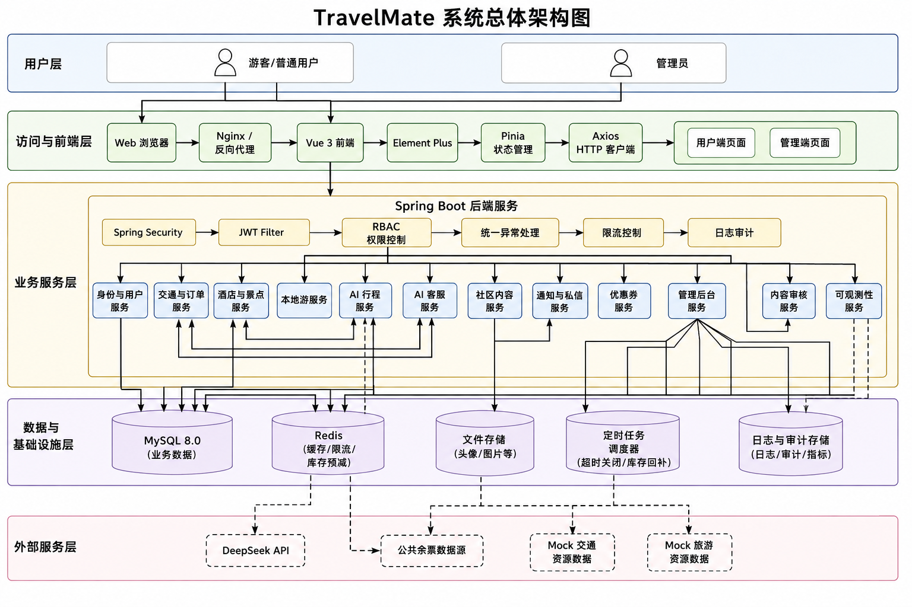

按照项目团队的开发分工与核心业务流，我们将系统整体划分为以下五个核心子系统：

**1. 大交通票务与订单子系统（设计责任：成员 A）**

- **功能职责**：负责平台核心大交通资源的预订与基础订单生命周期管理。
- **核心设计**：不接入真实商业票务系统，机票与火车票数据优先采用本地 Mock 数据与数据库初始化数据支撑。实现车次/航班实时查询、多平台模拟比价、历史价格走势展示。统一管理平台基础订单模型，包含订单状态机流转控制、模拟支付接口对接、库存预占调用以及退款处理逻辑。

**2. 目的地住宿与本地生活子系统（设计责任：成员 B）**

- **功能职责**：以最小可交付范围负责酒店、景点基础浏览，以及行后评价提交与展示。
- **核心设计**：实现酒店多维度搜索过滤、酒店 / 景点详情展示、基础五星图文评价提交与列表展示。酒店订单支持按 `roomCount` 多房间预订，景点门票订单写入 `tm_attraction_order` 并提供订单/凭证展示；商家回复、评价举报处理、酒店 / 景点后台维护由 E 的管理后台负责。

**3. AI 智能规划与 Agent 服务子系统（设计责任：成员 C）**

- **功能职责**：负责平台所有与大语言模型相关的智能化场景以及全局消息触达。
- **核心设计**：统一封装 DeepSeek API。行程规划模块要求模型返回严格 JSON，失败时回退到本地模板，保障前端稳定渲染；AI 客服结合站内业务数据提供旅行问答，但不编造实时库存、价格或订单状态。此外，负责统筹平台通知服务（站内信、红点未读逻辑），并在订单、审核、退款和 AI 规划场景中触达用户。

**4. 旅途社区与用户中心子系统（设计责任：成员 D）**

- **功能职责**：承担全平台的用户认证鉴权、社交互动与内容沉淀。
- **核心设计**：实现基于 **JWT** 的安全登录注册与用户信息管理；提供 UGC 内容发布工具（多图上传、地理位置打卡）；搭建兼容图文与视频的**双列瀑布流**交互界面；构建包含关注/粉丝体系、点赞收藏与树状评论结构的社交关系链。

**5. 管理后台与可观测性子系统（设计责任：成员 D）**

- **功能职责**：面向平台管理员，提供资源维护、安全审核与系统运行状态监控。
- **核心设计**：搭建基于 **RBAC（基于角色的访问控制）** 的权限与安全架构；实现轻量数据可观测仪表盘（如订单统计、日志看板、用户与内容统计）；构建内容与安全审核防线（社区图文敏感词自动过滤 + AI 辅助审核 + 人工审核工作流）；提供大交通、酒店、房型、景点、目的地基础数据的后台 CRUD、CSV 导入、退款审核、商家回复和评价举报工单处理等运营侧功能。

**子系统间的协同关系说明：**

- 子系统 A 与 B 重点围绕**交易履约流程和库存控制模型**进行底层协同；
- 子系统 C 在生成行程与智能问答时，需跨模块调用 A/B 提供的资源检索接口（Mock 数据共享）；
- 社区模块生成的 UGC 内容进入管理后台审核流完成安全合规校验；社区与管理后台统一使用内容状态和审核接口完成联调。

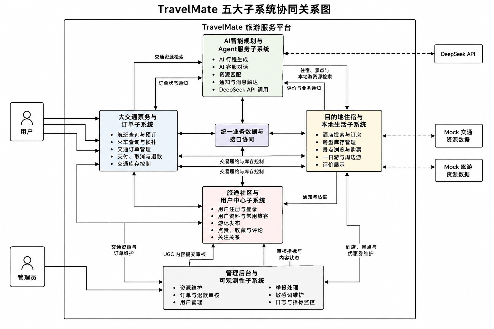

---

### 2.1 典型业务活动图（以智能行程规划为例）


### 2.2 典型业务顺序图（以订单支付为例）


### 2.3 需求编号与范围基线

下表采用与软件需求规格说明书一致的 REQ-01—REQ-19 编号，并与 UC01—UC19 一一对应。

| 需求编号 | 需求名称 | 验收口径 | 对应用例 |
| :--- | :--- | :--- | :--- |
| REQ-01 | 用户注册、登录与账户安全 | 账户数据正确；登录获得有效 Token；非法访问返回 401/403 | UC01 |
| REQ-02 | 查询并预订航班 | 生成待支付交通订单；航班库存按人数扣减且不为负 | UC02 |
| REQ-03 | 查询并预订火车票或提交候补 | 生成交通订单或候补记录；库存与候补关系正确 | UC03 |
| REQ-04 | 交通订单支付、取消、退款与凭证查看 | 订单状态、支付退款记录和库存一致；凭证可查询 | UC04 |
| REQ-05 | 搜索酒店并完成订房 | 生成待支付酒店订单；房型库存正确扣减且不超卖 | UC05 |
| REQ-06 | 酒店订单支付、取消、退款与库存回补 | 订单状态与两级库存一致，重复操作不重复回补 | UC06 |
| REQ-07 | 景点浏览与购票 | 景点订单、票数、金额和游客信息正确 | UC07 |
| REQ-08 | 选择并预订一日游或周边游产品 | 成功时订单可查；失败时不扣库存、不产生脏订单 | UC08 |
| REQ-09 | 提交评价、回复评价与举报处理 | 评价、回复、举报工单和处理终态关联正确 | UC09 |
| REQ-10 | 优惠券领取与订单核销 | 用户券状态、减免金额和 used_time 正确且仅更新一次 | UC10 |
| REQ-11 | 生成并保存 AI 行程 | 行程记录可查询；正常和降级结果均符合前端结构 | UC11 |
| REQ-12 | AI 客服多轮对话 | 同一会话消息顺序正确；失败提示明确且不编造库存订单信息 | UC12 |
| REQ-13 | 通知中心与站内私信 | 未读数、已读状态和会话消息正确，无越权泄露 | UC13 |
| REQ-14 | 游记发布、编辑、删除与审核 | 游记状态、审核结果、操作人和通知可查询 | UC14 |
| REQ-15 | 社区点赞、收藏与评论 | 互动关系唯一；树状评论和统计数量一致 | UC15 |
| REQ-16 | 常用旅客管理与使用 | 旅客归属和证件信息正确，其他用户无法访问或使用 | UC16 |
| REQ-17 | 用户主页与关注关系 | 关注关系唯一，计数一致，隐私字段不泄露 | UC17 |
| REQ-18 | 管理后台资源、订单与用户管理 | 业务数据状态正确，关键动作和操作人可追踪 | UC18 |
| REQ-19 | 内容安全、举报处理与可观测性 | 内容、工单、词库、日志和指标状态均可追踪 | UC19 |

### 2.4 完整业务场景清单

以下 19 个用例与软件需求规格说明书、概要设计说明书及追溯表采用相同编号、名称和业务边界。

| 用例编号 | 用例名称 | 主要参与者 | 责任成员 | 关键入口 |
| :--- | :--- | :--- | :--- | :--- |
| UC01 | 用户注册、登录与账户安全 | 游客、用户 | D | `/user/register`、`/user/login`、`/user/password` |
| UC02 | 查询并预订航班 | 用户 | A | `/api/flight/search`、`/api/order/flight/create` |
| UC03 | 查询并预订火车票或提交候补 | 用户 | A | `/api/train/search`、`/api/train/waitlist`、`/api/order/train/create` |
| UC04 | 交通订单支付、取消、退款与凭证查看 | 用户、管理员 | A、D | `/api/order/**`、`/api/admin/orders/**` |
| UC05 | 搜索酒店并完成订房 | 用户 | B | `/api/hotel/search`、`/api/hotel/order/create` |
| UC06 | 酒店订单支付、取消、退款与库存回补 | 用户、管理员 | A、B、D | `/api/hotel/order/{orderNo}/**` |
| UC07 | 景点浏览与购票 | 用户 | B | `/api/attraction/search`、`/{id}/ticket` |
| UC08 | 选择并预订一日游或周边游产品 | 游客、用户 | B | `/api/tour/list`、本地游预订入口 |
| UC09 | 提交评价、回复评价与举报处理 | 用户、管理员/商家 | B、D | `/api/review/**`、`/api/reply/**`、`/api/review/report` |
| UC10 | 优惠券领取与订单核销 | 用户、管理员 | B、D | `/api/coupon/**`、`/api/admin/coupons/**`、订单核销入口 |
| UC11 | 生成并保存 AI 行程 | 用户、外部 AI 服务 | C | `/api/ai/plan/generate`、`/api/ai/plan/list` |
| UC12 | AI 客服多轮对话 | 用户、外部 AI 服务 | C | `/api/ai/chat` |
| UC13 | 通知中心与站内私信 | 用户 | C、D | `/api/notification/**`、`/api/private-message/**` |
| UC14 | 游记发布、编辑、删除与审核 | 用户、管理员 | D | `/api/post/**`、`/api/admin/posts/**` |
| UC15 | 社区点赞、收藏与评论 | 用户 | D | `/api/like/**`、`/api/favorite/**`、`/api/comment/**` |
| UC16 | 常用旅客管理与使用 | 用户 | A | `/api/passenger/**` |
| UC17 | 用户主页与关注关系 | 用户 | D | `/api/user/profile/**`、`/api/follow/**` |
| UC18 | 管理后台资源、订单与用户管理 | 管理员 | D | `/api/admin/flights/**`、`trains/**`、`hotels/**`、`orders/**`、`users/**` |
| UC19 | 内容安全、举报处理与可观测性 | 管理员 | D | `/api/admin/posts/**`、`review-reports/**`、`sensitive-words/**`、`logs`、`dashboard/data` |

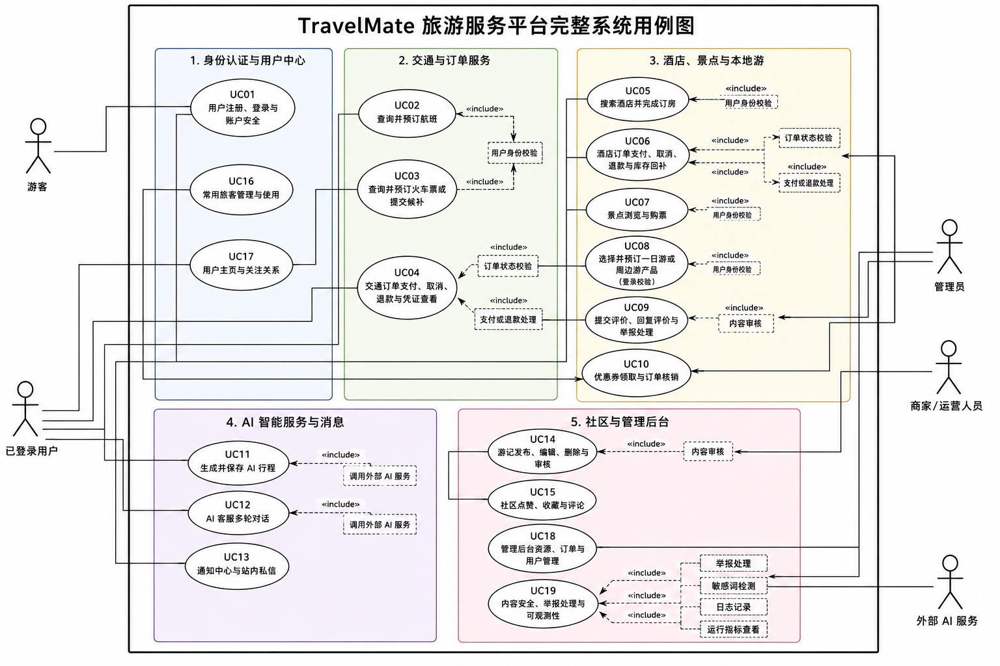

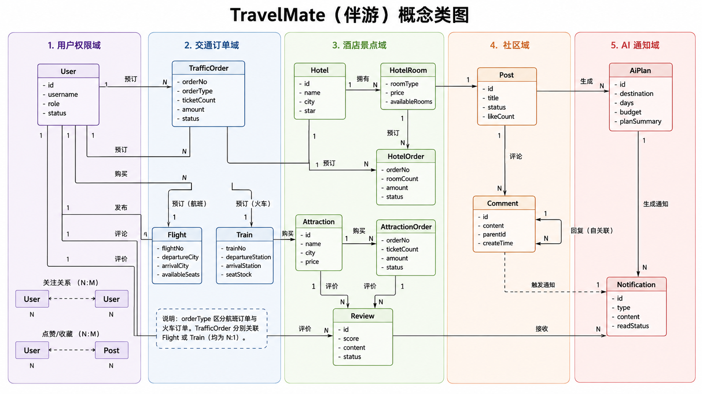

### 2.5 正式用例说明

| 用例 | 触发条件与前置条件 | 主成功流程 | 备选/异常流程 | 可验证结果 |
| :--- | :--- | :--- | :--- | :--- |
| UC01 用户注册、登录与账户安全 | 游客提交注册或登录；注册用户名未占用 | 校验输入 → BCrypt 保存/比对密码 → 生成 JWT → 前端保存 Token → 后续请求携带 Bearer Token | 用户名重复、密码错误、Token 过期或账号禁用时返回业务错误并拒绝访问 | `tm_user` 正确新增或登录返回 Token；匿名访问受保护接口得到 403 |
| UC02 查询并预订航班 | 用户选择出发地、目的地、日期；下单前已登录并已选择乘客 | 查询航班 → 选择舱位和乘客 → 校验库存/优惠 → 原子扣减 → 创建待支付交通订单 | 无结果、库存不足、参数非法或重复提交时不创建订单 | `tm_traffic_order` 新增，`tm_flight.available_seats` 按票数扣减 |
| UC03 查询并预订火车票或提交候补 | 用户输入车站与日期；下单前已登录 | 查询车次 → 选择席别/乘客 → 有票则扣减并建单，无票可提交候补 | 公共余票同步失败时回退本地数据；库存不足进入候补或提示失败 | 订单或 `tm_train_waitlist` 记录可查，库存不为负数 |
| UC04 交通订单支付、取消、退款与凭证查看 | 用户对本人交通订单执行支付、取消、退款或查看凭证 | 校验订单归属和当前状态 → 执行合法状态迁移 → 记录支付/退款 → 必要时回补库存 → 返回凭证 | 非法状态跃迁、重复操作、越权访问被拒绝；退款需管理员审核时进入待审核 | 状态机符合“待支付→已支付/已取消→已出行/退款”；库存与订单一致 |
| UC05 搜索酒店并完成订房 | 用户输入城市和入住日期；下单前已登录 | 搜索酒店 → 查看详情/房型 → 输入入住人与房间数 → Redis 预减 → 数据库原子扣减 → 创建待支付酒店订单 | Redis 不可用时降级数据库校验；库存不足、日期非法或参数缺失时失败 | `tm_hotel_order` 新增，房型库存按 `roomCount` 扣减且不超卖 |
| UC06 酒店订单支付、取消、退款与库存回补 | 用户操作本人酒店订单 | 支付确认 → 状态更新；取消/退款 → 校验状态 → 回补 Redis 与数据库库存 → 返回结果 | 超时未支付由调度器关闭并回补；重复退款、越权或非法状态拒绝 | 状态和库存最终一致，重复请求不造成重复回补 |
| UC07 景点浏览与购票 | 用户浏览景点并提交购票信息 | 查询景点 → 查看详情 → 选择成人/儿童票 → 校验票量 → 创建景点订单 → 查看凭证 | 票量不足、游客信息无效或未登录时不创建订单 | `tm_attraction_order` 新增，票数与金额计算正确 |
| UC08 选择并预订一日游或周边游产品 | 游客浏览产品；提交预订前用户已登录并选择日期、人数和联系人 | 查询产品与行程 → 选择班期、人数和联系人 → 校验价格与库存 → 扣减库存 → 创建订单并返回结果 | 产品下架、班期不可售、库存不足、未登录、联系人无效或重复提交时失败且不产生脏订单 | 成功时本地游订单可查；失败时不扣库存、不产生脏订单 |
| UC09 提交评价、回复评价与举报处理 | 已登录用户对目标提交评价，或举报已有评价 | 校验订单/目标 → 保存评分图文 → 展示评价；管理员/商家回复；用户举报后进入工单 | 重复评价、非法评分、空内容或重复举报时提示失败 | `tm_review`、`tm_reply`、`tm_review_report` 关联正确 |
| UC10 优惠券领取与订单核销 | 用户领取可用优惠券；管理员维护券 | 查询券 → 校验库存/有效期/重复领取 → 生成用户券；下单时校验门槛并核销 | 库存为零、过期、重复领取或不满足门槛时拒绝 | 用户券状态、订单金额减免和 `used_time` 正确且仅更新一次 |
| UC11 生成并保存 AI 行程 | 已登录用户提交目的地、日期、预算和偏好 | 参数校验 → 构造 Prompt → 调用模型 → 校验 JSON → 匹配本地资源 → 保存计划 → 返回卡片数据 | API Key 缺失、超时或 JSON 非法时返回本地模板，并记录降级原因 | `tm_ai_plan` 有记录，响应始终满足前端结构契约 |
| UC12 AI 客服多轮对话 | 已登录用户发送旅行问题 | 读取会话上下文 → 构造消息 → 调用模型 → 保存问答 → 返回回答 | 外部模型失败时返回可解释提示；不得编造实时价格、库存和订单状态 | `tm_ai_chat` 按 `session_id` 留存多轮消息 |
| UC13 通知中心与站内私信 | 用户触发业务事件或主动发送私信 | 业务服务写入通知 → 用户查询/标记已读/删除；私信服务维护联系人和会话 | 接收者不存在、越权读取或发送空消息时拒绝；通知写入失败不回滚核心交易 | 未读数、已读状态和会话消息可查询，核心业务不被通知故障阻断 |
| UC14 游记发布、编辑、删除与审核 | 已登录用户提交或修改游记 | 上传图片 → 敏感词检测 → 保存待审帖子 → 定时/人工审核 → 发布或拒绝 | 命中敏感词、图片上传失败、越权编辑/删除时拒绝；审核失败保留待审状态 | `tm_post.status` 在 0/1/2 间按规则流转并保留审核结果 |
| UC15 社区点赞、收藏与评论 | 已登录用户浏览帖子并互动 | 查询列表/详情 → 点赞或收藏切换 → 添加树状评论 → 更新计数 | 重复请求保持幂等；删除他人评论或非法父评论时拒绝 | `tm_like`、`tm_comment` 与计数缓存一致 |
| UC16 常用旅客管理与使用 | 已登录用户维护常用旅客 | 查询列表 → 新增旅客 → 下单时选择 → 可删除本人旅客 | 证件格式错误、重复旅客或越权删除时拒绝 | `tm_passenger` 与当前用户关联正确 |
| UC17 用户主页与关注关系 | 用户查看个人主页并关注他人 | 查询公开资料/帖子 → 关注或取消关注 → 查询粉丝和关注列表 | 不能关注自己；重复关注保持幂等；隐私字段不返回 | `tm_follow` 唯一关系正确，主页仅暴露允许字段 |
| UC18 管理后台资源、订单与用户管理 | 管理员登录后台 | RBAC 校验 → 维护航班/火车/酒店/房型/景点/目的地/优惠券 → 查看订单和用户 → 执行启停或退款审核 | 普通用户访问返回 403；CSV 非法行给出错误摘要；删除被引用资源时拒绝或软删除 | 资源表、用户状态和订单审核结果正确，操作写入 `sys_log` |
| UC19 内容安全、举报处理与可观测性 | 管理员进入审核或监控页面 | 查询待审帖子/举报 → 审核处理 → 维护敏感词 → 查看日志、QPS 和业务指标 | 重复处理工单保持终态；统计失败不阻断审核；敏感词变更立即生效 | 审核状态、举报状态、敏感词表及日志查询结果可验证 |

### 2.6 三层模型覆盖规则

每个用例均具备三层模型编号：`SYS-UCxx` 在需求说明中描述参与者、系统边界和系统响应；`COMP-UCxx` 在概要设计中描述页面、Controller、Service、Mapper 与外部依赖；`OBJ-UCxx` 在本详细设计中描述一次具体请求中的对象调用、状态变化与异常分支。以下编号与三份文档的画图描述一一对应。

| 用例 | 系统级证据（需求说明） | 组件级证据（概要设计） | 本文对象级证据 | 本文实现类图 |
| :--- | :--- | :--- | :--- | :--- |
| UC01 | [SYS-UC01](./需求规格说明/SYS-UC01_用户注册登录与账户安全.png) | [COMP-UC01](./概要设计说明/COMP-UC01_用户注册登录与账户安全.png) | OBJ-UC01 / 图片 36 | 图片 30 |
| UC02 | [SYS-UC02](./需求规格说明/SYS-UC02_查询并预订航班.png) | [COMP-UC02](./概要设计说明/COMP-UC02_查询并预订航班.png) | OBJ-UC02 / 图片 37 | 图片 31 |
| UC03 | [SYS-UC03](./需求规格说明/SYS-UC03_查询预订火车票或候补.png) | [COMP-UC03](./概要设计说明/COMP-UC03_查询火车票与提交候补.png) | OBJ-UC03 / 图片 38 | 图片 31 |
| UC04 | [SYS-UC04](./需求规格说明/SYS-UC04_交通订单履约.png) | [COMP-UC04](./概要设计说明/COMP-UC04_交通订单支付取消退款.png) | OBJ-UC04 / 图片 39 | 图片 31 |
| UC05 | [SYS-UC05](./需求规格说明/SYS-UC05_搜索酒店并订房.png) | [COMP-UC05](./概要设计说明/COMP-UC05_搜索酒店并完成订房.png) | OBJ-UC05 / 图片 40 | 图片 32 |
| UC06 | [SYS-UC06](./需求规格说明/SYS-UC06_酒店订单履约.png) | [COMP-UC06](./概要设计说明/COMP-UC06_酒店订单支付取消退款与库存回补.png) | OBJ-UC06 / 图片 41 | 图片 32 |
| UC07 | [SYS-UC07](./需求规格说明/SYS-UC07_景点浏览与购票.png) | [COMP-UC07](./概要设计说明/COMP-UC07_景点浏览与购票.png) | OBJ-UC07 / 图片 42 | 图片 32 |
| UC08 | [SYS-UC08](./需求规格说明/SYS-UC08_浏览本地游产品.png) | [COMP-UC08](./概要设计说明/COMP-UC08_浏览一日游周边游产品.png) | OBJ-UC08 / 图片 43 | 图片 32 |
| UC09 | [SYS-UC09](./需求规格说明/SYS-UC09_评价回复与举报.png) | [COMP-UC09](./概要设计说明/COMP-UC09_提交评价回复与举报处理.png) | OBJ-UC09 / 图片 44 | 图片 32 |
| UC10 | [SYS-UC10](./需求规格说明/SYS-UC10_优惠券领取与核销.png) | [COMP-UC10](./概要设计说明/COMP-UC10_优惠券领取与订单核销.png) | OBJ-UC10 / 图片 45 | 图片 32 |
| UC11 | [SYS-UC11](./需求规格说明/SYS-UC11_AI行程生成与保存.png) | [COMP-UC11](./概要设计说明/COMP-UC11_生成并保存AI行程.png) | OBJ-UC11 / 图片 46 | 图片 33 |
| UC12 | [SYS-UC12](./需求规格说明/SYS-UC12_AI客服多轮对话.png) | [COMP-UC12](./概要设计说明/COMP-UC12_AI客服多轮对话.png) | OBJ-UC12 / 图片 47 | 图片 33 |
| UC13 | [SYS-UC13](./需求规格说明/SYS-UC13_通知与私信.png) | [COMP-UC13](./概要设计说明/COMP-UC13_通知中心与站内私信.png) | OBJ-UC13 / 图片 48 | 图片 33 |
| UC14 | [SYS-UC14](./需求规格说明/SYS-UC14_游记发布与审核.png) | [COMP-UC14](./概要设计说明/COMP-UC14_游记发布编辑删除与审核.png) | OBJ-UC14 / 图片 49 | 图片 34 |
| UC15 | [SYS-UC15](./需求规格说明/SYS-UC15_社区互动.png) | [COMP-UC15](./概要设计说明/COMP-UC15_社区点赞收藏与评论.png) | OBJ-UC15 / 图片 50 | 图片 34 |
| UC16 | [SYS-UC16](./需求规格说明/SYS-UC16_常用旅客管理.png) | [COMP-UC16](./概要设计说明/COMP-UC16_常用旅客管理与使用.png) | OBJ-UC16 / 图片 51 | 图片 31 |
| UC17 | [SYS-UC17](./需求规格说明/SYS-UC17_用户主页与关注.png) | [COMP-UC17](./概要设计说明/COMP-UC17_用户主页与关注关系.png) | OBJ-UC17 / 图片 52 | 图片 30 |
| UC18 | [SYS-UC18](./需求规格说明/SYS-UC18_后台业务运营.png) | [COMP-UC18](./概要设计说明/COMP-UC18_管理后台资源订单与用户管理.png) | OBJ-UC18 / 图片 53 | 图片 35 |
| UC19 | [SYS-UC19](./需求规格说明/SYS-UC19_内容安全与可观测性.png) | [COMP-UC19](./概要设计说明/COMP-UC19_内容安全举报处理与可观测性.png) | OBJ-UC19 / 图片 54 | 图片 35 |

## 3 功能模块设计

### 3.1 AI 行程生成模块

- **模块描述**：根据用户输入生成个性化旅游行程，并与平台 Mock 资源进行关联匹配。
- **模块编号**：TM-MOD-01
- **输入**：目的地（String）、天数（Int）、预算范围（Float）、出行人数（Int）、偏好标签（List）
- **处理**：
  1.  对用户输入进行合法性校验。
  2.  构造标准化 Prompt（模板化 + 变量参数填充）。
  3.  异步调用 DeepSeek API 获取行程推荐结果。
  4.  使用 JSON Output 约束，对返回结果进行严格的结构化校验。
  5.  对不完整字段进行本地模板补全；DeepSeek 未配置、超时或 JSON 解析失败时，自动降级为可展示的本地行程 JSON。
  6.  结合本地酒店、景点及交通数据生成推荐说明，并将生成结果持久化到 `tm_ai_plan`。
  7.  **规范化记录：对 Prompt、AI 对话、行程结果和通知触达进行落库或日志留存，便于复盘。**
- **算法与调用描述**：
  采用 Prompt Engineering + 结构化 JSON 约束，结合本地 Mock 景点数据与热门行程模板。DeepSeek Chat Completions 调用由 `AiServiceImpl` 封装，模型输出解析失败时走本地降级模板，以保证前端 `AiPlan.vue` 稳定渲染。
  **大模型相关用途、Prompt 模板、配置项和降级策略见同目录下的 [`大模型使用说明.md`](./大模型使用说明.md)，确保模型使用的可解释性与可追溯性。**
- **输出**：行程 JSON 数据（按天划分）、推荐资源列表、行程摘要信息。

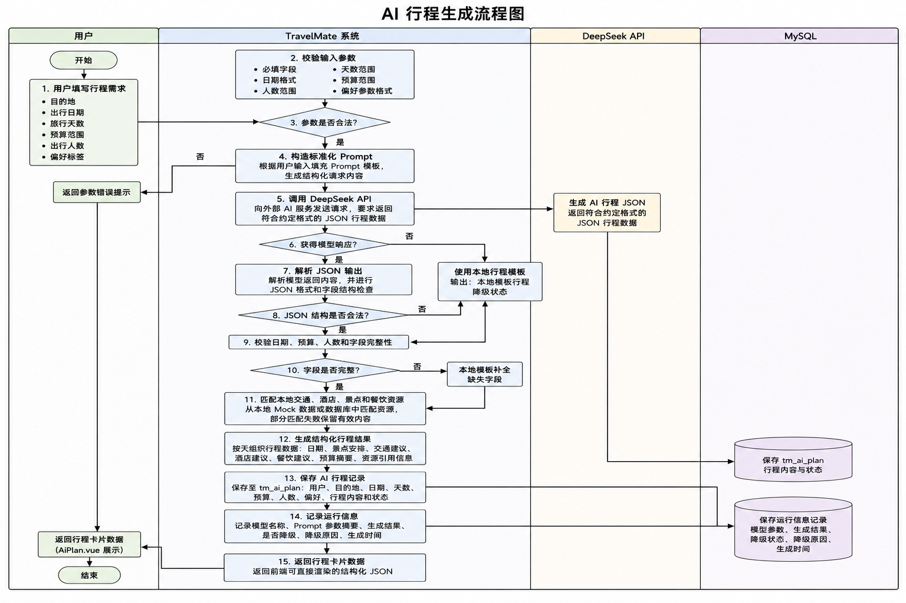

### 3.2 订单库存管控模块

- **模块描述**：面向小并发运行环境，负责机票、酒店等资源在预订过程中的防超卖控制与数据一致性保证。
- **模块编号**：TM-MOD-02
- **输入**：商品 ID（Mock 资源主键）、预订数量、用户 ID
- **处理**：
  1.  **Redis 缓存预减**：酒店房型下单时优先在 Redis 中按 `roomCount` 执行 Lua 预减，快速拦截非法/超量请求；Redis 不可用时降级为数据库扣减。
  2.  **数据库原子校验**：订单落库时，放弃重量级的行级悲观锁，**采用数据库原子更新语句**进行库存校验（例如：`UPDATE tm_hotel_room SET available_rooms = available_rooms - #{count} WHERE id = ? AND available_rooms >= #{count}`）。航班、火车、酒店、景点均按实际 `ticketCount` / `roomCount` 扣减。
  3.  生成待支付订单，标记库存处于“预占”状态。
  4.  接收到支付成功回调后，正式确认为已售库存。
  5.  超时未支付的订单（15 分钟），通过 `OrderTimeoutScheduler` 定时任务触发库存回滚，恢复 Redis 与数据库中的剩余可用量。
- **算法策略描述**：
  不使用企业级庞大复杂的分布式锁方案，采用“Redis 缓存预减 + 数据库原子更新语句 + 超时回滚”的组合策略。该策略既能有效防止资源超卖现象，又能充分验证小并发场景下系统处理关键业务的并发安全性。
- **输出**：锁定成功 / 失败状态标识、最新库存余额。

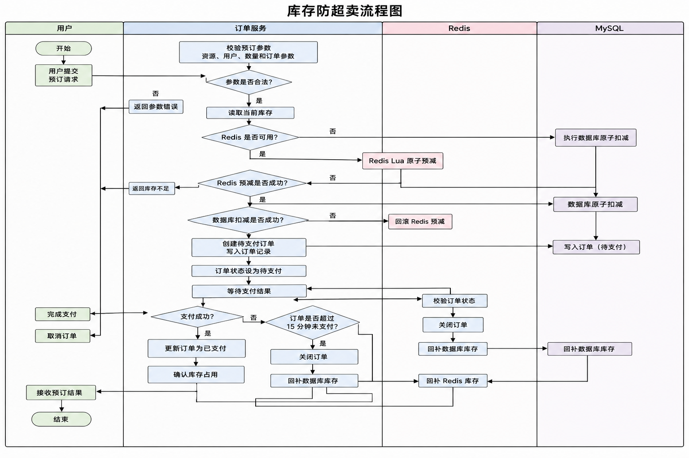

### 3.3 社区内容推荐模块

- **模块描述**：为用户提供基于 UGC 内容的个性化推荐流。
- **模块编号**：TM-MOD-03
- **输入**：用户行为数据（浏览、点赞、收藏）、内容标签信息。
- **处理**：
  1.  构建基于本地业务库的简易用户兴趣标签模型。
  2.  基于标签库进行协同过滤基础推荐。
  3.  按热度因子（点赞量/评论量）与时间因子进行加权衰减排序。
  4.  过滤命中后台违规词库的低质量或敏感内容。
- **算法策略描述**：采用“标签匹配 + 热度排序 + 时间衰减”的轻量级混合推荐策略，在不引入复杂大数据组件的前提下实现基础个性化推荐，支撑双列瀑布流展示。
- **输出**：推荐内容 ID 列表。

### 3.4 基础订单管理模块

- **模块描述**：统管大交通与酒店业务线的生命周期，构建业务闭环的基石。
- **模块编号**：TM-MOD-04
- **输入**：各业务线生成的预留单、外部支付指令（模拟）、用户侧操作指令（取消/确认出行/评价）。
- **处理**：
  1.  统一订单模型落库：生成全局唯一的订单流水号，聚合资源信息与用户信息。
  2.  模拟支付接口（Mock）处理：不接入微信/支付宝等真实商业支付系统，而是由系统内部提供统一的“支付确认”Mock 接口（或本地桩代码），模拟支付成功并主动触发 Webhook 回调服务。
  3.  核心订单状态机流转控制：管理订单的阶段演进，校验状态跃迁的合法性。定义基础流转路径：【待支付】 -> 【已支付 / 已取消】 -> 【已出行（履约）】 -> 【已评价 / 退款处理】。
  4.  模拟生成电子票据及行程单导出功能。
- **算法与业务逻辑描述**：
  基于状态机（State Machine）模式实现订单流转。每次状态变更须校验 `expected_current_state`（预期当前状态），防止因小并发点击导致的状态乱序。通过对支付环节进行 Mock 模拟，将重点集中于验证从“行前规划、下单预占”到“行中履约”、“行后评价”的完整业务闭环真实性。
- **输出**：统一订单详情 DTO、状态变更操作记录。
  订单状态机流转如下：

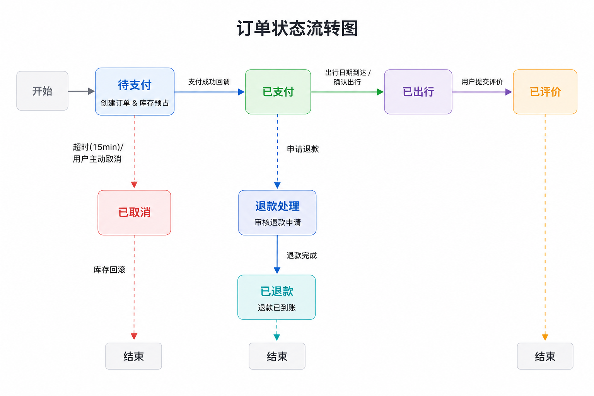

---

### 3.5 用户认证与安全模块

- **模块描述**：负责全平台统一身份认证、会话管理与角色权限控制，是所有业务模块的安全基础。
- **模块编号**：TM-MOD-05
- **输入**：注册请求（用户名 / 邮箱 / 手机号 / 密码）、登录请求（用户名 + 密码）、HTTP 请求 Header 中的 Bearer Token。
- **处理**：
  1.  **注册流程**：接收注册信息，进行格式校验（长度、邮箱格式等），检查用户名唯一性，使用 BCrypt 对密码进行加盐哈希加密后落库（`tm_user` 表）。
  2.  **登录流程**：查询用户，用 `BCryptPasswordEncoder.matches()` 校验密码，校验通过后使用 jjwt 0.11.5（HS256 对称密钥）生成 JWT，过期时间 24h，连同用户基础信息一并返回给前端。
  3.  **JWT 拦截验证**：`JwtFilter` 在 Spring Security 过滤链中拦截每个请求，从 `Authorization: Bearer <token>` Header 提取 token，解析有效性与过期时间，将 username 设入 `SecurityContextHolder`。
  4.  **权限控制（RBAC）**：`SecurityConfig` 按接口路径配置白名单（`/user/register`、`/user/login`、`/user/reset-password`、航班/火车/酒店/景点/目的地/游记列表等只读 GET 接口），其余接口均需认证。管理员接口 `/api/admin/**` 通过 `ROLE_ADMIN` 校验。
  5.  **UserContext 工具**：Controller/Service 层通过 `UserContext.getCurrentUserId()` 获取当前登录用户 ID，内部从 `SecurityContextHolder` 取 username 再查库。
- **关键设计决策**：
  - JWT 使用每次重启重新生成的内存对称密钥，旧 token 重启后全部失效（课程项目场景可接受，保证实现简单）；
  - 密码不可逆 BCrypt 存储，满足 OWASP 密码安全要求；
  - `User` 实体 `@TableName` 值为 `"tm_user"`，非 MyBatis-Plus 默认推导的 `"user"`。
- **输出**：JWT Token（登录成功）、用户详情 DTO、403/401 JSON 错误响应。


---

### 3.6 目的地住宿与本地生活模块

- **模块描述**：提供酒店 / 景点浏览与基础评价功能；酒店订单库存一致性由成员 A 的订单模块协同保障，举报处理等运营功能由成员 D 的管理后台维护。
- **模块编号**：TM-MOD-06
- **输入**：城市 / 关键词、入住 / 退房日期、房客数量（酒店搜索）；景区 ID（景点详情）；评分 + 图文内容（评价提交）。
- **处理**：
  1.  **酒店搜索**：多条件组合查询（城市、日期、价格区间、星级、设施标签），返回酒店列表及首图摘要。
  2.  **房型展示与库存展示**：查询指定酒店的所有房型，实时展示剩余可用库存（从 Redis 缓存或数据库查询）。
  3.  **房务预订 & 防超卖**：酒店订单接口已落地，支持按 `roomCount` 预订多间房；Redis 预减、数据库原子扣减、订单状态流转由 TM-MOD-02 统一约束。
  4.  **景点 / 本地玩乐**：提供景点列表与详情展示；门票购买入口通过 `/api/attraction/{id}/ticket` 提供，订单写入 `tm_attraction_order`，订单/凭证展示用于演示核销流程。
  5.  **评价体系**：成员 B 负责用户 1-5 星评分 + 图文评价提交与列表展示；商家回复（`tm_reply`）、评价举报（`tm_review_report`）及举报工单处理由成员 D 负责的管理模块统一维护。
- **关键实体**：`tm_hotel`、`tm_hotel_room`、`tm_hotel_order`、`tm_attraction`、`tm_attraction_order`、`tm_tour_product`、`tm_tour_product_step`、`tm_media_asset`、`tm_review`、`tm_reply`、`tm_review_report`。
- **输出**：酒店 / 景点列表 JSON、酒店 / 景点详情 JSON、基础评价提交与列表结果。

---

### 3.7 旅途社区与用户中心模块

- **模块描述**：承担全平台 UGC 内容发布、社交关系与互动，以及用户个人中心管理。
- **模块编号**：TM-MOD-07
- **输入**：图文帖子（标题 + 正文 + 图片 URL + 话题标签）、点赞 / 收藏 / 评论请求、关注 / 取关请求。
- **处理**：
  1.  **内容发布**：接收帖子创建请求，进行敏感词过滤（`SensitiveWordService`），过滤通过后写入 `tm_post`，状态置为"审核中"（0）或"已发布"（1）；图片文件上传至本地存储，URL 写入帖子字段。
  2.  **内容流**：首页推荐流按热度（点赞 + 评论加权）+ 时间衰减排序；关注流按 `follow` 关系过滤用户发布的帖子，分页返回。
  3.  **互动行为**：点赞、收藏统一写入 `tm_like`，通过 `target_type` 区分帖子、评论和收藏，同时更新 `tm_post` 中的计数缓存；评论采用父子树状结构（`parent_id`），写入 `tm_comment`。
  4.  **关注关系**：`tm_follow` 记录 `follower_id` → `followee_id`，关注成功后推送站内通知。
  5.  **用户中心**：支持头像上传（文件接口）、个人资料修改、查看我的发布 / 点赞 / 收藏列表，以及修改密码。
- **关键实体**：`tm_post`、`tm_comment`、`tm_like`、`tm_follow`、`tm_user`、`tm_notification`。
- **输出**：帖子列表 / 详情 JSON、互动操作结果、用户主页数据 DTO。

---

### 3.8 管理后台与可观测性模块

- **模块描述**：面向管理员的运营管理、内容审核、系统监控与权限控制。

- **模块编号**：TM-MOD-08

- **输入**：管理员操作指令（资源 CRUD、内容审核、用户管理）、定时采集任务触发信号。

- **处理**：
  1.  **资源管理**：航班、火车、酒店、房型、景点、目的地的后台增删改查，支持 CSV 批量导入与库存调整。
  2.  **内容审核**：对 `status=0`（待审核）的帖子进行人工审核，通过则置 `status=1`，拒绝则置 `status=2` 并记录原因；支持一键封禁用户。
  3.  **优惠券管理**：创建满减 / 折扣优惠券（`tm_coupon`），设置发行量、使用规则、有效期和业务分类（通用/机票/火车票/酒店）；查看用户领券记录（`tm_user_coupon`）。
  4.  **系统日志与 AOP 审计**：`SysLogAspect` 通过 AOP 自动拦截所有 `com.travelmate.controller` 下的方法，记录方法名、参数摘要、耗时、操作用户、IP 及成功 / 失败状态到 `sys_log` 表，日志落库失败不影响业务。
  5.  **接口限流（RateLimiter）**：`@RateLimiter(maxRequests, timeWindowSeconds)` 注解作用于高频写接口（下单、支付），`RateLimiterInterceptor` 基于 Redis 计数器 + IP 拦截超限请求，返回 HTTP 429。
  6.  **可观测大屏**：统计用户数、订单总量、收入、帖子、举报、优惠券等指标；数据来源为业务表和 `sys_log` 聚合，前端使用 ECharts 可视化展示。
  7.  **举报工单**：查看 `tm_review_report` 举报列表，支持驳回或删除被举报评价。
  8.  **敏感词维护**：动态添加 / 删除敏感词库，立即生效于发帖审核流程。

- **关键实体**：`sys_log`、`tm_coupon`、`tm_user_coupon`、`sys_sensitive_word`、`tm_review_report`、`tm_reply`、`tm_destination`。

- **输出**：管理操作结果、审核结果、可观测统计 JSON（供前端 ECharts 渲染）。

  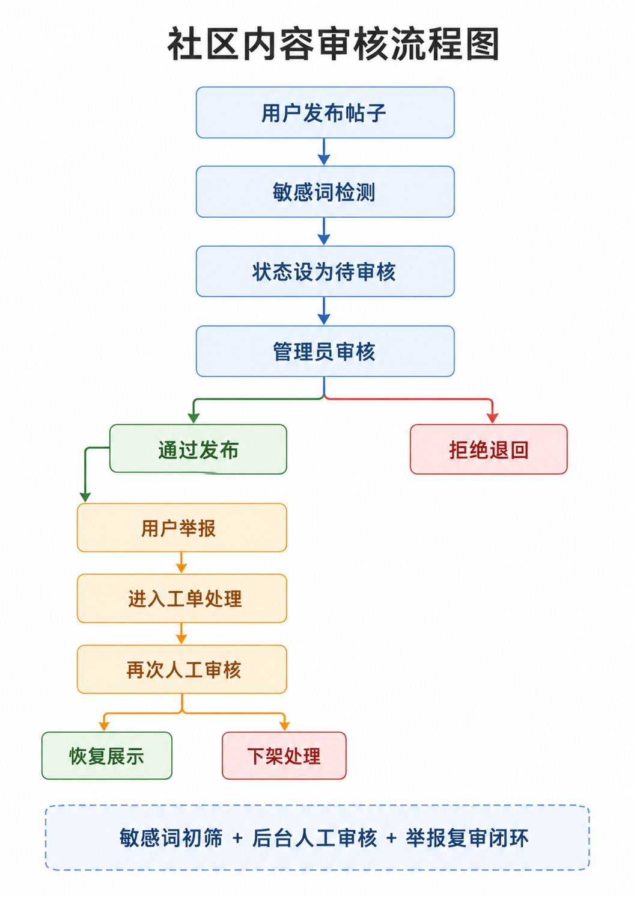

---

### 3.9 用例域的组件级与对象级设计

本节从组件静态协作和对象动态交互两个角度补充模块设计。组件图用于说明前端、Controller、Service、Mapper、数据库及外部依赖之间的职责边界；对象级顺序图则以一次完整业务请求为线索，展示关键方法调用、状态变化及异常处理分支。

#### 3.9.1 大交通与订单域（UC02—UC04、UC16）

大交通域由航班、火车、交通订单和常用旅客四类组件组成。查询请求分别进入 `FlightController` 与 `TrainController`，订单创建、支付、取消和退款统一由 `TrafficOrderController` 协调；Service 层负责库存校验和状态机控制，Mapper 层持久化资源、候补、订单与旅客数据。公共余票同步和 Redis 仅作为辅助能力，失败时不能破坏本地订单主流程。

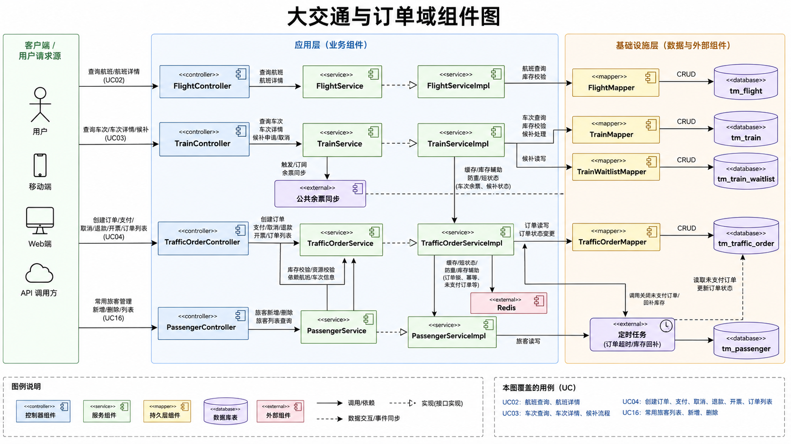

对象级顺序图以用户创建交通订单为起点：系统先校验资源与库存，再写入待支付订单并进行库存预占。支付成功后更新订单状态并发送通知；用户取消时释放库存；库存不足或越权访问则在写入订单前终止流程，从而保证订单归属和库存数据一致。

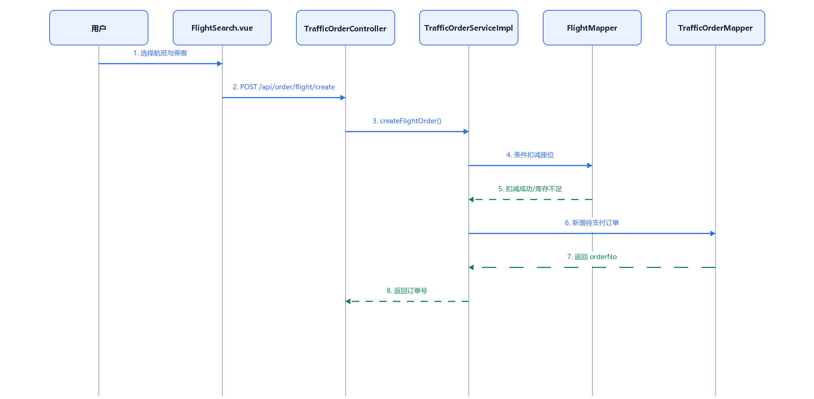

#### 3.9.2 酒店、景点与权益域（UC05—UC10）

酒店景点域覆盖酒店与房型、景点门票、评价回复、评价举报、优惠券及本地游产品。各 Controller 只处理参数和响应，具体业务由对应 Service 完成；酒店库存采用 Redis Lua 预减与数据库原子扣减组合，评价和举报通过独立数据表形成提交、回复、举报、处理的闭环。


酒店预订顺序图展示了正常预订、库存不足、Redis 降级、支付、主动取消和超时回滚等分支。数据库是库存最终事实源：Redis 不可用时直接执行数据库原子扣减；订单取消或超时关闭时，同时回补缓存与数据库库存，并通过订单状态防止重复回补。

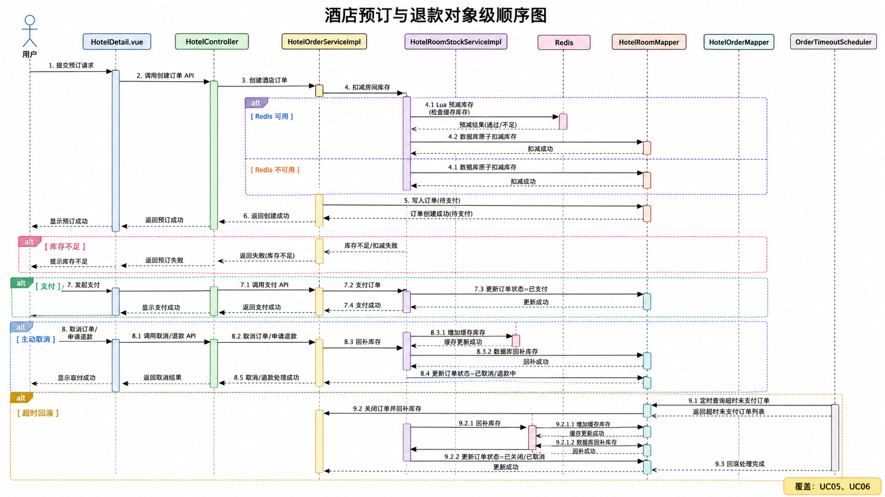

#### 3.9.3 AI 与消息域（UC11—UC13）

AI 与消息域由行程页面、AI Controller、AI Service、模型接口、本地降级模板、计划/对话 Mapper、通知中心和私信服务组成。DeepSeek API 被视为可失败的外部依赖，模型响应必须经过结构化校验后才能持久化和展示，通知或私信发送失败不得导致已生成的行程回滚。

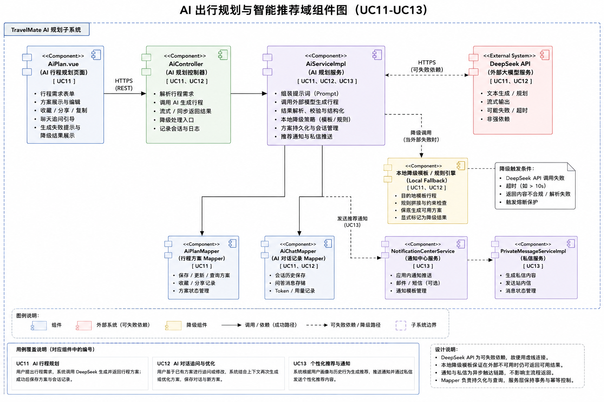

行程生成顺序图从参数校验开始，依次执行 Prompt 构造、模型调用、JSON 解析、本地资源匹配、结果落库和通知发送。当 API Key 缺失、请求超时或返回内容不符合结构约束时，系统切换到本地模板并显式标记降级结果，保证前端始终获得可渲染的数据结构。

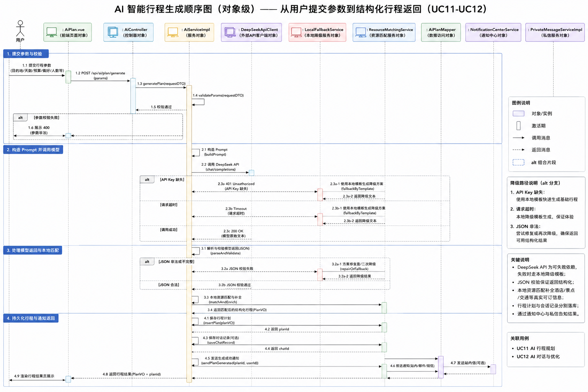

#### 3.9.4 社区与用户关系域（UC14、UC15、UC17）

社区域围绕帖子、评论、点赞收藏、关注关系、用户主页和文件上传展开。帖子发布前由敏感词服务执行内容检查，审核调度器和管理员共同控制帖子状态；点赞、评论、关注等互动通过通知中心异步触达相关用户，通知失败不影响互动记录本身。

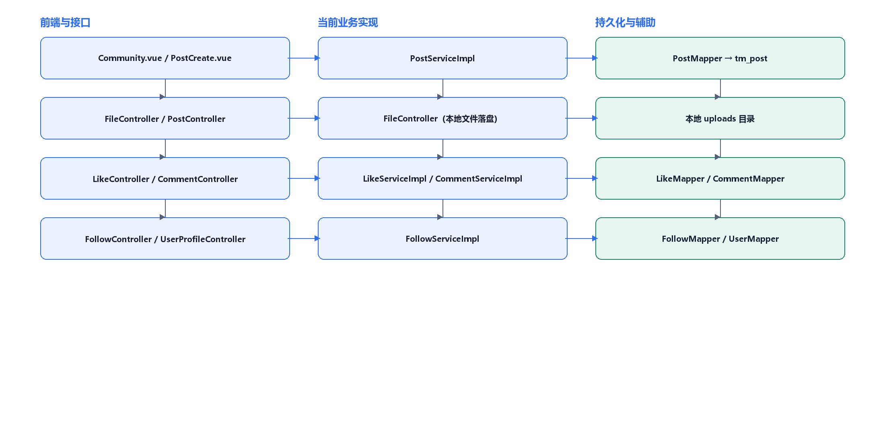

游记发布顺序图将业务分为图片上传、内容提交、敏感词检测、帖子审核和发布后互动五个阶段。上传失败时允许用户重试；命中敏感词时拒绝提交；通过检测的帖子先进入待审核状态，只有审核通过后才进入公开内容流并允许其他用户进行点赞和评论。


#### 3.9.5 身份认证域（UC01、UC16、UC17）

身份认证域采用 Spring Security、JWT 与 BCrypt 组合。`UserController` 和 `UserService` 负责注册、登录和账户操作，`UserMapper` 读写用户表；`JwtFilter` 在受保护请求到达业务 Controller 前解析 Bearer Token，并通过 `SecurityContextHolder` 和 `UserContext` 向后续业务提供当前用户身份。

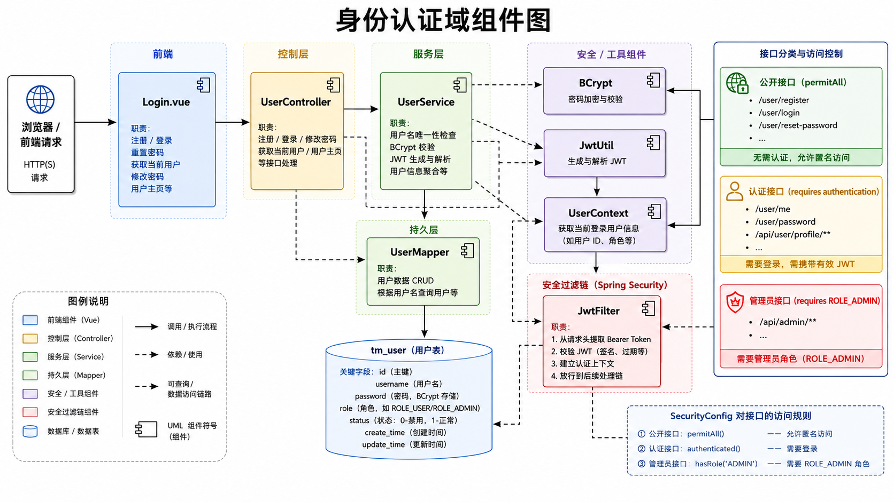

JWT 顺序图覆盖注册、登录和后续鉴权三个阶段。注册时密码经 BCrypt 哈希后保存；登录成功后生成 JWT 并由前端保存；后续请求经 `JwtFilter` 验证签名和有效期。Token 缺失、过期或角色不足时，请求在进入受保护 Controller 前被拒绝。


#### 3.9.6 管理后台与可观测性域（UC18、UC19）

管理后台统一承载资源维护、订单与退款、内容审核、举报工单、敏感词和日志指标等运营能力。所有 `/api/admin/**` 接口均经过管理员角色校验。`AdminController` 协调各业务 Mapper，并复用 `HotelRoomStockService`、`NotificationCenterService` 等业务 Service；`SysLogAspect` 负责记录操作人、参数摘要、执行耗时和结果状态。

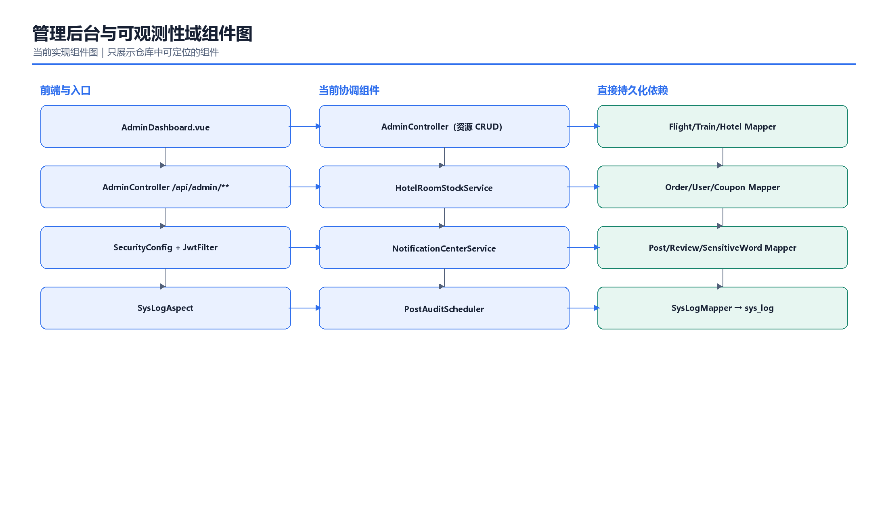

管理员审核顺序图展示了登录鉴权、查询待审内容、审核通过或拒绝、写入审计日志和通知用户的完整过程。重复审核通过状态条件更新保持幂等；普通用户访问直接返回 403；日志落库失败仅记录告警，不回滚已经成功提交的审核结果。


### 3.10 实现类图

- **图片编号**：DLD-FIG-01
- **图名**：TravelMate 核心实现类图
- **图类型**：UML 类图

**类图内容说明：**

1. 类图按 package 分成六个区域：身份与用户、大交通订单、酒店景点权益、AI 与消息、社区内容、管理后台与可观测；每个区域按 Controller、Service 接口/实现、Mapper、Entity/DTO 分层展示。
2. 身份与用户区域包含 `UserController`、`UserService/UserServiceImpl`、`UserMapper`、`User`、`PassengerController/Service/Mapper`、`FollowController/Service/Mapper`、`JwtFilter`、`JwtUtil`、`SecurityConfig`。
3. 大交通与订单区域包含 `FlightController/Service/Mapper`、`TrainController/Service/Mapper`、`TrainWaitlistService/Mapper`、`TrafficOrderController/Service/Mapper`、`OrderTimeoutScheduler`；酒店景点权益区域包含 Hotel、HotelOrder、HotelRoomStock、Attraction、TourProduct、Coupon、Review/Reply/Report 对应类。
4. AI 与消息区域包含 `AiController`、`AiServiceImpl`、AI Client 适配器、`AiPlanMapper`、`AiChatMapper`、通知和私信 Controller/Service/Mapper；社区区域包含 Post、Like、Favorite、Comment、Follow 相关类。
5. 管理区域包含 `AdminController`、`SysLogAspect`、`SysLogMapper`、`SensitiveWordServiceImpl` 和安全组件。
6. Controller 到 Service 用依赖箭头，ServiceImpl 实现 Service 用虚线空心三角，Service 到 Mapper 用依赖箭头，Mapper 与 Entity 标注持久化关系；组合关系只用于生命周期真正从属的实体。
7. 每个类保留 3—6 个与 UC01—UC19 有关的核心方法，方法名与代码一致；在订单、帖子、用户券实体上列出关键状态字段，并用注释标出事务、幂等、权限和定时任务约束。

由于单张总图无法在正常页面宽度下同时保证六个业务域的类名、方法和关系可读，DLD-FIG-01 按业务域拆分为 A—F 六张实现类图。六张图共同构成 TravelMate 核心实现类图，分别覆盖 UC01—UC19；可编辑 Mermaid 源文件统一保存在 [`详细设计说明/source`](./详细设计说明/source/) 中。

#### 3.10.1 DLD-FIG-01A 身份与用户关系实现类图

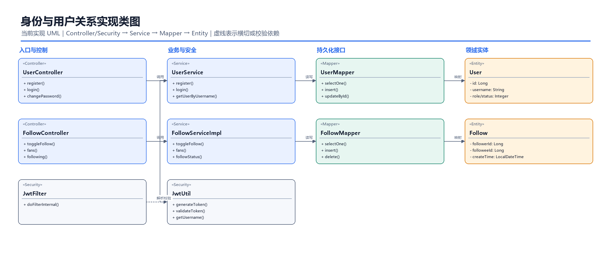

*图 DLD-FIG-01A　身份与用户关系实现类图（UC01、UC16、UC17）*

#### 3.10.2 DLD-FIG-01B 大交通与订单实现类图


*图 DLD-FIG-01B　大交通与订单实现类图（UC02—UC04、UC16）*

#### 3.10.3 DLD-FIG-01C 酒店、景点与权益实现类图


*图 DLD-FIG-01C　酒店、景点与权益实现类图（UC05—UC10）*

#### 3.10.4 DLD-FIG-01D AI 与消息实现类图

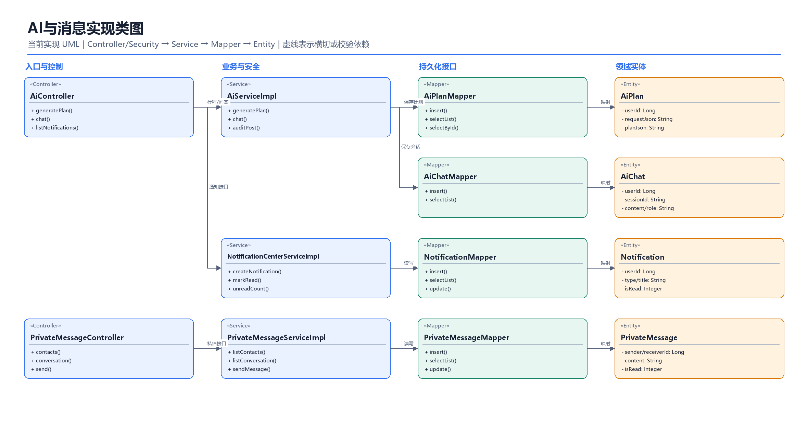

*图 DLD-FIG-01D　AI 与消息实现类图（UC11—UC13）*

#### 3.10.5 DLD-FIG-01E 社区内容实现类图

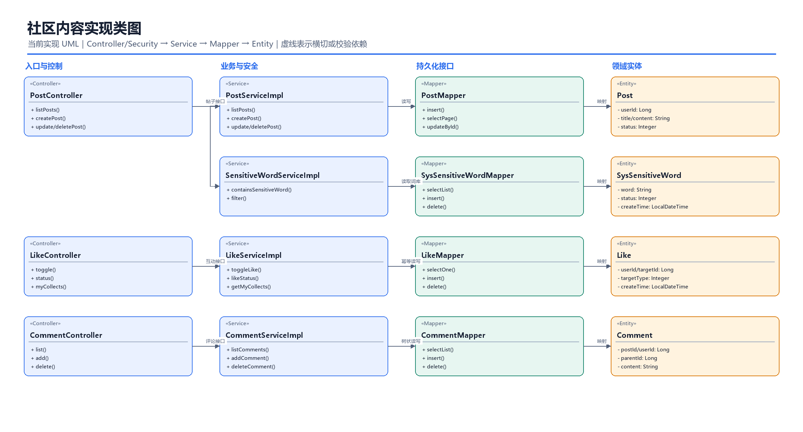

*图 DLD-FIG-01E　社区内容实现类图（UC14、UC15、UC17）*

#### 3.10.6 DLD-FIG-01F 管理后台与可观测性实现类图

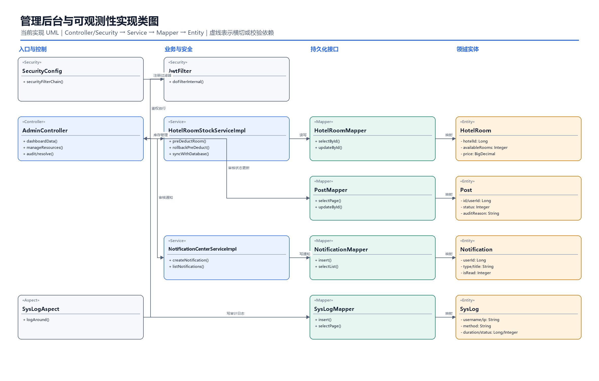

*图 DLD-FIG-01F　管理后台与可观测性实现类图（UC18、UC19）*

### 3.11 UC01—UC19 独立对象级模型

每个业务场景对应一张对象级顺序图，编号为 `OBJ-UC01`—`OBJ-UC19`。对象级图使用具体对象或类实例，展示方法调用、参数与返回语义、持久化、状态变化、事务边界和异常处理。

| 图片编号 | 模型编号 | 图名 | 对象/生命线 | 主调用链与状态变化 | alt/opt/loop 与结果 |
| :--- | :--- | :--- | :--- | :--- | :--- |
| DLD-FIG-02 | OBJ-UC01 | 用户注册、登录与账户安全对象级顺序图 | Login.vue、UserController、UserService/UserServiceImpl、UserMapper、JwtUtil、JwtFilter | register/login → UserService 校验并读写用户 → JwtUtil 生成 Token；后续请求由 JwtFilter 解析 Token 并写入 SecurityContext | 用户名重复、密码错误、账号禁用、Token 无效、旧密码错误时拒绝 |
| DLD-FIG-03 | OBJ-UC02 | 查询并预订航班对象级顺序图 | FlightSearch.vue、FlightController、FlightServiceImpl、TrafficOrderController、TrafficOrderServiceImpl、FlightMapper、TrafficOrderMapper | searchFlights → 查询航班；createFlightOrder → 校验当前用户、旅客和库存 → 条件扣减 → 写入订单 → 返回 orderNo | 无航班、旅客越权、库存不足、重复请求或事务失败时不保留无效订单 |
| DLD-FIG-04 | OBJ-UC03 | 查询火车票与提交候补对象级顺序图 | TrainSearch.vue、TrainController、TrainServiceImpl、TrainLiveSyncService/TrainLiveSyncServiceImpl、TrainBrowserSyncService/TrainBrowserSyncServiceImpl、TrainWaitlistServiceImpl、TrainMapper、TrainWaitlistMapper | searchTrains → 实时同步或读取本地数据；无票时 createWaitlist → 校验用户和旅客 → 写入候补记录 | 外部余票同步失败时回退本地数据；重复候补或旅客无效时拒绝 |
| DLD-FIG-05 | OBJ-UC04 | 交通订单支付、取消、退款与凭证查看对象级顺序图 | MyOrders.vue、TrafficOrderController、TrafficOrderServiceImpl、TrafficOrderMapper、OrderTimeoutScheduler、NotificationCenterService | getDetail → pay/cancel/applyRefund → TrafficOrderServiceImpl 校验用户与状态 → 条件更新订单 → 必要时回补库存 → 写入通知 → 查询凭证 | 越权、非法状态、重复支付/退款以及超时任务竞争时拒绝或幂等返回 |
| DLD-FIG-06 | OBJ-UC05 | 搜索酒店并完成订房对象级顺序图 | HotelDetail.vue、HotelController、HotelServiceImpl、HotelOrderServiceImpl、HotelRoomStockServiceImpl、CouponServiceImpl、HotelMapper、HotelRoomMapper、HotelOrderMapper | searchHotels/getRooms → createOrder → 校验日期、入住人和优惠券 → 扣减库存 → 写入酒店订单 | 日期非法、库存不足、优惠失效、重复提交或事务失败时不保留无效订单 |
| DLD-FIG-07 | OBJ-UC06 | 酒店订单支付、取消、退款与库存回补对象级顺序图 | MyOrders.vue、HotelController、HotelOrderServiceImpl、HotelRoomStockServiceImpl、HotelOrderMapper、OrderTimeoutScheduler | pay/cancel/requestRefund → HotelOrderServiceImpl 校验用户和状态 → 条件更新订单 → 取消、退款或超时时回补库存 | 非法状态迁移、重复请求、重复回补及超时与支付竞争时拒绝或幂等处理 |
| DLD-FIG-08 | OBJ-UC07 | 景点浏览与购票对象级顺序图 | AttractionList.vue、AttractionController、AttractionServiceImpl、AttractionMapper、AttractionOrderMapper | search/getDetail → buyTicket → AttractionServiceImpl 校验票数和金额 → 读取并更新景点票量 → 写入门票订单 → 返回凭证入口 | 未登录、景点下架、票量不足、金额异常或事务失败时不创建订单 |
| DLD-FIG-09 | OBJ-UC08 | 选择并预订一日游或周边游产品对象级顺序图 | AttractionList.vue、MyOrders.vue、TourProductController、TourProductServiceImpl、产品/步骤/班期/订单 Mapper | GET list → 展示行程与班期；POST orders → 校验并原子扣库存 → 写订单；GET orders/{orderNo} → 本人回显 | 无效班期、库存不足、价格变化、未登录、联系人错误与幂等冲突均拒绝且无脏数据 |
| DLD-FIG-10 | OBJ-UC09 | 提交评价、回复评价与举报处理对象级顺序图 | 详情页/后台页面、ReviewController、ReplyController、ReviewReportController、ReviewServiceImpl、AdminController、ReviewMapper、ReplyMapper、ReviewReportMapper | createReview → ReviewServiceImpl 校验并写评价；ReplyController 写回复；ReviewReportController 创建举报；AdminController 处理举报 | 重复评价、评分越界、空内容、越权回复、重复举报或重复处理时拒绝 |
| DLD-FIG-11 | OBJ-UC10 | 优惠券领取与订单核销对象级顺序图 | CouponCenter.vue、CouponController、CouponServiceImpl、CouponMapper、UserCouponMapper、HotelOrderServiceImpl | list/claim → CouponServiceImpl 校验并领取；酒店下单时 HotelOrderServiceImpl 调用 CouponService.useCoupon 校验门槛、范围并核销 | 过期、库存为零、重复领取、门槛或范围不符、重复核销时拒绝 |
| DLD-FIG-12 | OBJ-UC11 | 生成并保存 AI 行程对象级顺序图 | AiPlan.vue、AiController、AiServiceImpl、ExternalHttpClientFactory、TravelPlaceService、TravelWeatherService、AiPlanMapper | generatePlan → AiServiceImpl 构造请求并调用外部 AI 或本地模板 → 匹配站内信息 → AiPlanMapper 保存 → 返回行程卡片 | Key 缺失、超时、服务错误或 JSON 非法时使用本地降级结果 |
| DLD-FIG-13 | OBJ-UC12 | AI 客服多轮对话对象级顺序图 | AiPlan.vue、AiController、AiServiceImpl、ExternalHttpClientFactory、AiChatMapper | chat → AiServiceImpl 校验会话归属 → 读取历史 → 调用外部 AI → AiChatMapper 保存用户消息和回答 | 空消息、会话越权、外部 AI 超时或失败时拒绝或返回可解释的降级结果 |
| DLD-FIG-14 | OBJ-UC13 | 通知中心与站内私信对象级顺序图 | NotificationCenter.vue、PrivateMessages.vue、AiController、AiServiceImpl、NotificationCenterServiceImpl、PrivateMessageController、PrivateMessageServiceImpl、NotificationMapper、PrivateMessageMapper | 通知：AiController → AiServiceImpl → NotificationCenterServiceImpl → NotificationMapper，完成 list/markRead/unreadCount/delete；私信：PrivateMessageController → PrivateMessageServiceImpl → PrivateMessageMapper，完成 sendMessage/listConversation | 通知写入异常只记日志；删除他人通知、空消息、接收者不存在、非会话成员查询时拒绝 |
| DLD-FIG-15 | OBJ-UC14 | 游记发布、编辑、删除与审核对象级顺序图 | PostCreate.vue、AdminDashboard.vue、FileController、PostController、AdminController、PostServiceImpl、SensitiveWordServiceImpl、PostMapper、NotificationCenterService | FileController 上传图片 → PostController.createPost → PostServiceImpl 检测敏感词并保存待审内容 → AdminController 条件审核 → 成功后写入通知 | 上传失败、敏感词命中、越权编辑/删除或重复审核时拒绝 |
| DLD-FIG-16 | OBJ-UC15 | 社区点赞、收藏与评论对象级顺序图 | PostDetail.vue、LikeController、FavoriteController、CommentController、LikeServiceImpl、CommentServiceImpl、LikeMapper、CommentMapper | 点赞/收藏控制器切换关系；CommentController → CommentServiceImpl 校验内容和父评论 → CommentMapper 写入评论 | 重复切换按幂等处理；非法父评论、空内容、敏感内容或越权删除时拒绝 |
| DLD-FIG-17 | OBJ-UC16 | 常用旅客管理与使用对象级顺序图 | FlightSearch.vue、TrainSearch.vue、PassengerController、PassengerServiceImpl、PassengerMapper、TrafficOrderServiceImpl | list/create/update/delete → PassengerServiceImpl 校验证件与归属 → PassengerMapper 持久化；交通下单时校验并使用当前用户旅客 | 证件格式错误、重复证件、越权或被未完成订单引用时拒绝 |
| DLD-FIG-18 | OBJ-UC17 | 用户主页与关注关系对象级顺序图 | UserProfile.vue、UserProfileController、FollowController、FollowServiceImpl、UserMapper、FollowMapper、NotificationCenterService | getProfile → 返回公开资料；follow/unfollow → FollowServiceImpl 校验目标并更新 FollowMapper → 成功后写通知 | 自关注、目标不存在、重复请求、隐私字段访问或越权修改时拒绝或幂等返回 |
| DLD-FIG-19 | OBJ-UC18 | 管理后台资源、订单与用户管理对象级顺序图 | AdminDashboard.vue、JwtFilter、SecurityConfig、AdminController、各业务 Mapper、SysLogAspect、SysLogMapper | JwtFilter/SecurityConfig 校验 ADMIN → AdminController 执行资源、订单、用户或导入操作 → 对应 Mapper 持久化 → SysLogAspect 写审计日志 | 普通用户返回 403；CSV 错误、被引用资源、非法状态或重复审核时拒绝 |
| DLD-FIG-20 | OBJ-UC19 | 内容安全、举报处理与可观测性对象级顺序图 | AdminDashboard.vue、AdminController、PostMapper、ReviewReportMapper、SysSensitiveWordMapper、SysLogMapper、NotificationCenterService | AdminController 查询并处理内容/举报、维护敏感词、查询日志和统计 → 对应 Mapper 读写 → 必要时通过 NotificationCenterService 通知用户 | 重复处理保持终态；词库更新失败保留旧数据；统计失败降级；无权限返回 403 |

#### 3.11.1 OBJ-UC01 用户注册、登录与账户安全

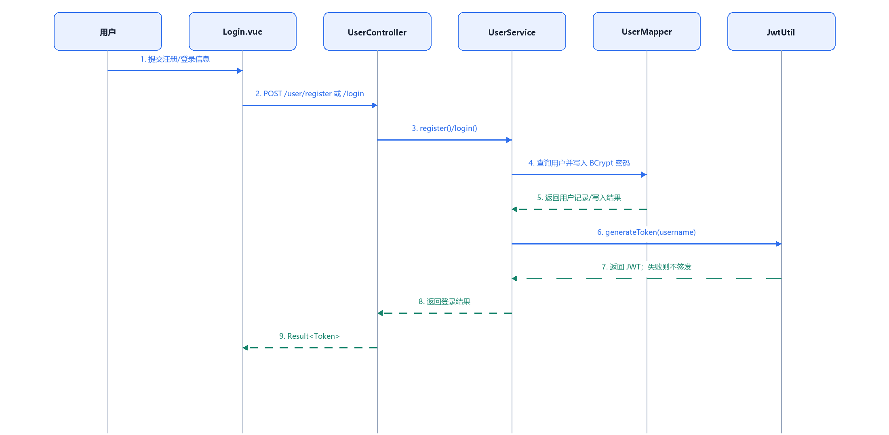

*图 DLD-FIG-02　OBJ-UC01 用户注册、登录与账户安全对象级顺序图*

#### 3.11.2 OBJ-UC02 查询并预订航班

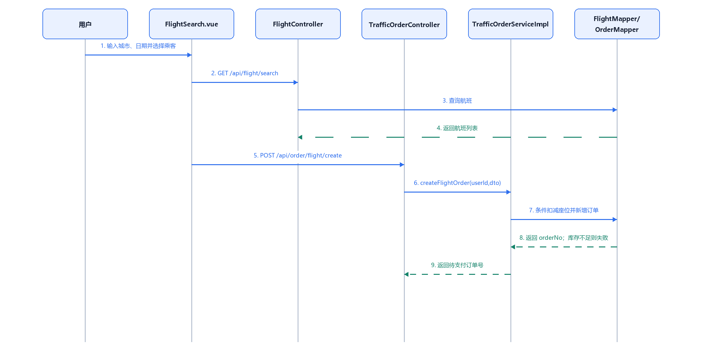

*图 DLD-FIG-03　OBJ-UC02 查询并预订航班对象级顺序图*

#### 3.11.3 OBJ-UC03 查询火车票与提交候补

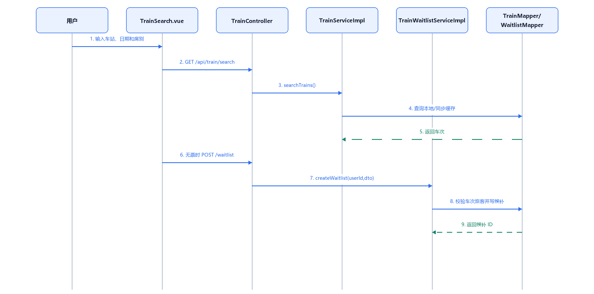

*图 DLD-FIG-04　OBJ-UC03 查询火车票与提交候补对象级顺序图*

#### 3.11.4 OBJ-UC04 交通订单支付、取消与退款

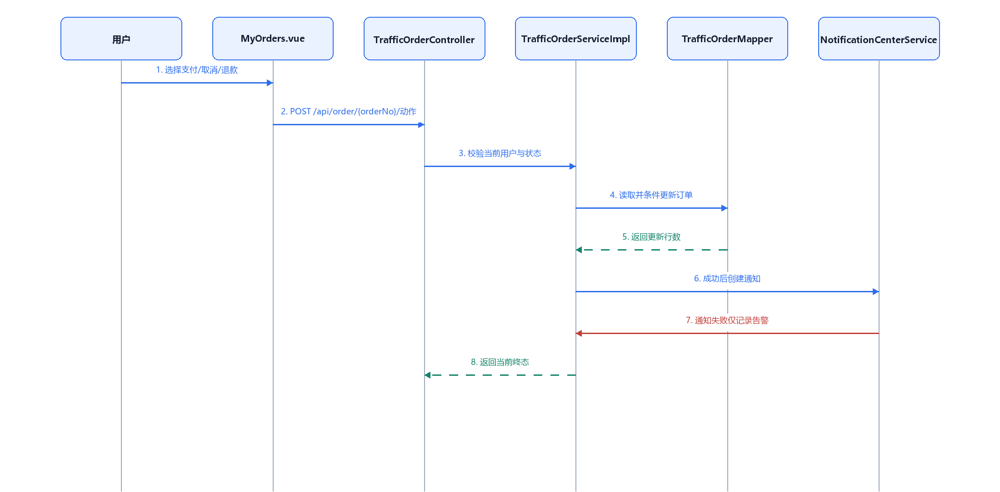

*图 DLD-FIG-05　OBJ-UC04 交通订单支付、取消与退款对象级顺序图*

#### 3.11.5 OBJ-UC05 搜索酒店并完成订房

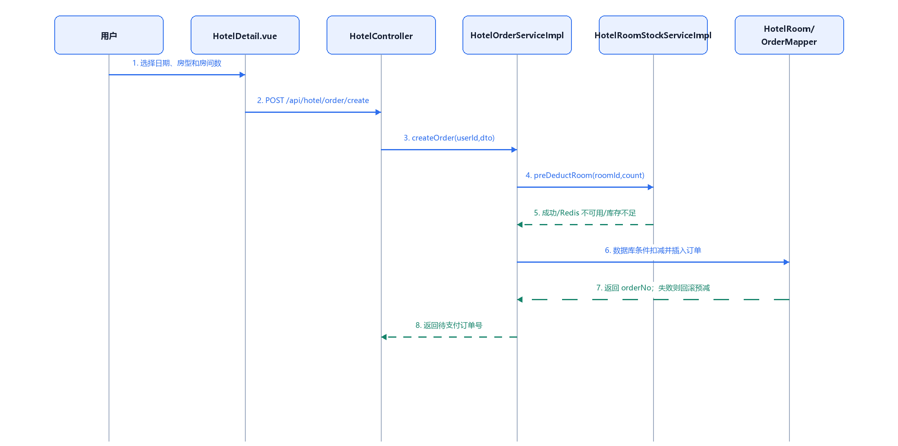

*图 DLD-FIG-06　OBJ-UC05 搜索酒店并完成订房对象级顺序图*

#### 3.11.6 OBJ-UC06 酒店订单支付、取消与退款


*图 DLD-FIG-07　OBJ-UC06 酒店订单支付、取消与退款对象级顺序图*

#### 3.11.7 OBJ-UC07 景点浏览与购票


*图 DLD-FIG-08　OBJ-UC07 景点浏览与购票对象级顺序图*

#### 3.11.8 OBJ-UC08 选择并预订一日游或周边游产品

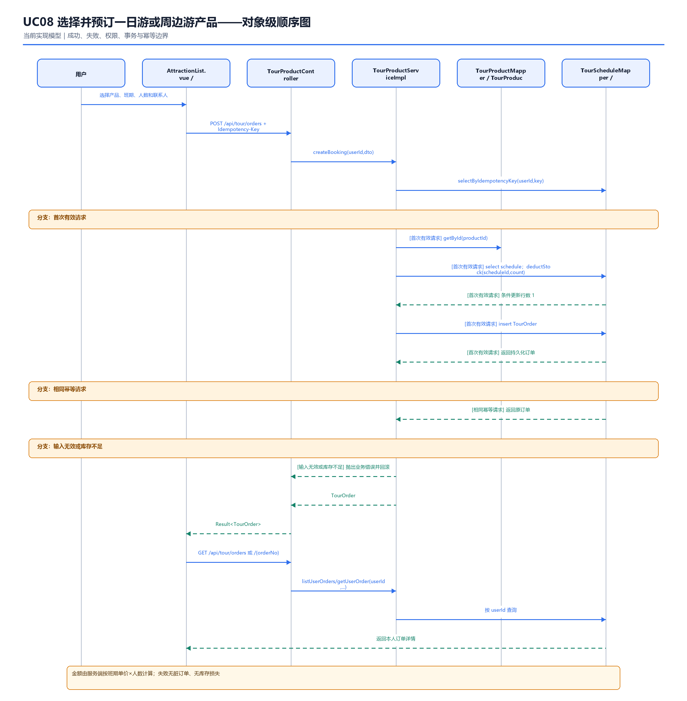

*图 DLD-FIG-09　OBJ-UC08 选择并预订一日游或周边游产品对象级顺序图*

#### 3.11.9 OBJ-UC09 提交评价、回复与举报

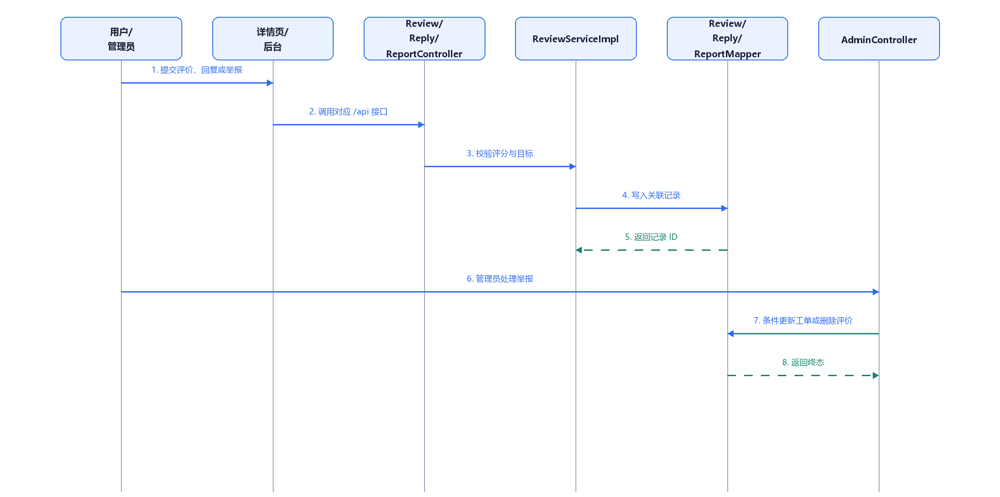

*图 DLD-FIG-10　OBJ-UC09 提交评价、回复与举报对象级顺序图*

#### 3.11.10 OBJ-UC10 优惠券领取与使用


*图 DLD-FIG-11　OBJ-UC10 优惠券领取与使用对象级顺序图*

#### 3.11.11 OBJ-UC11 生成并保存 AI 行程

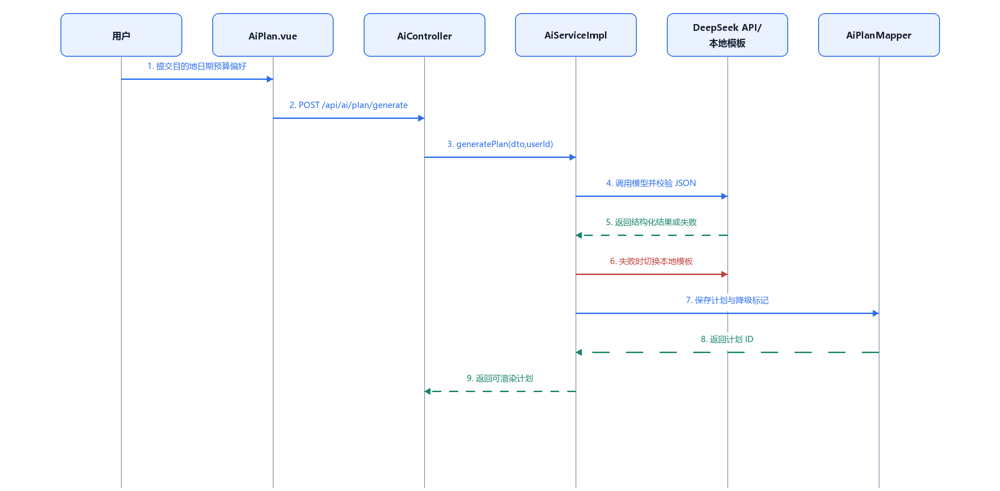

*图 DLD-FIG-12　OBJ-UC11 生成并保存 AI 行程对象级顺序图*

#### 3.11.12 OBJ-UC12 AI 客服多轮对话


*图 DLD-FIG-13　OBJ-UC12 AI 客服多轮对话对象级顺序图*

#### 3.11.13 OBJ-UC13 通知中心与站内私信

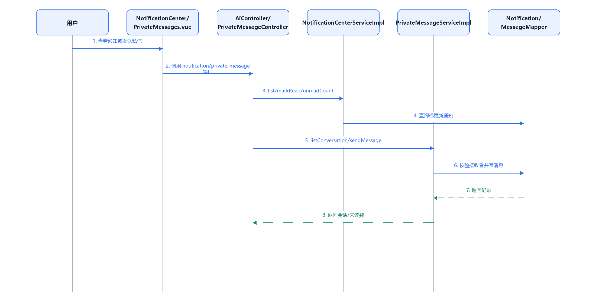

*图 DLD-FIG-14　OBJ-UC13 通知中心与站内私信对象级顺序图*

#### 3.11.14 OBJ-UC14 发布、编辑、删除游记并审核

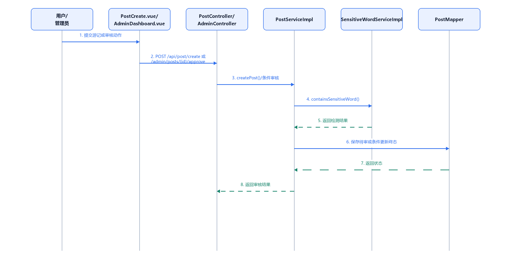

*图 DLD-FIG-15　OBJ-UC14 发布、编辑、删除游记并审核对象级顺序图*

#### 3.11.15 OBJ-UC15 社区点赞、收藏与评论

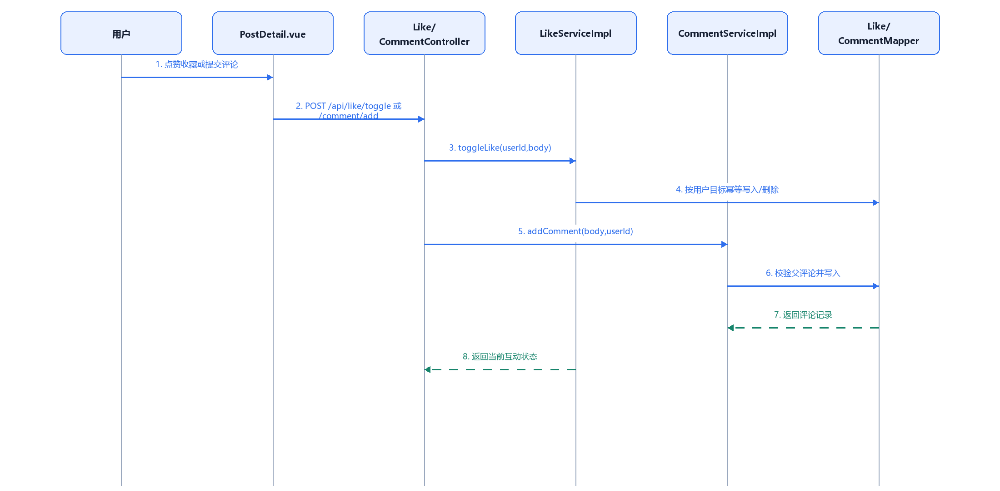

*图 DLD-FIG-16　OBJ-UC15 社区点赞、收藏与评论对象级顺序图*

#### 3.11.16 OBJ-UC16 常用旅客管理

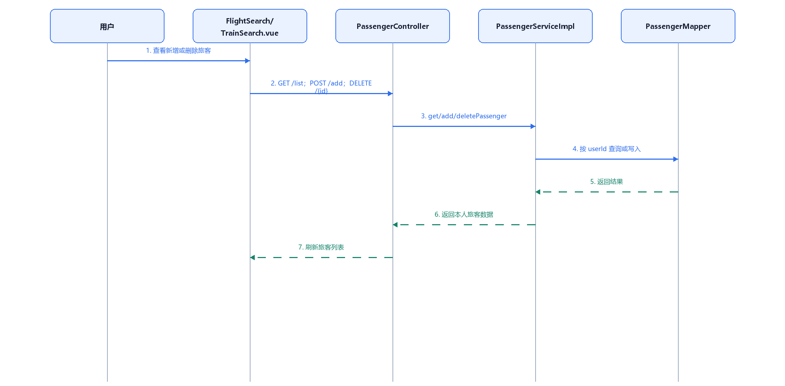

*图 DLD-FIG-17　OBJ-UC16 常用旅客管理对象级顺序图*

#### 3.11.17 OBJ-UC17 用户主页与关注关系

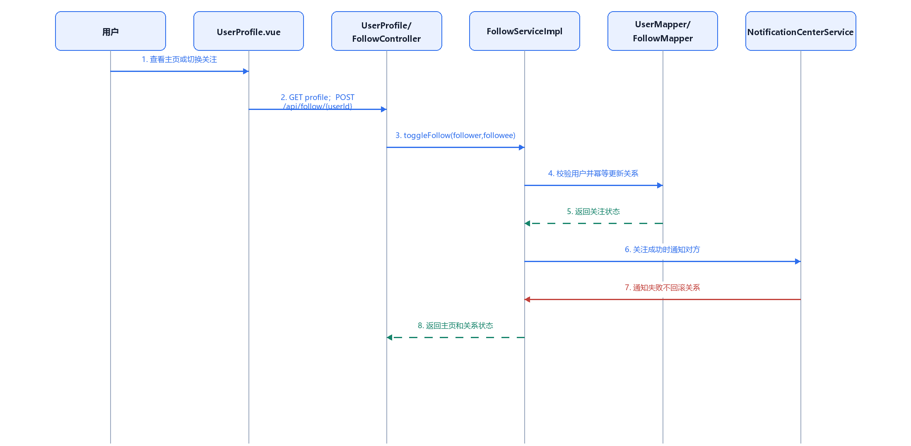

*图 DLD-FIG-18　OBJ-UC17 用户主页与关注关系对象级顺序图*

#### 3.11.18 OBJ-UC18 管理后台资源、订单与用户管理

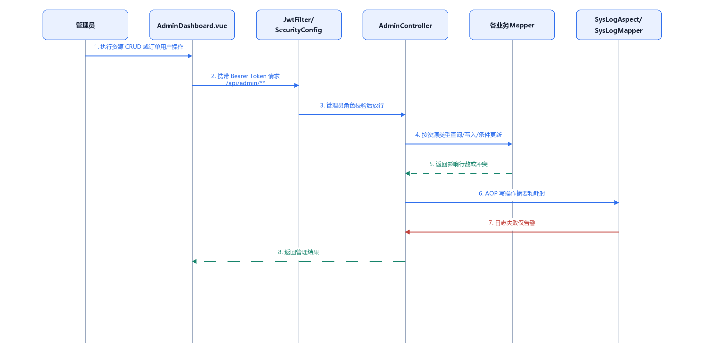

*图 DLD-FIG-19　OBJ-UC18 管理后台资源、订单与用户管理对象级顺序图*

#### 3.11.19 OBJ-UC19 内容安全与可观测性


*图 DLD-FIG-20　OBJ-UC19 内容安全与可观测性对象级顺序图*

### 3.12 对象级模型统一规范

1. 图片标题统一为“OBJ-UCxx + 完整用例名称 + 对象级顺序图”，图片编号 DLD-FIG-02—DLD-FIG-20。
2. 生命线从左到右按 Boundary/Page、Controller、Service、协作 Service/外部适配器、Mapper/Repository、Entity/数据库排列；不要把多个 Service 合并成一个模糊对象。
3. 同步调用使用实线实心箭头，返回使用虚线；事务范围使用 `group transaction` 或旁注；条件分支使用 `alt/else`，可选步骤使用 `opt`，批量或多轮处理使用 `loop`。
4. 每个持久化写操作旁标注引起的状态或数量变化，例如 `status: PENDING→PAID`、`availableSeats -= count`、`usedTime = now`。
5. 每张图必须至少包含一个异常或幂等分支，并在结束处标明返回对象、数据库可验证结果以及库存/状态是否回滚。
6. 图中的对象名称、接口名称、状态值和调用关系与本文类图、接口清单及数据结构保持一致。

## 4 界面设计

### 4.1 外部界面设计

#### 4.1.1 第三方与外部服务接口

- **支付接口**：不接入真实商业微信/支付宝支付，而是采用内部模拟支付逻辑或本地桩代码（Mock）实现 Webhook 回调机制，专注于验证支付完成后的订单状态机流转与库存真实扣减。
- **票务与酒店资源接口**：大交通与酒店数据**优先采用 Mock 接口响应和数据库初始化测试数据**，以此支撑前端页面的搜索与预订交互。
- **AI 接口**：统一封装 DeepSeek API 调用接口，采用 OpenAI 兼容协议；认证方式为 Bearer Auth。对于行程生成等结构化场景，要求返回严格 JSON；接口不可用、超时或返回格式异常时自动切换本地模板，确保 AI 结果可控、可解释。
- **火车公共余票同步**：通过 Playwright Java 读取公共余票页面，在支持的车站与日期场景下补充火车查询数据；同步失败不影响本地数据库查询。
- **文件接口**：支持社区图文图片的上传与获取，在前端或网关层进行图片压缩处理，降低服务器存储与带宽压力。

#### 4.1.2 统一响应格式

前后端统一使用 `Result<T>` 封装所有响应：

```json
{
  "code": 200,
  "msg": "success",
  "data": {}
}
```

前端 Axios 拦截器：`code === 200` 时直接返回 `data` 字段；非 200 抛出 Error；401 / 403 自动清除 Token 并跳转 `/login`。

#### 4.1.3 核心 API 端点清单

**用户认证接口**

| 方法 | 路径             | 描述             | 认证   |
| :--- | :--------------- | :--------------- | :----- |
| POST | `/user/register` | 注册             | 公开   |
| POST | `/user/login`    | 登录，返回 JWT   | 公开   |
| POST | `/user/admin-register` | 管理员注册入口 | 公开 |
| POST | `/user/reset-password` | 重置密码 | 公开 |
| GET  | `/user/me`       | 获取当前用户信息 | 需登录 |
| POST | `/user/password` | 修改密码         | 需登录 |
| DELETE | `/user/account` | 注销账号         | 需登录 |
| GET  | `/api/user/profile/{username}` | 查看用户主页 | 需登录 |
| PUT  | `/api/user/profile/update`     | 修改个人资料 | 需登录 |

**大交通接口**

| 方法 | 路径                              | 描述                              | 认证   |
| :--- | :-------------------------------- | :-------------------------------- | :----- |
| GET  | `/api/flight/search`              | 搜索航班（出发地、目的地、日期）  | 公开   |
| GET  | `/api/flight/{id}`                | 航班详情                          | 公开   |
| GET  | `/api/train/search`               | 搜索车次                          | 公开   |
| GET  | `/api/train/{id}`                 | 车次详情                          | 公开   |
| GET  | `/api/train/transfer`             | 中转方案推荐                      | 公开   |
| GET  | `/api/train/live-sync-status`     | 火车公共余票同步状态              | 公开   |
| POST | `/api/train/waitlist`             | 提交火车候补需求                  | 需登录 |
| POST | `/api/order/flight/create`        | 创建机票订单（含 @RateLimiter）   | 需登录 |
| POST | `/api/order/train/create`         | 创建火车票订单（含 @RateLimiter） | 需登录 |
| POST | `/api/order/{orderNo}/pay`        | 模拟支付                          | 需登录 |
| POST | `/api/order/{orderNo}/cancel`     | 取消订单                          | 需登录 |
| POST | `/api/order/{orderNo}/refund`     | 申请退款                          | 需登录 |
| GET  | `/api/order/list`                 | 我的大交通订单列表                | 需登录 |
| GET  | `/api/order/{orderNo}/receipt`    | 行程单 / 票据                     | 需登录 |
| GET  | `/api/passenger/list`             | 常用旅客列表                      | 需登录 |
| POST | `/api/passenger/add`              | 新增常用旅客                      | 需登录 |
| DELETE | `/api/passenger/{id}`           | 删除常用旅客                      | 需登录 |
| GET  | `/api/price/trend`                | 价格趋势数据                      | 需登录 |

**酒店与目的地接口**

| 方法 | 路径                         | 描述                            | 认证   |
| :--- | :--------------------------- | :------------------------------ | :----- |
| GET  | `/api/hotel/search`          | 酒店搜索                        | 公开   |
| GET  | `/api/hotel/{id}`            | 酒店详情                        | 公开   |
| GET  | `/api/hotel/{id}/rooms`      | 房型列表                        | 公开   |
| POST | `/api/hotel/order/create`    | 创建酒店订单（含 @RateLimiter） | 需登录 |
| POST | `/api/hotel/order/{orderNo}/pay`    | 模拟支付                 | 需登录 |
| POST | `/api/hotel/order/{orderNo}/cancel` | 取消订单                 | 需登录 |
| GET  | `/api/hotel/orders`          | 我的酒店订单列表                | 需登录 |
| GET  | `/api/hotel/order/{orderNo}/receipt` | 酒店订单凭证             | 需登录 |
| POST | `/api/hotel/order/{orderNo}/refund` | 酒店退款申请             | 需登录 |
| GET  | `/api/attraction/search`     | 景点搜索                        | 公开   |
| GET  | `/api/attraction/{id}`       | 景点详情                        | 公开   |
| POST | `/api/attraction/{id}/ticket` | 景点门票购买入口               | 需登录 |
| GET  | `/api/attraction/orders`     | 我的景点票订单                 | 需登录 |
| GET  | `/api/attraction/order/{orderNo}/receipt` | 景点票凭证          | 需登录 |
| GET  | `/api/destinations`          | 热门目的地列表                  | 公开   |
| GET  | `/api/destinations/{slug}`   | 目的地详情                      | 公开   |
| GET  | `/api/tour/list`             | 一日游 / 周边游产品列表         | 需登录 |
| POST | `/api/tour/orders`           | 创建本地游预订，支持幂等键       | 需登录 |
| GET  | `/api/tour/orders`           | 查询当前用户本地游订单           | 需登录 |
| GET  | `/api/tour/orders/{orderNo}` | 查询当前用户本地游订单详情       | 需登录 |
| POST | `/api/review/add`            | 提交评价                        | 需登录 |
| GET  | `/api/review/list`           | 评价列表                        | 公开   |
| POST | `/api/review/report`         | 举报评价                        | 需登录 |
| GET  | `/api/reply/list`            | 商家回复列表                    | 需登录 |

**AI 智能规划接口**

| 方法 | 路径            | 描述                    | 认证   |
| :--- | :-------------- | :---------------------- | :----- |
| POST | `/api/ai/plan/generate` | 生成行程（JSON Output） | 需登录 |
| GET  | `/api/ai/plan/list`     | 我的行程列表            | 需登录 |
| GET  | `/api/ai/plan/{id}`     | 行程详情                | 需登录 |
| POST | `/api/ai/chat`          | AI 客服多轮对话         | 需登录 |
| GET  | `/api/notification/list` | 通知列表               | 需登录 |
| POST | `/api/notification/read/{id}` | 标记通知已读       | 需登录 |
| GET  | `/api/notification/unread-count` | 未读通知数        | 需登录 |
| DELETE | `/api/notification/{id}` | 删除通知             | 需登录 |
| DELETE | `/api/notification/clear-all` | 清空通知          | 需登录 |

**社区接口**

| 方法 | 路径                       | 描述               | 认证   |
| :--- | :------------------------- | :----------------- | :----- |
| GET  | `/api/post/list`           | 帖子列表（推荐流） | 公开   |
| GET  | `/api/post/{id}`           | 帖子详情           | 公开   |
| POST | `/api/post/create`         | 发布帖子 / 草稿    | 需登录 |
| GET  | `/api/post/my`             | 我的发布           | 需登录 |
| GET  | `/api/post/following`      | 关注流             | 需登录 |
| PUT  | `/api/post/{id}`           | 修改帖子           | 需登录 |
| DELETE | `/api/post/{id}`          | 删除帖子           | 需登录 |
| POST | `/api/like/toggle`         | 点赞 / 收藏切换    | 需登录 |
| GET  | `/api/like/status`         | 点赞 / 收藏状态    | 需登录 |
| GET  | `/api/like/my/collects`    | 我的收藏           | 需登录 |
| GET  | `/api/comment/list`        | 评论列表           | 需登录 |
| POST | `/api/comment/add`         | 发表评论           | 需登录 |
| DELETE | `/api/comment/{id}`       | 删除评论           | 需登录 |
| POST | `/api/follow/{userId}`     | 关注/取关用户      | 需登录 |
| GET  | `/api/follow/fans/{userId}` | 粉丝列表          | 需登录 |
| GET  | `/api/follow/following/{userId}` | 关注列表     | 需登录 |
| POST | `/api/file/upload`         | 上传图片           | 需登录 |

**管理后台接口（需 `ROLE_ADMIN`，对应 `role=1`）**

| 方法                | 路径                         | 描述           |
| :------------------ | :--------------------------- | :------------- |
| GET                 | `/api/admin/dashboard/data`  | 可观测大屏数据 |
| GET                 | `/api/admin/stats`           | 后台统计摘要   |
| GET/POST/PUT/DELETE | `/api/admin/flights/**`      | 航班资源管理   |
| GET/POST/PUT/DELETE | `/api/admin/trains/**`       | 火车资源管理   |
| GET/POST/PUT/DELETE | `/api/admin/hotels/**`       | 酒店资源管理   |
| GET/POST/PUT/DELETE | `/api/admin/hotel-rooms/**`  | 房型资源管理   |
| GET                 | `/api/admin/orders`          | 订单流水查看   |
| GET                 | `/api/admin/posts`           | 内容审核列表   |
| POST                | `/api/admin/posts/{id}/approve` | 审核通过    |
| POST                | `/api/admin/posts/{id}/reject`  | 审核拒绝    |
| GET                 | `/api/admin/review-reports`  | 评价举报工单   |
| POST                | `/api/admin/review-reports/{id}/resolve` | 处理举报 |
| POST                | `/api/admin/review-reports/{id}/reject` | 驳回举报 |
| POST                | `/api/admin/review-reports/{id}/delete-review` | 删除被举报评价 |
| GET/POST/DELETE     | `/api/admin/reviews/{reviewId}/replies` | 商家回复管理 |
| POST                | `/api/admin/orders/{orderNo}/refund/approve` | 退款通过 |
| POST                | `/api/admin/orders/{orderNo}/refund/reject` | 退款拒绝 |
| GET                 | `/api/admin/import/{type}/template` | CSV 导入模板下载 |
| POST                | `/api/admin/import/{type}`   | CSV 导入 |
| GET                 | `/api/admin/users`           | 用户管理       |
| POST                | `/api/admin/users/{id}/disable` | 禁用用户    |
| POST                | `/api/admin/users/{id}/enable`  | 启用用户    |
| GET                 | `/api/admin/logs`            | 系统日志查看   |
| GET/POST/DELETE     | `/api/admin/sensitive-words` | 敏感词管理     |
| GET/POST/PUT/DELETE | `/api/admin/coupons`         | 优惠券管理     |

**优惠券接口**

| 方法 | 路径                         | 描述       | 认证   |
| :--- | :--------------------------- | :--------- | :----- |
| GET  | `/api/coupon/list`           | 优惠券列表 | 公开   |
| GET  | `/api/coupon/my`             | 我的优惠券 | 需登录 |
| POST | `/api/coupon/claim/{id}`     | 领取优惠券 | 需登录 |

#### 4.1.4 接口限流设计

`@RateLimiter` 注解用于高频写接口，`RateLimiterInterceptor` 基于 Redis 计数器 + IP 拦截超限请求：

```java
// 创建订单接口：每个 IP 每秒最多 5 次
@RateLimiter(maxRequests = 5, timeWindowSeconds = 1)
@PostMapping("/api/order/flight/create")
public Result<TrafficOrderVO> createOrder(@RequestBody TrafficOrderCreateDTO dto) { ... }
```

超限时返回 `HTTP 429`，响应体 `code=429, msg="请求过于频繁，请稍后再试"`。

---

### 4.2 内部界面设计

#### 4.2.1 服务间通信规范

- **服务间通信**：采用 RESTful API，统一使用 JSON 数据格式交互。主外键命名统一采用小写下划线，时间字段统一约定为 `create_time`、`update_time`，确保各子系统联调时不出现数据割裂。
- **接口文档管理**：接口契约由 Controller 定义、前端调用清单和本文接口表共同约束，并通过 Apifox/OpenAPI 维护请求、响应和错误码说明。
- **鉴权机制**：通过 JWT 在 HTTP Header 中传递 Token，后端过滤器统一进行合法性与有效期校验。
- **异步处理机制（降级设计）**：为降低验收环境搭建成本，不引入重量级消息队列（如 Kafka/RabbitMQ）。站内信通知由 `NotificationCenterService` 直接落库；操作日志由 AOP 切面记录；超时未支付订单、库存回滚和帖子 AI 审核由 Spring 定时任务（`@Scheduled`）处理。

#### 4.2.2 数据库设计

本系统采用 MySQL 8.0，业务表主要使用 `tm_` 前缀，系统日志与敏感词表使用 `sys_` 前缀。主键统一为 `BIGINT AUTO_INCREMENT`，公共字段按表结构包含 `create_time`、`update_time`（`DATETIME`）与逻辑删除字段 `deleted`（`TINYINT DEFAULT 0`）。

**用户与权限域**

| 表名        | 关键字段                                                                                                | 说明                                             |
| :---------- | :------------------------------------------------------------------------------------------------------ | :----------------------------------------------- |
| `tm_user`   | `id`, `username`, `password`(BCrypt), `nickname`, `avatar`, `email`, `phone`, `bio`, `role`(0 普通/1 管理员), `status` | 账号主表                                         |
| `tm_follow` | `id`, `follower_id`, `followee_id`                                                                     | 关注关系，唯一约束 `(follower_id, followee_id)` |

**大交通域**

| 表名               | 关键字段                                                                                                                                                                                     | 说明                         |
| :----------------- | :------------------------------------------------------------------------------------------------------------------------------------------------------------------------------------------- | :--------------------------- |
| `tm_flight`        | `id`, `flight_no`, `airline`, `departure_city`, `arrival_city`, `departure_time`, `arrival_time`, `economy_price`, `business_price`, `total_seats`, `available_seats`, `status` | 航班表 |
| `tm_train`         | `id`, `train_no`, `train_type`, `departure_station`, `arrival_station`, `departure_time`, `arrival_time`, `first_class_price`, `second_class_price`, `first_class_seats`, `second_class_seats`, `status` | 车次表 |
| `tm_traffic_order` | `id`, `order_no`, `user_id`, `order_type`(0 机票/1 火车票), `ticket_id`, `seat_type`, `ticket_count`, `passenger_name`, `passenger_id_card`, `amount`, `status`, `pay_time`, `create_time` | 大交通订单 |
| `tm_train_waitlist` | `id`, `user_id`, `train_no`, `departure_station`, `arrival_station`, `departure_time`, `seat_type`, `ticket_count`, `status` | 火车候补 |
| `tm_passenger`     | `id`, `user_id`, `name`, `id_card`, `phone`, `type` | 常用旅客 |
| `tm_price_history` | `id`, `ticket_id`, `ticket_type`, `record_date`, `lowest_price` | 历史价格记录 |
| `tm_coupon`        | `id`, `name`, `description`, `category`, `discount_type`, `discount_value`, `min_amount`, `expire_date`, `stock`, `status` | 优惠券 |
| `tm_user_coupon`   | `id`, `user_id`, `coupon_id`, `status`, `received_time`, `used_time` | 用户领券记录 |

**酒店与目的地域**

| 表名               | 关键字段                                                                                                                               | 说明                      |
| :----------------- | :------------------------------------------------------------------------------------------------------------------------------------- | :------------------------ |
| `tm_hotel`         | `id`, `name`, `city`, `address`, `star_rating`, `description`, `cover_img`, `lat`, `lng`, `avg_price`, `score`, `status` | 酒店主表 |
| `tm_hotel_room`    | `id`, `hotel_id`, `room_type`, `bed_type`, `area`, `price`, `total_rooms`, `available_rooms`, `facilities`, `status` | 房型表，使用可售房量原子扣减防超卖 |
| `tm_hotel_order`   | `id`, `order_no`, `user_id`, `hotel_id`, `room_id`, `hotel_name`, `room_type`, `room_count`, `check_in_date`, `check_out_date`, `nights`, `guest_name`, `guest_phone`, `amount`, `status`, `create_time` | 酒店订单 |
| `tm_attraction`    | `id`, `name`, `city`, `address`, `description`, `cover_img`, `adult_price`, `child_price`, `total_tickets`, `available_tickets`, `open_time`, `lat`, `lng`, `status` | 景点表 |
| `tm_attraction_order` | `id`, `order_no`, `user_id`, `attraction_id`, `attraction_name`, `city`, `adult_count`, `child_count`, `ticket_count`, `guest_name`, `guest_phone`, `amount`, `status` | 景点门票订单 |
| `tm_destination`   | `id`, `slug`, `name`, `country`, `tag`, `keywords`, `img`, `desc`, `intro`, `highlights`, `status` | 热门目的地 |
| `tm_media_asset`   | `id`, `target_type`, `target_id`, `media_type`, `url`, `source_url`, `source_name`, `license_name` | 酒店/景点/游记图片来源 |
| `tm_review`        | `id`, `user_id`, `target_type`, `target_id`, `order_id`, `rating`, `content`, `images`, `tags`, `status` | 评价表，`tags` 为逗号分隔 |
| `tm_reply`         | `id`, `review_id`, `user_id`, `content` | 商家回复 |
| `tm_review_report` | `id`, `review_id`, `reporter_id`, `reason`, `status`(0 待处理/1 已处理)                                                                | 评价举报                  |
| `tm_tour_product`  | `id`, `name`, `description`, `tour_type`, `departure_city`, `destination`, `duration`, `price`, `cover_img`, `status` | 一日游/周边游产品 |
| `tm_tour_product_step` | `id`, `product_id`, `day_no`, `sequence_no`, `place_name`, `attraction_id`, `stay_minutes` | 本地游行程步骤 |

**社区域**

| 表名                 | 关键字段                                                                                                                                       | 说明               |
| :------------------- | :--------------------------------------------------------------------------------------------------------------------------------------------- | :----------------- |
| `tm_post`            | `id`, `user_id`, `title`, `content`, `images`, `location`, `tags`, `like_count`, `comment_count`, `status`(0 待审/1 已发/2 拒绝), `view_count` | 游记帖子           |
| `tm_comment`         | `id`, `post_id`, `user_id`, `parent_id`(NULL 为顶级), `content`, `like_count`                                                                  | 树状评论           |
| `tm_like`            | `id`, `user_id`, `target_type`(POST/COMMENT/COLLECT), `target_id`                                                                              | 点赞 / 收藏记录 |

**AI 与通知域**

| 表名 | 关键字段 | 说明 |
| :--- | :--- | :--- |
| `tm_ai_plan` | `id`, `user_id`, `title`, `destination`, `start_date`, `days`, `budget`, `people_count`, `preferences`, `plan_content`, `status`, `create_time` | AI 行程规划结果 |
| `tm_ai_chat` | `id`, `user_id`, `session_id`, `role`, `content`, `create_time` | AI 客服对话记录 |
| `tm_notification` | `id`, `user_id`, `type`, `title`, `content`, `action_url`, `is_read`, `create_time` | 站内通知 |

**后台与监控域**

| 表名                | 关键字段                                                                                                                      | 说明         |
| :------------------ | :---------------------------------------------------------------------------------------------------------------------------- | :----------- |
| `sys_log`           | `id`, `method_name`, `class_name`, `params`, `result`, `duration_ms`, `user_id`, `ip`, `status`, `create_time`                | AOP 操作日志 |
| `sys_sensitive_word` | `id`, `word`, `level`, `create_time`                                                                                         | 敏感词库     |

**关键索引**

```sql
CREATE INDEX idx_flight_depart ON tm_flight(departure_city, arrival_city, departure_time);
CREATE INDEX idx_hotel_city ON tm_hotel(city);
CREATE INDEX idx_post_status ON tm_post(status, create_time);
CREATE INDEX idx_traffic_order_user ON tm_traffic_order(user_id, status);
CREATE INDEX idx_hotel_order_user ON tm_hotel_order(user_id, status);
CREATE INDEX idx_sys_log_time ON sys_log(create_time, status);
```

**防超卖核心 SQL**

数据库原子扣减库存（以酒店房型为例）：

```sql
UPDATE tm_hotel_room
SET available_rooms = available_rooms - #{count}
WHERE id = #{roomId}
  AND status = 1
  AND available_rooms >= #{count}
```

Redis 原子预减（Lua 脚本）：

```lua
local current = redis.call('GET', KEYS[1])
if not current then
    return -2
end
current = tonumber(current)
local count = tonumber(ARGV[1])
if current < count then
    return -1
end
redis.call('DECRBY', KEYS[1], count)
return current - count
```


#### 4.2.3 逻辑服务划分

后端采用模块化单体部署，各逻辑服务编译为一个 Spring Boot 应用、共享一个 MySQL 数据库，并通过 Java 方法调用协作。逻辑边界用于约束职责、数据归属和接口依赖。

| 服务编号 | 逻辑服务 | 实现组件 | 负责数据 | 对外能力 |
| :--- | :--- | :--- | :--- | :--- |
| SVC-IDENTITY | 身份与用户服务 | `UserController`、`UserProfileController`、`FollowController`、`PassengerController` | `tm_user`、`tm_follow`、`tm_passenger` | 注册登录、资料、关系、旅客 |
| SVC-TRAFFIC | 交通与订单服务 | `FlightController`、`TrainController`、`TrafficOrderController` | `tm_flight`、`tm_train`、`tm_traffic_order`、`tm_train_waitlist`、`tm_price_history` | 交通查询、下单、支付、取消、退款 |
| SVC-LOCAL | 酒店景点与权益服务 | `HotelController`、`AttractionController`、`ReviewController`、`CouponController`、`TourProductController` | 酒店、景点、评价、优惠券、本地游相关表 | 酒店、景点、评价、优惠券和本地游业务 |
| SVC-AI | AI 与消息服务 | `AiController`、`AiServiceImpl`、`PrivateMessageController` | `tm_ai_plan`、`tm_ai_chat`、`tm_notification`、`tm_private_message`、`tm_private_contact` | 行程、问答、通知、私信 |
| SVC-COMMUNITY | 社区内容服务 | `PostController`、`CommentController`、`LikeController`、`FileController` | `tm_post`、`tm_comment`、`tm_like` | 发帖、内容流、评论、点赞收藏、文件 |
| SVC-OPS | 运营管理服务 | `AdminController`、`SysLogAspect`、`SensitiveWordService` | `sys_log`、`sys_sensitive_word`；其他域数据通过业务接口管理 | 审核、资源运营、退款审核、指标 |

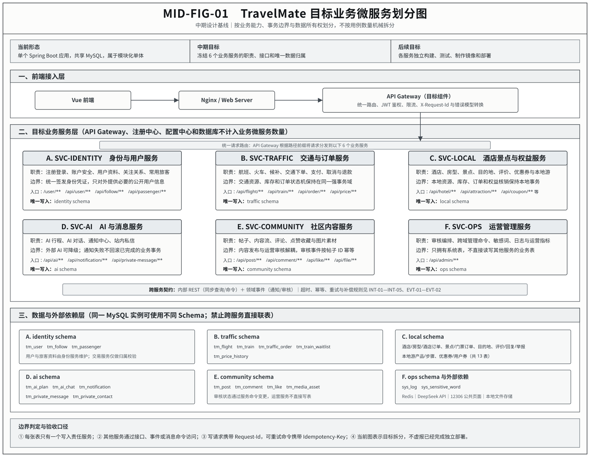

**数据归属规则：**

1. 每张业务表只能有一个写入责任服务；其他服务通过接口读取或请求变更，不直接跨域写表。
2. 订单服务只保存下单时必要的资源快照，资源名称和价格变化不反向修改历史订单。
3. 用户身份通过 JWT 中的稳定用户标识传递；服务不得复制用户密码、手机号等敏感字段。
4. 通知属于 AI 与消息服务，业务服务提交通知命令；通知失败不回滚已成功的订单或审核事务。
5. 运营服务通过各业务服务的管理接口执行操作；`sys_log` 可独立记录审计事件。

**逐表唯一写入责任：**

| 数据表 | 唯一写入责任服务 | 其他服务访问方式 |
| :--- | :--- | :--- |
| `tm_user` | SVC-IDENTITY | JWT/用户查询接口 |
| `tm_follow` | SVC-IDENTITY | 关注关系查询接口 |
| `tm_passenger` | SVC-IDENTITY | 旅客归属校验接口 |
| `tm_flight` | SVC-TRAFFIC | 航班查询/管理接口 |
| `tm_train` | SVC-TRAFFIC | 车次查询/管理接口 |
| `tm_traffic_order` | SVC-TRAFFIC | 订单查询、状态命令 |
| `tm_train_waitlist` | SVC-TRAFFIC | 候补创建/查询接口 |
| `tm_price_history` | SVC-TRAFFIC | 价格趋势只读接口 |
| `tm_hotel` | SVC-LOCAL | 酒店查询/管理接口 |
| `tm_hotel_room` | SVC-LOCAL | 房型库存接口 |
| `tm_hotel_order` | SVC-LOCAL | 酒店订单查询、状态命令 |
| `tm_attraction` | SVC-LOCAL | 景点查询/管理接口 |
| `tm_attraction_order` | SVC-LOCAL | 门票订单查询接口 |
| `tm_destination` | SVC-LOCAL | 目的地查询/管理接口 |
| `tm_tour_product` | SVC-LOCAL | 本地游产品查询接口 |
| `tm_tour_product_step` | SVC-LOCAL | 随产品聚合读取 |
| `tm_review` | SVC-LOCAL | 评价查询、审核命令 |
| `tm_reply` | SVC-LOCAL | 回复查询/写入接口 |
| `tm_review_report` | SVC-LOCAL | 举报提交/处理命令 |
| `tm_coupon` | SVC-LOCAL | 优惠券查询/管理接口 |
| `tm_user_coupon` | SVC-LOCAL | 领券/核销接口 |
| `tm_ai_plan` | SVC-AI | 本人计划查询接口 |
| `tm_ai_chat` | SVC-AI | 本人会话接口 |
| `tm_notification` | SVC-AI | 通知命令和本人查询接口 |
| `tm_private_message` | SVC-AI | 私信发送/会话接口 |
| `tm_private_contact` | SVC-AI | 联系人查询接口 |
| `tm_post` | SVC-COMMUNITY | 内容查询、审核状态命令 |
| `tm_comment` | SVC-COMMUNITY | 评论接口 |
| `tm_like` | SVC-COMMUNITY | 点赞/收藏接口 |
| `tm_media_asset` | SVC-COMMUNITY | 文件上传后返回素材引用 |
| `sys_log` | SVC-OPS | 审计日志只读接口 |
| `sys_sensitive_word` | SVC-OPS | 敏感词查询/管理接口 |

#### 4.2.4 跨服务接口与失败处理

下表描述逻辑服务之间的交互语义；在模块化单体中由 Controller、Service 和 Mapper 的进程内调用实现。所有写请求携带 `X-Request-Id`，幂等请求额外携带 `Idempotency-Key`。

| 调用方 → 被调用方 | 接口/事件 | 一致性要求 | 超时、重试与补偿 |
| :--- | :--- | :--- | :--- |
| SVC-AI → SVC-TRAFFIC/SVC-LOCAL | 查询交通、酒店、景点候选资源 | 只读，允许短时陈旧 | 2 秒超时，最多重试 1 次；失败时生成不含实时库存承诺的降级行程 |
| SVC-TRAFFIC/SVC-LOCAL → SVC-IDENTITY | 校验用户与旅客归属 | 强认证、只读 | 失败即拒绝下单，不进行库存扣减 |
| SVC-TRAFFIC/SVC-LOCAL → SVC-AI | `NotificationRequested` 通知命令 | 最终一致 | 业务先提交，通知失败记日志并重试，不回滚订单 |
| SVC-COMMUNITY → SVC-OPS | `PostSubmitted` 审核事件 | 最终一致 | 事件重复按帖子 ID 幂等；失败保持待审核并由调度器重试 |
| SVC-OPS → SVC-COMMUNITY | 审核通过/拒绝命令 | 状态条件更新 | 仅允许 `待审核` 状态处理；重复命令返回当前终态 |
| SVC-OPS → SVC-TRAFFIC/SVC-LOCAL | 退款审核命令 | 强一致到单订单 | 按订单号和预期状态幂等；超时后先查状态再决定是否重试 |
| SVC-OPS → SVC-TRAFFIC | 航班/车次 CRUD、订单查询 | 管理员鉴权、单资源事务 | 失败返回明确冲突；删除被订单引用的资源时拒绝或软删除 |
| SVC-OPS → SVC-LOCAL | 酒店/房型/景点/优惠券 CRUD | 管理员鉴权、单资源事务 | CSV 导入按行报告失败；库存变更携带版本或预期值 |
| SVC-OPS → SVC-IDENTITY | 用户启用/禁用命令 | 状态条件更新 | 重复命令幂等；调用失败不得伪报成功 |
| SVC-COMMUNITY → SVC-IDENTITY | 查询作者公开资料/关注状态 | 只读，隐私字段裁剪 | 500 ms 超时；失败时内容仍可显示匿名化作者信息 |
| SVC-LOCAL → SVC-LOCAL | 优惠券核销与酒店/门票订单 | 同服务本地事务 | 核销失败时整体回滚，订单与用户券状态保持一致 |
| 订单服务 → Redis/MySQL | 库存预减与最终扣减 | 数据库为最终事实源 | Redis 失败降级数据库；数据库失败立即回滚 Redis 预减；超时订单执行补偿 |

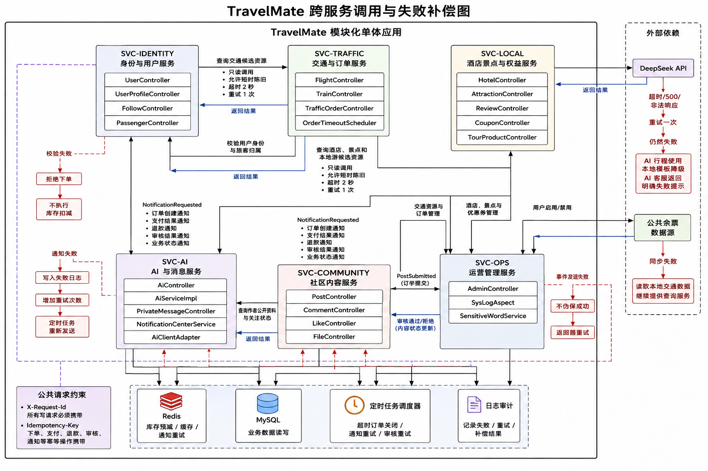

---

### 4.3 用户界面设计

- **风格与实现指南**：采用简洁卡片式设计，主色调为蓝色系，保证页面的可读性与交互效率。在前端开发中合理复用通用 UI 组件库（Element Plus）和图表可视化库（ECharts），不在 UI 原创上投入过多时间。

- **核心页面布局**：
  - **综合首页（成员 A/B）**：顶部多 Tab 搜索栏（机票/火车票/酒店）+ 核心功能入口区 + 底部推荐展位。
  - **交通搜索页（成员 A）**：`FlightSearch.vue` 与 `TrainSearch.vue` 分别提供航班 / 火车搜索、乘客选择、下单入口和价格趋势弹窗。
  - **目的地页面（成员 B）**：`HotelSearch.vue` 提供酒店筛选；`HotelDetail.vue` 展示酒店详情、房型摘要、图文评价列表与评价提交入口；`AttractionList.vue` 展示景点与一日游 / 周边游产品。
  - **AI 规划页（成员 C）**：`AiPlan.vue` 左侧为需求输入和多轮对话，右侧展示生成的结构化行程卡片，并关联站内酒店/航班等查询能力。
  - **社区发现页（成员 D）**：`Community.vue`、`PostCreate.vue`、`PostDetail.vue` 支持双列瀑布流、图文发布、点赞收藏、关注与树状评论。
  - **用户订单页（成员 A/B 公共）**：`MyOrders.vue` 顶部状态筛选标签（待支付/已支付/已出行/退款）+ 订单列表卡片 + 核心操作按钮（去支付、取消、查看凭证）。
  - **后台管理（成员 D）**：`AdminDashboard.vue` 采用左侧折叠菜单 + 右侧内容区布局，包含可观测仪表盘、航班/火车/酒店/房型 CRUD、优惠券、订单流水、帖子审核、评价举报工单、敏感词和系统日志。

---

## 5 异常处理设计

### 5.1 出错信息管理

- **统一响应格式与状态码规范**：
  前后端统一定义全局响应格式结构：

  ```json
  {
    "code": 200,
    "msg": "错误描述/成功提示",
    "data": null
  }
  ```

- **核心异常分类枚举**：

  - `401`：认证失败/Token 过期（跳转登录页）
  - `403`：RBAC 权限不足（拒绝访问特定接口）
  - `404`：请求的 Mock 资源或路径不存在
  - `429`：接口限流拦截（超过 RateLimiter 阈值）
  - `500`：服务器内部兜底错误
  - `601`：库存不足/超卖拦截（针对小并发订单防超卖设计）
  - 自定义错误码说明：`ERR_001` AI 服务暂不可用；`ERR_002` 库存不足，订单关闭；`ERR_003` 登录过期，请重新认证。

- **异常处理机制**：
  - **后端**：通过 `@RestControllerAdvice` 结合统一异常处理类（`GlobalExceptionHandler`）集中捕获自定义业务异常和运行时异常，并转化为规范的 JSON 响应，不将数据库原生报错栈暴露给前端。特殊处理：数据库连接失败提示检查 `DB_PASSWORD`；表不存在提示执行 `docs/sql/init.sql`。
  - **前端**：通过 Axios 全局拦截器（Interceptors）统一拦截响应，根据 `code` 码触发统一的 UI Toast 错误提示或路由重定向。

### 5.2 故障预防与补救

- **AI 服务降级与容错**：当 DeepSeek API 接口超时、触发并发限流或 JSON 结构化输出失败时，系统**自动降级切换为本地预设的静态推荐模板或默认行程方案**，并辅以"人工校验提示"，确保 AI 规划核心页面在演示阶段的可用性。调用时需严格控制 `max_tokens` 以避免输出被中途截断导致 JSON 损坏。
- **库存防并发与回滚**：
  - 在订票、订房场景中，后端采用**数据库原子扣减（UPDATE...WHERE available > 0）**预防超卖故障；酒店房型额外通过 Redis Lua 进行预减，数据库侧最终校验，形成双重保障。
  - 利用 Spring `@Scheduled` 定时任务扫描待支付订单，确保订单超过 15 分钟仍未支付时，**自动触发库存回滚机制**释放预占资源。
- **一致性问题排查**：强制要求主外键关系（如订单表与模拟资源表）在插入时进行程序逻辑校验，防止孤儿数据导致联调崩溃。
  - **数据保障（降级）**：项目提供包含完整数据结构与初始测试数据（Mock 数据）的 SQL 初始化脚本 [`init.sql`](../docs/sql/init.sql)，保障开发、测试与验收环境中的可重现启动。

### 5.3 系统维护设计

- **轻量日志审计**：不使用 ELK 栈，改为采用 Spring Boot 本地日志文件记录（Logback），并结合 **Spring AOP 切面（SysLogAspect）** 实现系统关键操作的日志审计，将关键记录持久化到数据库 `sys_log` 表中。`SysLogAspect` 环绕通知自动拦截所有 `com.travelmate.controller` 下的方法，记录方法名、参数摘要、耗时、操作用户、IP 及成功/失败状态，日志落库失败不影响业务。
- **轻量监控大屏（成员 D 负责）**：在管理后台提供自研的数据可观测仪表盘。不引入第三方 APM 探针，基于 Redis 和本地应用内存统计并展示系统 QPS、热门查询词频、实时报错日志列表和订单财务图表，前端使用 ECharts 可视化。
- **接口限流控制**：通过 `@RateLimiter` 自定义注解结合 Redis 计数器，对下单等敏感接口配置 QPS 限流防刷，超限返回 HTTP 429。
- **数据库维护**：提供 `setup.ps1` 脚本支持一键初始化/重建数据库，使用 `mysql.exe` 直接 `SOURCE` 导入以保证中文数据编码正确。

### 5.4 故障演练与恢复验收

下表规定故障演练场景、预期行为和恢复判定指标。实验记录包含起止时间、注入方式、日志片段、业务结果、恢复时间、提交号和报告路径。

| 实验编号 | 故障注入 | 预期系统行为 | 恢复与判定指标 |
| :--- | :--- | :--- | :--- |
| CHAOS-01 | 停止 Redis 或阻断连接 | 酒店下单降级数据库原子扣减；限流/缓存异常有告警，不产生负库存 | 恢复 Redis 后执行库存同步；成功订单数等于库存扣减量 |
| CHAOS-02 | DeepSeek 超时、返回 500 或非法 JSON | UC11 返回本地模板并标记降级；UC12 返回可解释错误，不编造库存 | 外部接口恢复后新请求正常；核心页面持续可用 |
| CHAOS-03 | 通知写入失败 | 订单、审核或关注主事务正常提交；日志记录通知失败 | 重试或人工补发后通知可查；主业务状态不回滚 |
| CHAOS-04 | MySQL 在库存预减后失败 | 事务回滚并释放 Redis 预减，不产生孤立订单 | 数据库恢复后对账差异为 0 |
| CHAOS-05 | 应用实例滚动重启 | 健康检查摘除未就绪实例，请求由可用实例处理 | `readiness` 恢复后重新接流；错误率和恢复时间写入报告 |

---

## 6 性能优化和安全设计

### 6.1 性能优化

- **Redis 缓存热点数据**：Redis 用于接口限流和酒店房型库存预减；用户会话采用无状态 JWT，Token 失效由有效期和服务端密钥轮换控制。
- **前端资源优化**：由于不部署真实 CDN 节点，前端性能优化通过 Vue 路由的**页面组件懒加载**、Vite 构建时的代码分包（Code Splitting）以及在网关层/Nginx 配置 HTTP Gzip 压缩来实现。
- **图片与 UGC 内容压缩**：针对旅途社区的 UGC 图文发布，前端在上传前进行图片尺寸裁切与压缩，减少服务器带宽与存储占用。
- **防并发与小规模削峰**：在订房场景，通过 Redis Lua 进行**预占库存的快速校验**，阻挡无效的高并发写请求直达数据库；机票/火车票和酒店最终均通过数据库原子 UPDATE 完成库存校验；通过 Spring 定时任务处理超时取消和库存回滚。

### 6.2 性能对比与弹性伸缩设计

性能结论必须来自同一提交、同一数据量、同一硬件和同一压测脚本。选取航班查询、酒店查询和酒店下单三个接口，每个场景预热后连续运行 3 次，报告中同时给出每次结果和中位数，不只报告最好值。

| 测试编号 | 接口与负载 | 对比变量 | 记录指标 |
| :--- | :--- | :--- | :--- |
| PERF-TC-101 | `GET /api/flight/search`，20/50/100 并发 | 数据库查询基线 vs 查询优化后 | QPS、P50/P95/P99、错误率、CPU、数据库连接数 |
| PERF-TC-102 | `GET /api/hotel/search`，20/50/100 并发 | 无缓存 vs 热点缓存 | QPS、P95、缓存命中率、MySQL QPS |
| PERF-TC-103 | `POST /api/hotel/order/create`，固定库存 50 | 仅数据库原子扣减 vs Redis 预减 + 数据库扣减 | 成功数、失败数、负库存数、重复订单数、P95 |

Kubernetes 正式部署包含 `identity-service`、`traffic-service`、`local-service`、`ai-service`、`community-service`、`ops-service` 六个业务服务，每个服务均配置 `Deployment`、`Service`、`readinessProbe`、`livenessProbe` 和 `HorizontalPodAutoscaler`。HPA 参数采用 `minReplicas=2`、`maxReplicas=6`、CPU 平均利用率 60%。扩容验收记录触发阈值、扩容耗时、扩容前后 P95/错误率和回落时间。

### 6.3 安全与风险控制设计

- **数据安全**：用户密码须采用加盐哈希算法（BCrypt）进行加密存储，不明文保存敏感信息。数据库密码、API Key 等敏感配置通过 `.env` 文件注入环境变量，不写入代码仓库。
- **认证与会话安全**：采用 JWT（jjwt 0.11.5，HS256）生成无状态 Token，过期时间 24h。每次重启生成新密钥，旧 token 全部失效（课程场景可接受）。
- **权限安全控制（RBAC）**：`SecurityConfig` 按接口路径配置白名单，其余接口均需认证；管理员接口额外校验 `role == 1`。确保普通用户无法越权操作管理后台的审核与资源维护接口。
- **社区内容安全审核**：采用"**敏感词词库自动过滤拦截（SensitiveWordService）+ 后台人工审核工作流**"双重机制。管理员可动态维护敏感词库，立即生效。
- **防超卖安全**：利用数据库原子 UPDATE 条件（如 `available_rooms > 0`、`available_seats > 0`）保障订单并发创建时的数据一致性；酒店房型 Redis 侧先行预减作为第一道防线。
- **防刷与限流**：前端实施按钮防抖拦截，后端 `@RateLimiter` 注解 + Redis IP 频次限制（单 IP 每秒最多 5 次下单请求），超限返回 HTTP 429。

### 6.4 AI 工具使用、人工复核与开源来源

| 使用场景 | 工具/来源 | 输入与输出边界 | 人工复核方式 | 留存要求 |
| :--- | :--- | :--- | :--- | :--- |
| 运行时行程生成 | DeepSeek Chat Completions | 输入目的地、日期、预算、人数和偏好；输出结构化行程 JSON | 校验 JSON Schema、日期/金额范围、资源是否来自站内数据；不把模型文本当作实时库存承诺 | 保存模型名、参数摘要、降级标记和生成结果，不保存 API Key |
| 运行时旅行问答 | DeepSeek Chat Completions | 输入用户问题和必要会话上下文；输出旅行建议 | 过滤敏感信息；订单、价格、库存必须调用站内接口确认，模型不得自行编造 | 按 `session_id` 保存必要对话，日志脱敏 |
| 文档、代码或图稿辅助 | 实际使用的生成式 AI 工具 | 只提供完成任务所需的最少上下文 | 由责任成员逐项核对类名、接口、表名、数据、版权和课程要求；未经核对不合入基线 | 记录日期、用途、工具、主要 Prompt、人工修改和审核人 |
| 开源框架与组件 | Maven/npm 依赖及其官方仓库 | 仅使用公开发布的软件包和文档 | 对照 `pom.xml`、`package-lock.json` 与官方 LICENSE；检查再分发和署名要求 | 建立“组件、版本、来源 URL、许可证、用途、修改情况”清单 |
| 图片与示例数据 | 自制、生成或公开材料 | 不使用无法确认授权的真实用户数据和受限素材 | 检查人物、商标、地图、文案和数据来源；必要时替换为 Mock | 在 `tm_media_asset` 或素材台账记录来源、作者和许可证 |

详细 Prompt 模板、环境变量和降级策略见 [`大模型使用说明.md`](./大模型使用说明.md)。开源材料台账记录组件版本、来源和许可证；文档、日志、截图和配置均执行密码、Token、API Key、手机号等敏感信息扫描。

---

## 7 项目测试计划

### 7.1 测试编号与分层策略

- `UNIT-TC-xxx`：无外部依赖的类/方法级测试，覆盖值对象、状态机、金额计算、库存边界和 AI JSON 校验。
- `INT-TC-xxx`：Spring Boot + MockMvc/测试数据库集成测试，覆盖 Controller、Security、Service、Mapper 和事务。
- `E2E-TC-xxx`：Playwright 浏览器测试，覆盖真实页面和真实后端；使用 API Mock 的路由冒烟测试不能替代真实 E2E。
- `PERF-TC-xxx`：并发与性能测试，重点验证库存不为负、订单不重复和响应时间。
- `SEC-TC-xxx`：认证、越权、输入、上传和敏感信息测试。

测试用例必须记录：测试编号、对应 UC/REQ、前置数据、执行命令、预期结果、实际结果、时间、提交号和原始报告路径。详细执行步骤见同目录下的 [`test-runbook.md`](./test-runbook.md)。

### 7.2 自动化测试分工

自动化测试由后端单元测试、Spring 集成测试、Playwright 端到端测试和专项性能/安全测试组成。各层测试共同验证业务规则、持久化结果、权限边界、页面流程和异常处理，测试报告统一记录环境、执行时间、提交号和原始证据路径。

| 测试层级 | 主要范围 | 核心断言 |
| :--- | :--- | :--- |
| 单元测试 | 状态机、金额计算、参数校验、库存边界、AI JSON 解析 | 输入输出、边界值、异常分支和幂等规则正确 |
| 集成测试 | Controller、Security、Service、Mapper、MySQL、Redis | 请求响应、权限、事务、落库和缓存一致性正确 |
| 端到端测试 | 用户端与管理端的 UC01—UC19 页面流程 | 页面操作、接口调用、结果展示和异常提示形成闭环 |
| 性能与安全测试 | 查询、下单、并发库存、认证、越权、上传和敏感信息 | 响应指标满足要求，库存不超卖，越权访问被拒绝 |

### 7.3 用例级测试对应关系

| 用例 | 测试编号 | 验证范围 |
| :--- | :--- | :--- |
| UC01 | UNIT-TC-101、INT-TC-101、E2E-TC-101、SEC-TC-101 | 注册登录、改密、Token 与匿名访问拦截 |
| UC02 | UNIT-TC-102、INT-TC-102、E2E-TC-102、PERF-TC-101 | 航班查询、下单、旅客归属和库存扣减 |
| UC03 | UNIT-TC-103、INT-TC-103、E2E-TC-103 | 火车查询、有票下单、无票候补和同步降级 |
| UC04 | UNIT-TC-104、INT-TC-104、E2E-TC-104 | 支付、取消、退款、凭证、状态机和库存回补 |
| UC05 | UNIT-TC-105、INT-TC-105、E2E-TC-105、PERF-TC-103 | 酒店查询、订房、防超卖和落库一致性 |
| UC06 | UNIT-TC-106、INT-TC-106、E2E-TC-106 | 支付、退款、超时关闭和幂等库存回补 |
| UC07 | UNIT-TC-107、INT-TC-107、E2E-TC-107 | 景点查询、购票、游客信息、金额和票量 |
| UC08 | UNIT-TC-108、INT-TC-108、E2E-TC-108 | 本地游产品预订、库存扣减和失败无脏订单 |
| UC09 | UNIT-TC-109、INT-TC-109、E2E-TC-109 | 评价、回复、举报、权限和工单终态 |
| UC10 | UNIT-TC-110、INT-TC-110、E2E-TC-110 | 领券幂等、门槛范围、抵扣和一次性核销 |
| UC11 | UNIT-TC-111、INT-TC-111、E2E-TC-111 | 结构化输出、资源匹配、持久化和降级 |
| UC12 | UNIT-TC-112、INT-TC-112、E2E-TC-112 | 多轮上下文、会话归属、消息顺序和外部失败 |
| UC13 | UNIT-TC-113、INT-TC-113、E2E-TC-113 | 通知未读、删除归属、私信权限和故障隔离 |
| UC14 | UNIT-TC-114、INT-TC-114、E2E-TC-114 | 发布、编辑、删除、审核、通知和越权维护 |
| UC15 | UNIT-TC-115、INT-TC-115、E2E-TC-115 | 点赞收藏幂等、树状评论和计数一致性 |
| UC16 | UNIT-TC-116、INT-TC-116、E2E-TC-116 | 旅客归属、证件校验、重复证件和订单使用 |
| UC17 | UNIT-TC-117、INT-TC-117、E2E-TC-117 | 主页公开字段、关注幂等和计数一致性 |
| UC18 | UNIT-TC-118、INT-TC-118、E2E-TC-118、SEC-TC-102 | 管理员鉴权、资源订单用户管理和审计日志 |
| UC19 | UNIT-TC-119、INT-TC-119、E2E-TC-119 | 内容审核、举报、敏感词、日志指标和降级 |

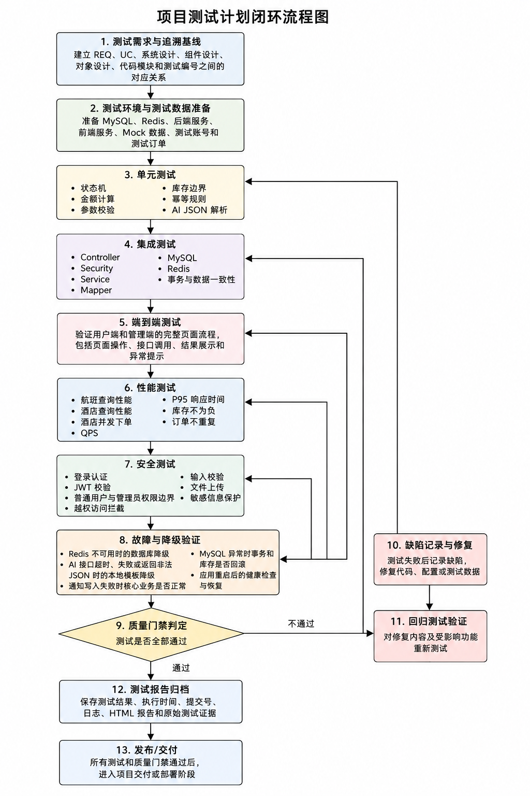

### 7.4 容器化与 CI/CD 设计

CI/CD 流水线覆盖用例追溯检查、单体与六服务测试打包、前端构建、Playwright 冒烟、单体真实 E2E、六服务生产入口真实 E2E、质量门禁、制品归档和 Kubernetes 部署发布。

1. 前端镜像：Vite 构建 Vue 静态资源，Nginx 提供静态文件，并按接口所有权将请求分别代理到 identity、traffic、local、ai、community、ops 六服务；未登记 API 返回 404，禁止静默回落到 `travelmate-backend`。
2. 服务镜像：JDK 21 分别运行单体兼容 JAR 和六个微服务 JAR，通过环境变量注入各自 MySQL、Redis、JWT、内部服务 Token 和 DeepSeek 配置。
3. Compose：仅作为六服务本地联调与可复现实验环境；正式交付部署使用 `deploy/k8s/` 和 `travelmate` namespace。
4. Kubernetes：前端、兼容单体及六服务分别使用 Deployment + Service；MySQL 使用 PVC；Secret 保存密码/API Key；ConfigMap 保存非敏感配置；滚动更新失败时恢复更新前 digest。
5. HPA：六个业务服务均配置 `minReplicas=2`、`maxReplicas=6` 和 CPU 60% 目标，扩容前先通过 `readinessProbe`，缩容设置稳定窗口避免抖动。
6. CI 流程：`仓库/UC01—UC19/接口/部署校验 → Maven verify → 前端构建与单测 → Mock Playwright → 单体真实 E2E → 构建生产前端 Nginx 镜像 → 六服务真实 E2E → CI quality gate → 镜像扫描与发布 → K8s rollout/健康检查 → CI/CD delivery gate`。任一必需阶段失败时总门禁失败。
7. 报告归档：上传 Surefire、Playwright HTML/trace、六服务与 Nginx 日志、JAR、前端 `dist`、镜像摘要、Kubernetes rollout/健康检查和 HPA 事件。

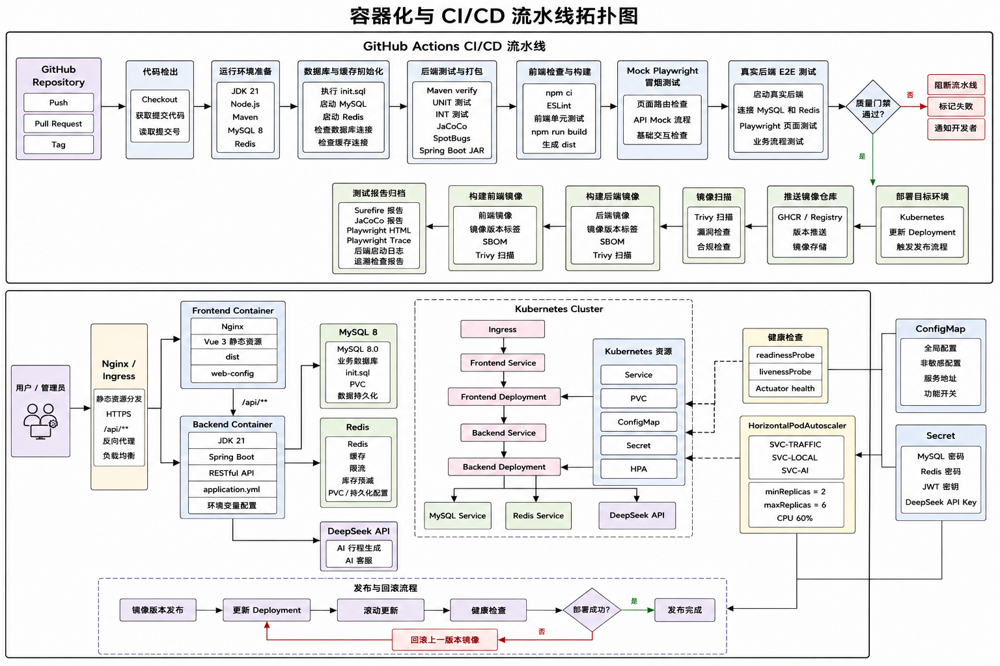

### 7.5 验收证据门禁

满足以下条件后才能在测试报告中写“通过”：后端与六服务命令退出码为 0；前端构建退出码为 0；单体真实 E2E 与穿过生产 Nginx 的六服务真实 E2E 全部通过；数据库初始化成功；并发测试证明库存不为负且成功订单数等于库存扣减量；AI 未配置/超时/非法 JSON 三种场景均完成降级；管理员与普通用户权限边界通过；原始报告已归档并记录提交号。

---

## 8 需求—设计—代码—测试追溯

完整追溯信息统一维护在 [需求设计代码测试追溯表](./需求设计代码测试追溯表.md)。该表按 UC01—UC19 一用例一行，同时记录需求、三层模型、代码模块、测试编号和测试结果；本节仅保留模型编号交叉检查。

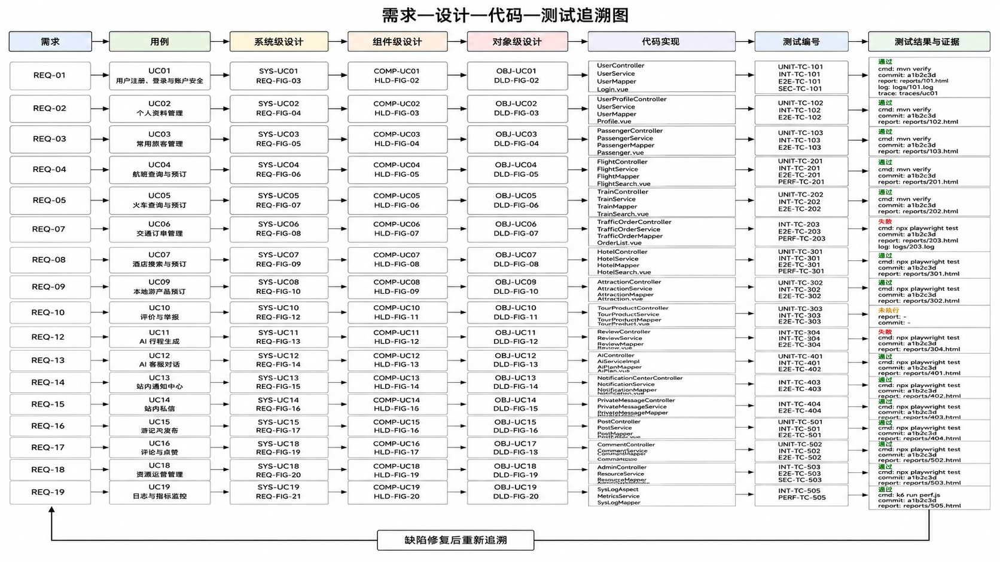

*图 DLD-TRACE-01　需求、设计、代码与测试追溯关系*

| 用例 | 需求 | 系统级模型 | 组件级模型 | 对象级模型 |
| :--- | :--- | :--- | :--- | :--- |
| UC01 | REQ-01 | SYS-UC01 / REQ-FIG-03 | COMP-UC01 / HLD-FIG-02 | OBJ-UC01 / DLD-FIG-02 |
| UC02 | REQ-02 | SYS-UC02 / REQ-FIG-04 | COMP-UC02 / HLD-FIG-03 | OBJ-UC02 / DLD-FIG-03 |
| UC03 | REQ-03 | SYS-UC03 / REQ-FIG-05 | COMP-UC03 / HLD-FIG-04 | OBJ-UC03 / DLD-FIG-04 |
| UC04 | REQ-04 | SYS-UC04 / REQ-FIG-06 | COMP-UC04 / HLD-FIG-05 | OBJ-UC04 / DLD-FIG-05 |
| UC05 | REQ-05 | SYS-UC05 / REQ-FIG-07 | COMP-UC05 / HLD-FIG-06 | OBJ-UC05 / DLD-FIG-06 |
| UC06 | REQ-06 | SYS-UC06 / REQ-FIG-08 | COMP-UC06 / HLD-FIG-07 | OBJ-UC06 / DLD-FIG-07 |
| UC07 | REQ-07 | SYS-UC07 / REQ-FIG-09 | COMP-UC07 / HLD-FIG-08 | OBJ-UC07 / DLD-FIG-08 |
| UC08 | REQ-08 | SYS-UC08 / REQ-FIG-10 | COMP-UC08 / HLD-FIG-09 | OBJ-UC08 / DLD-FIG-09 |
| UC09 | REQ-09 | SYS-UC09 / REQ-FIG-11 | COMP-UC09 / HLD-FIG-10 | OBJ-UC09 / DLD-FIG-10 |
| UC10 | REQ-10 | SYS-UC10 / REQ-FIG-12 | COMP-UC10 / HLD-FIG-11 | OBJ-UC10 / DLD-FIG-11 |
| UC11 | REQ-11 | SYS-UC11 / REQ-FIG-13 | COMP-UC11 / HLD-FIG-12 | OBJ-UC11 / DLD-FIG-12 |
| UC12 | REQ-12 | SYS-UC12 / REQ-FIG-14 | COMP-UC12 / HLD-FIG-13 | OBJ-UC12 / DLD-FIG-13 |
| UC13 | REQ-13 | SYS-UC13 / REQ-FIG-15 | COMP-UC13 / HLD-FIG-14 | OBJ-UC13 / DLD-FIG-14 |
| UC14 | REQ-14 | SYS-UC14 / REQ-FIG-16 | COMP-UC14 / HLD-FIG-15 | OBJ-UC14 / DLD-FIG-15 |
| UC15 | REQ-15 | SYS-UC15 / REQ-FIG-17 | COMP-UC15 / HLD-FIG-16 | OBJ-UC15 / DLD-FIG-16 |
| UC16 | REQ-16 | SYS-UC16 / REQ-FIG-18 | COMP-UC16 / HLD-FIG-17 | OBJ-UC16 / DLD-FIG-17 |
| UC17 | REQ-17 | SYS-UC17 / REQ-FIG-19 | COMP-UC17 / HLD-FIG-18 | OBJ-UC17 / DLD-FIG-18 |
| UC18 | REQ-18 | SYS-UC18 / REQ-FIG-20 | COMP-UC18 / HLD-FIG-19 | OBJ-UC18 / DLD-FIG-19 |
| UC19 | REQ-19 | SYS-UC19 / REQ-FIG-21 | COMP-UC19 / HLD-FIG-20 | OBJ-UC19 / DLD-FIG-20 |

---

## 9 模型与追溯清单

| 文档 | 模型内容 | 编号范围 | 说明位置 |
| :--- | :--- | :--- | :--- |
| 需求说明书 | 完整用例图、概念类图、19 张系统级模型 | REQ-FIG-01—REQ-FIG-21 | 需求说明书 3.4.2、3.4.4、3.4.5 |
| 概要设计说明书 | 系统组件图、19 张组件级模型 | HLD-FIG-01—HLD-FIG-20 | 概要设计说明书第 6 章 |
| 详细设计说明书 | 核心实现类图（A—F 六张分图）、19 张对象级模型 | DLD-FIG-01A—01F、DLD-FIG-02—DLD-FIG-20 | 本文 3.10—3.12 |
| 详细设计追溯图 | 需求—设计—代码—测试追溯关系 | DLD-TRACE-01 | 本文第 8 章 |
| 追溯表 | 需求—模型—代码—测试对应关系 | UC01—UC19 | `需求设计代码测试追溯表.md` |

模型图片使用模型编号开头的文件名，并通过相对路径嵌入对应章节。图片与 UC01—UC19 的名称、边界、状态、类名和测试编号保持一致；域级总览图不替代逐 UC 模型。

---

## 10 文档一致性说明

1. 本文范围为 UC01—UC19，与软件需求规格说明书、概要设计说明书和追溯表一致。
2. REQ-01—REQ-19 与 UC01—UC19 一一对应；SYS-UC01—SYS-UC19、COMP-UC01—COMP-UC19、OBJ-UC01—OBJ-UC19 分别描述系统级、组件级和对象级设计。
3. 代码采用模块化单体结构，逻辑服务边界用于约束模块职责、数据归属和接口依赖。
4. UNIT、INT、E2E、SEC、PERF 和 CHAOS 测试编号与相应用例及质量属性建立追溯关系。
5. AI 工具用途、人工复核方式、开源材料来源与许可证见 [`大模型使用说明.md`](./大模型使用说明.md)。
