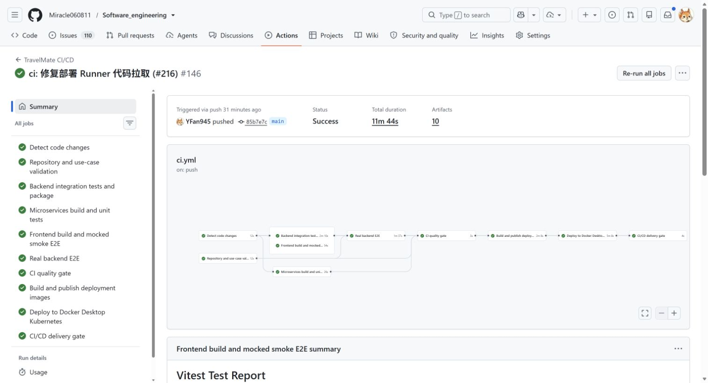
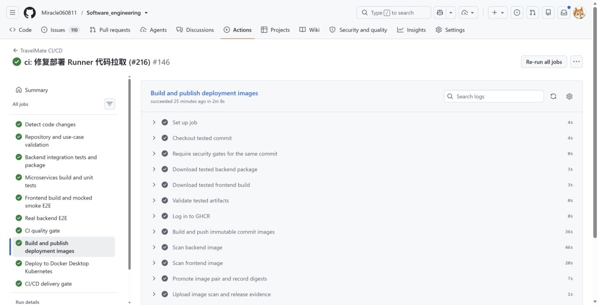
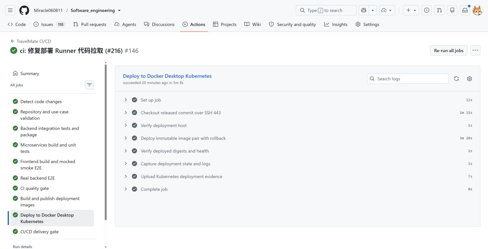
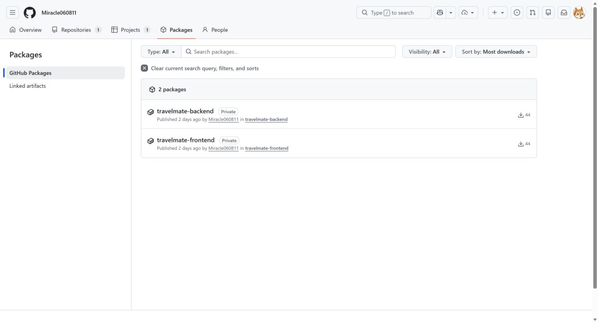
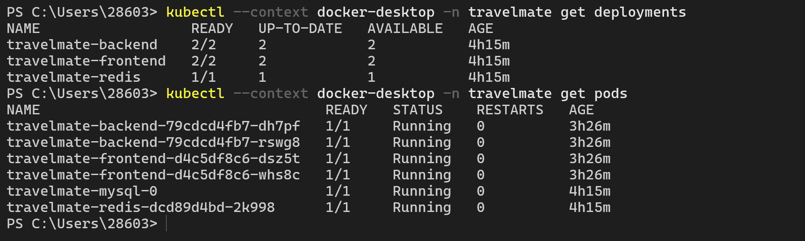
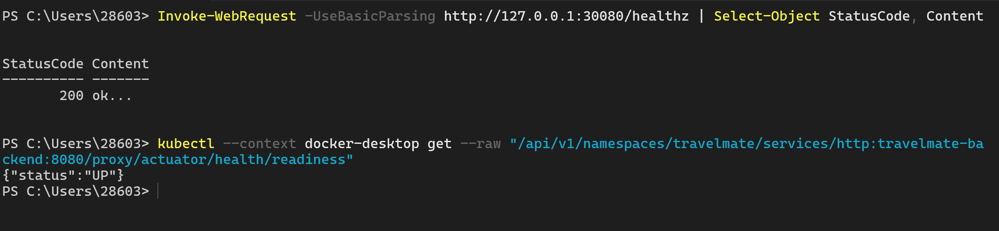

# TravelMate 软件工程基础实践中期报告

> 课程：《软件工程基础实践》（2026 夏季学期）
> 项目：TravelMate 智慧旅行平台
> 小组：第 5 组
> 报告日期：2026 年 8 月 29 日
> 功能验收基线：`main` commit `85b7e7c3ad5c7f1fb1df59d0abcbffb48ef59b9f`

## 1. 项目概况

TravelMate 是面向综合旅行服务场景的智慧旅行平台，覆盖用户与旅客管理、交通预订、酒店与景点、优惠权益、AI 行程、通知消息、社区互动和运营管理等业务。项目当前已完成原系统基线固化、19 个业务场景验证、需求与设计模型、容器化运行、CI/CD 交付闭环以及微服务目标架构设计。

本阶段工作范围包括：

1. 固化可运行的原系统版本，并建立 Git 标签；
2. 完成 UC01-UC19 的需求、系统级模型、组件级模型、对象级模型和追溯关系；
3. 完成前端、后端、MySQL、Redis 的容器化及自动构建测试；
4. 建立 Docker 镜像构建、安全扫描、镜像发布、Kubernetes 部署和健康检查闭环；
5. 完成微服务划分、服务接口和数据表归属设计。

## 2. 阶段成果摘要

| 成果项 | 完成状态 | 核心证据 |
| :--- | :---: | :--- |
| 原系统启动与 Git 标签 | 已完成 | `monolith-start` 标签；前后端健康检查；Kubernetes Pod 运行状态 |
| UC01-UC19 全部业务场景 | 已完成自动化验收 | 《业务场景清单与用例说明》；161 个后端测试、24 个前端测试、真实后端 E2E |
| 需求与三层模型 | 已完成 | 19 份系统级模型、19 份组件级模型、19 份对象级模型及源文件 |
| 需求-设计-代码-测试追溯 | 已完成 | 《需求设计代码测试追溯表》；19 个 `covered`，0 个 `partial`，0 个 `planned` |
| 容器化 | 已完成 | 前端、后端 Dockerfile；MySQL、Redis 容器；Docker Desktop Kubernetes |
| 原系统 CI/CD | 已完成并真实运行 | push 后自动构建、测试、镜像、Trivy 扫描、GHCR 发布、Kubernetes 部署、健康检查 |
| 微服务划分图 | 已完成 | 6 个目标业务服务及跨服务契约图 |
| 服务接口清单 | 已完成 | 对外 REST API、内部接口和领域事件清单 |
| 数据表归属方案 | 已完成 | 一表一主、禁止跨服务直接联表的归属表 |

阶段结论：本阶段各项成果均已形成，并具备代码、配置、测试、流水线和运行证据。完整微服务迁移、微服务 Kubernetes 自动部署、HPA、故障实验和性能对比将在下一阶段继续实施。

## 3. 原系统启动、版本基线与业务场景

### 3.1 原系统版本基线

| 项目 | 值 |
| :--- | :--- |
| 单体基线标签 | `monolith-start` |
| 标签 commit | `65eacaa5a1739ed949691a6fd86805580b39889b` |
| 第一阶段微服务标签 | `microservices-phase1` |
| 标签 commit | `5c4ffa53b42b8b3aebde9144c9e61e362fc63b51` |
| 当前中期汇报基线 | `85b7e7c3ad5c7f1fb1df59d0abcbffb48ef59b9f` |
| 前端入口 | `http://127.0.0.1:30080` |
| 前端健康检查 | `http://127.0.0.1:30080/healthz` |
| 后端就绪检查 | `/actuator/health/readiness` |

当前部署验证结果：

- `travelmate-backend`：2/2 Ready；
- `travelmate-frontend`：2/2 Ready；
- MySQL、Redis：各 1/1 Ready；
- 6 个 Pod 全部 `Running`，重启次数均为 0；
- 前端健康检查返回 `200 / ok`；
- 后端 readiness 返回 `{"status":"UP"}`。

### 3.2 UC01-UC19 业务场景清单

| 编号 | 业务场景 | 自动化状态 |
| :--- | :--- | :---: |
| UC01 | 用户注册、登录与账户安全 | covered |
| UC02 | 查询并预订航班 | covered |
| UC03 | 查询并预订火车票或提交候补 | covered |
| UC04 | 交通订单支付、取消、退款与凭证查看 | covered |
| UC05 | 搜索酒店并完成订房 | covered |
| UC06 | 酒店订单支付、取消、退款与库存回补 | covered |
| UC07 | 景点浏览与购票 | covered |
| UC08 | 选择并预订一日游或周边游产品 | covered |
| UC09 | 提交评价、回复评价与举报处理 | covered |
| UC10 | 优惠券领取与订单核销 | covered |
| UC11 | 生成并保存 AI 行程 | covered |
| UC12 | AI 客服多轮对话 | covered |
| UC13 | 通知中心与站内私信 | covered |
| UC14 | 游记发布、编辑、删除与审核 | covered |
| UC15 | 社区点赞、收藏与评论 | covered |
| UC16 | 常用旅客管理与使用 | covered |
| UC17 | 用户主页与关注关系 | covered |
| UC18 | 管理后台资源、订单与用户管理 | covered |
| UC19 | 内容安全、举报处理与可观测性 | covered |

完整参与者、触发条件、前置条件、成功流程、异常流程、可验证结果和实现映射见 [业务场景清单与用例说明](../业务场景清单与用例说明.md)。

### 3.3 自动化测试证据

| 测试层级 | 已验证结果 | 证据位置 |
| :--- | :--- | :--- |
| 后端单元/集成测试 | 161/161 通过，34 个测试类 | `02_docs/测试执行报告-2026-08-28.md`、Actions artifact `backend-test-reports` |
| 前端单元测试 | 24/24 通过，3 个测试文件 | Actions Summary、artifact `frontend-playwright-report` |
| 真实后端 E2E | 真实 MySQL/Redis 环境执行通过 | Actions job `Real backend E2E`、artifact `real-backend-e2e-evidence` |
| 用例追溯门禁 | 19 covered，0 partial，0 planned | `docs/ci/use-case-test-matrix.json`、`use-case-traceability-report` |

代表性验证场景为 UC02、UC06、UC14，分别覆盖交通预订、库存与退款状态机、社区内容审核；其余用例均保留对应自动化验证证据。

## 4. 需求、设计图和追溯表

### 4.1 文档完成情况

| 成果类别 | 完成情况 | 主要交付路径 |
| :--- | :---: | :--- |
| 需求说明、用例图、概念类图 | 已完成 | `02_docs/5组-软件需求规格说明.md`、`02_docs/需求规格说明/` |
| 每个用例的系统级图 | 19/19 | `02_docs/需求规格说明/REQ-FIG-03` 至 `REQ-FIG-21`，并保留 Mermaid 源文件 |
| 系统组件图与概要设计 | 已完成 | `02_docs/软件概要设计说明书.md`、`02_docs/概要设计说明/00_系统总体组件图.png` |
| 每个用例的组件级图 | 19/19 | `02_docs/概要设计说明/HLD-FIG-02` 至 `HLD-FIG-20`，并保留 Mermaid 源文件 |
| 类图与详细设计 | 已完成 | `02_docs/5组-软件详细设计说明.md`、6 张实现类图 |
| 每个用例的对象级图 | 19/19 | `02_docs/详细设计说明/36_UC01` 至 `54_UC19`，并保留 Mermaid 源文件 |
| 完整追溯表 | 已完成 | `02_docs/需求设计代码测试追溯表.md` |

### 4.2 追溯关系

仓库采用以下编号链：

```text
REQ → UC → SYS → COMP → OBJ → 代码模块 → UNIT/INT/E2E → 测试结果
```

追溯表以 UC01-UC19 为统一范围，每个用例一行，将需求、三层模型、实现模块、测试编号、验证重点和结果放在同一张表中。流水线运行 `scripts/check-use-case-traceability.mjs`，追溯结构或证据不完整时质量门禁失败。

## 5. 容器化与原系统 CI/CD

### 5.1 容器化交付

| 组件 | 容器化方式 | 关键文件 |
| :--- | :--- | :--- |
| 前端 | 自有 Nginx 镜像 | `frontend/Dockerfile`、`frontend/nginx.conf` |
| 后端 | 自有 Spring Boot 镜像 | `backend/Dockerfile` |
| MySQL | 官方镜像、PVC、Flyway 自动迁移 | `deploy/k8s/mysql.yaml`、`backend/src/main/resources/db/migration/` |
| Redis | 官方镜像 | `deploy/k8s/redis.yaml` |
| Kubernetes | Docker Desktop Kubernetes | `deploy/k8s/`、`scripts/cd/` |

### 5.2 同一流水线闭环

当前 `.github/workflows/ci.yml` 在 `main` push 后执行：

```text
取代码
  → 配置/追溯校验
  → 后端、前端、微服务构建与测试
  → 真实后端 E2E
  → CI quality gate
  → 构建前后端镜像
  → Trivy 扫描
  → 推送 GHCR 并记录 digest
  → Docker Desktop Kubernetes 实际部署
  → 部署 digest 与前后端健康检查
  → CI/CD delivery gate
```

任一必要构建、测试或安全阶段失败，镜像发布和部署均不会继续。部署使用完整 commit 对应的不可变 digest，不使用 `latest` 作为验收版本。

最近一次完整成功运行：

- Workflow：`TravelMate CI/CD`；
- Run：[#33154114496](https://github.com/Miracle060811/Software_engineering/actions/runs/33154114496)；
- commit：`85b7e7c3ad5c7f1fb1df59d0abcbffb48ef59b9f`；
- 结果：`Success`；
- 总时长：11 分 44 秒；
- 发布后端 digest：`sha256:901eb2c323a2902f118f46d81fb9f93e135b6c8f8c421cc5808f911e62705f6b`；
- 发布前端 digest：`sha256:faf467fb63eeccf045ee2439e02075f83f3007cd8783f531f715208fb0865bf1`。













## 6. 微服务划分、接口和数据归属

### 6.1 目标服务划分

划分依据是业务能力、事务边界、数据所有权和变化原因，不按用例数量机械拆分。API Gateway、注册中心、配置中心、前端和数据库不计入业务微服务数量。


| 编号 | 业务服务 | 核心职责 | 当前阶段 |
| :--- | :--- | :--- | :--- |
| SVC-IDENTITY | 身份与用户服务 | 账号、资料、关注、常用旅客 | 第一批模块已落地 |
| SVC-TRAFFIC | 交通与订单服务 | 航班、火车、候补、交通订单 | 第一批模块已落地 |
| SVC-LOCAL | 酒店景点与权益服务 | 酒店、景点、评价、优惠券、本地游 | 第一批模块已落地 |
| SVC-AI | AI 与消息服务 | AI 行程、AI 对话、通知、私信 | 第一批模块已落地 |
| SVC-COMMUNITY | 社区内容服务 | 帖子、评论、点赞收藏、图片素材 | 目标边界已冻结，待后续完整迁移 |
| SVC-OPS | 运营管理服务 | 审核编排、管理命令、日志、敏感词 | 目标边界已冻结，待后续完整迁移 |

当前事实边界：`microservices` 工程已有 IDENTITY、TRAFFIC、LOCAL、AI 四个独立 Maven 模块、Dockerfile、健康检查和分库脚本；六个目标业务服务的设计、接口和表归属已经冻结。完整业务切流、Gateway 和六服务统一 Kubernetes 部署属于第二阶段。

### 6.2 服务接口与跨服务契约

详细清单见 [TravelMate 微服务改造中期验收基线](../TravelMate中期验收基线.md)第 3 节。主要接口族如下：

| 服务 | 对外接口族 |
| :--- | :--- |
| IDENTITY | `/user/**`、`/api/user/**`、`/api/passenger/**`、`/api/follow/**` |
| TRAFFIC | `/api/flight/**`、`/api/train/**`、`/api/order/**`、`/api/price/**` |
| LOCAL | `/api/hotel/**`、`/api/attraction/**`、`/api/review/**`、`/api/coupon/**`、`/api/tour/**` |
| AI | `/api/ai/**`、`/api/notification/**`、`/api/private-message/**` |
| COMMUNITY | `/api/post/**`、`/api/comment/**`、`/api/like/**`、`/api/file/**` |
| OPS | `/api/admin/**` |

关键跨服务规则：

- 同步查询/命令采用内部 REST，设置超时、幂等键和失败返回；
- 通知与审核采用领域事件，写请求通过 Outbox 保证业务数据与事件同事务；
- 消费端按事件 ID 幂等，重试达到上限后进入死信；
- 其他服务只能通过接口或事件访问数据，不能直接连接并读写归属表。

### 6.3 数据表归属摘要

| 唯一写入责任服务 | 主要归属表 |
| :--- | :--- |
| IDENTITY | `tm_user`、`tm_follow`、`tm_passenger` |
| TRAFFIC | `tm_flight`、`tm_train`、`tm_traffic_order`、`tm_train_waitlist`、`tm_price_history`、交通 Outbox |
| LOCAL | 酒店/景点资源与订单、评价举报、本地游、优惠券、本地 Outbox |
| AI | `tm_ai_plan`、`tm_ai_chat`、通知、私信、已消费事件 |
| COMMUNITY | `tm_post`、`tm_comment`、`tm_like`、`tm_media_asset` |
| OPS | `sys_log`、`sys_sensitive_word` |

完整逐表归属、访问方式和特殊说明见《TravelMate 微服务改造中期验收基线》第 4 节。

## 7. 系统验证方法

### 7.1 版本基线验证

```powershell
git tag --list
git log --oneline --decorate -5
```

`monolith-start` 为改造前原系统基线，`microservices-phase1` 为第一阶段微服务实现基线。

### 7.2 系统运行状态验证

```powershell
kubectl --context docker-desktop -n travelmate get deployments
kubectl --context docker-desktop -n travelmate get pods
```

预期：前后端 Deployment 均为 2/2；MySQL、Redis 和前后端 Pod 全部 Ready/Running。

### 7.3 健康状态验证

```powershell
Invoke-WebRequest -UseBasicParsing http://127.0.0.1:30080/healthz |
  Select-Object StatusCode, Content

kubectl --context docker-desktop get --raw `
  "/api/v1/namespaces/travelmate/services/http:travelmate-backend:8080/proxy/actuator/health/readiness"
```

预期：前端 `200 / ok`，后端 `{"status":"UP"}`。

### 7.4 CI/CD 验证

成功流水线 [TravelMate CI/CD #33154114496](https://github.com/Miracle060811/Software_engineering/actions/runs/33154114496) 包含以下关键阶段：

1. Backend/Frontend/Microservices tests；
2. Real backend E2E；
3. Build and publish deployment images；
4. Scan backend/frontend image；
5. Deploy to Docker Desktop Kubernetes；
6. Verify deployed digests and health；
7. CI/CD delivery gate。

### 7.5 微服务设计验证

服务边界可通过 TRAFFIC、IDENTITY、LOCAL 的接口映射进行核对；`tm_passenger`、`tm_user_coupon` 等表用于验证“一表一主、跨服务通过接口或事件访问”的数据所有权原则。

## 8. 证据索引

| 证据 | 路径或链接 |
| :--- | :--- |
| 业务场景清单与正式用例 | `02_docs/业务场景清单与用例说明.md` |
| 需求说明 | `02_docs/5组-软件需求规格说明.md` |
| 概要设计 | `02_docs/软件概要设计说明书.md` |
| 详细设计 | `02_docs/5组-软件详细设计说明.md` |
| 追溯表 | `02_docs/需求设计代码测试追溯表.md` |
| 测试报告 | `02_docs/测试执行报告-2026-08-28.md` |
| 微服务中期基线 | `02_docs/TravelMate中期验收基线.md` |
| 服务划分图 | `02_docs/中期验收/TravelMate服务划分图.svg` |
| CI/CD workflow | `.github/workflows/ci.yml` |
| Dockerfile | `backend/Dockerfile`、`frontend/Dockerfile`、`microservices/services/*/Dockerfile` |
| Kubernetes 清单 | `deploy/k8s/` |
| 部署与回滚脚本 | `scripts/cd/` |
| 成功流水线 | <https://github.com/Miracle060811/Software_engineering/actions/runs/33154114496> |
| CI/CD 修复 PR | <https://github.com/Miracle060811/Software_engineering/pull/216> |
| 流水线与运行截图 | `05_management/CI-CD验收截图/` |

Actions 中保留的关键原始 artifact：

- `backend-test-reports`；
- `frontend-playwright-report`；
- `real-backend-e2e-evidence`；
- `use-case-traceability-report`；
- `deployment-release-85b7e7c3...`；
- `kubernetes-deployment-85b7e7c3...`。

## 9. 当前边界、风险与后续计划

1. 当前原系统 CI/CD 已闭环，但自托管 Runner 和 Docker Desktop 必须在线，才能执行本机 Kubernetes 部署；执行部署前需要确认 Runner 为 Online、Docker/Kubernetes Ready。
2. 19 个用例已经具备自动化验收证据，登录、预订、退款和社区审核等代表性链路同时保留可重复执行的端到端验证方式。
3. 中期已经完成 6 服务设计冻结，第一批 4 个服务落地；不能将未完成的 COMMUNITY、OPS 完整迁移和全量业务切流描述为已完成。
4. 第二阶段继续完成微服务独立部署、全场景回归、HPA 扩缩容、故障处理和单体/微服务性能对比。
5. 验收证据由仓库文件、Actions 日志、Kubernetes 实时状态和可重复执行命令共同组成，截图仅作为运行时状态留档。

## 10. AI 工具使用说明

项目过程中使用生成式 AI 辅助讨论方案、检查配置、生成部分测试和整理文档。所有产出均由组员结合仓库代码、测试结果、Git 提交、Actions 日志和本地 Kubernetes 运行结果进行人工核对；未将 AI 输出直接视为验收结论。仓库使用 Secret、环境变量和本机凭据管理敏感信息，不提交 Token、密码或云平台密钥。

## 11. 阶段结论

TravelMate 已完成本阶段既定目标：原系统与 19 个业务场景具备运行和自动化验收证据；需求、系统级/组件级/对象级模型和追溯表齐全；前端、后端、MySQL、Redis 已容器化；CI/CD 已完成构建、测试、镜像、安全扫描、Kubernetes 部署和健康检查闭环；微服务划分、接口清单和数据表归属方案已经冻结，并完成第一批微服务实现。
