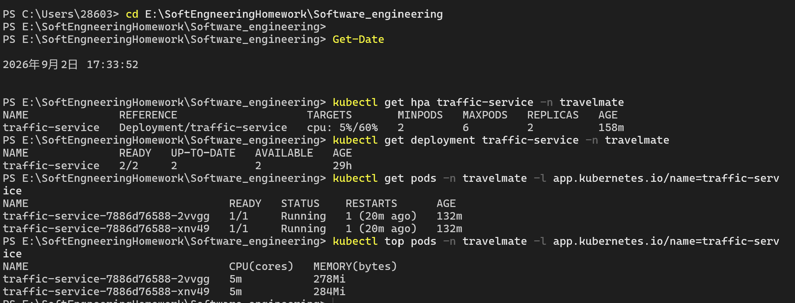
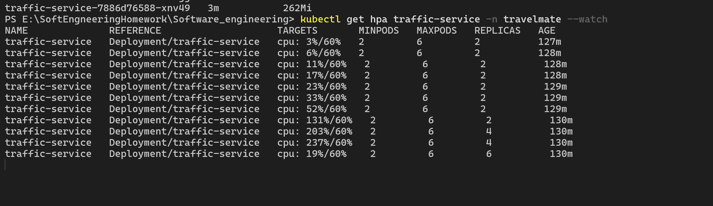
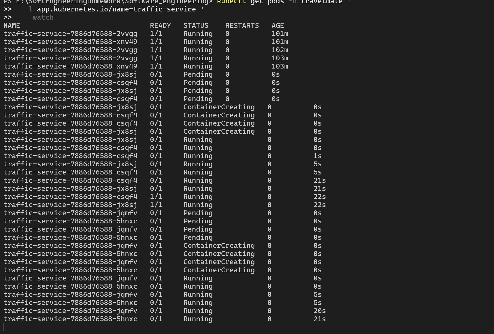
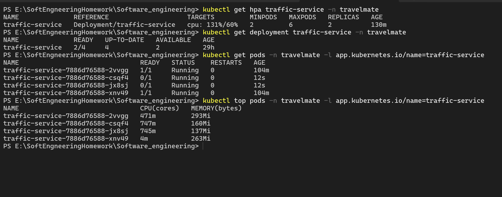
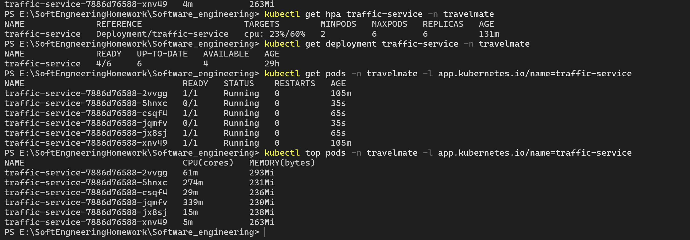
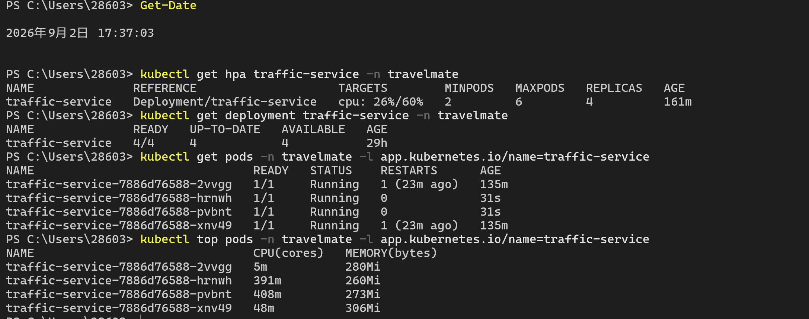
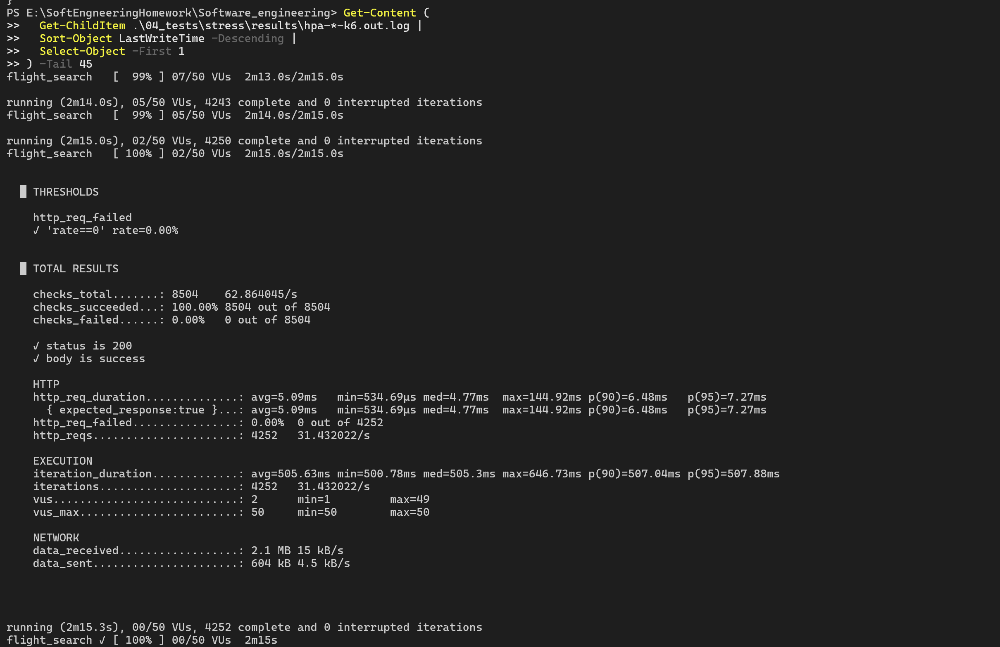
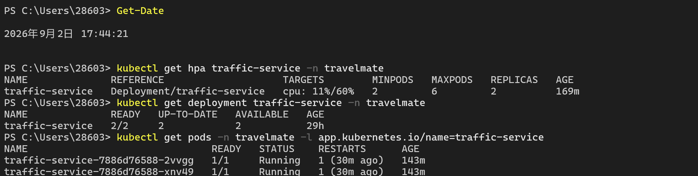
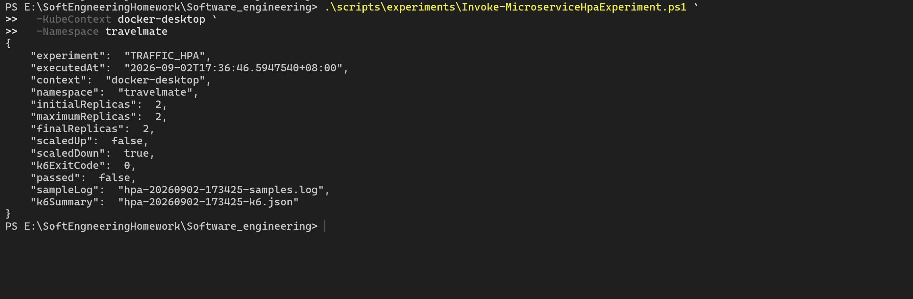
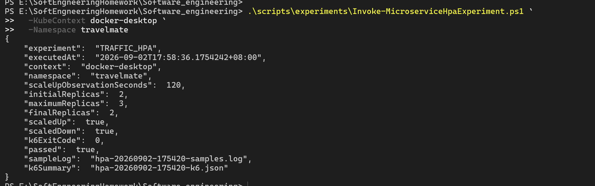

# TravelMate 微服务 HPA 实验记录

## 1. 实验信息

| 项目 | 记录 |
| --- | --- |
| 主要现场实验 | 2026-09-02 17:33:52—17:44:21（Asia/Shanghai） |
| 自动判定复测 | 2026-09-02 17:54:20—17:58:36（Asia/Shanghai） |
| Git 提交 | `dde8b3299b8b83f0ebad5fcb2a410b96b36155b2` |
| Kubernetes context | `docker-desktop` |
| Kubernetes/机器配置 | Kubernetes v1.36.1，1 个 control-plane + 4 个 worker；HONOR DRA-XX，22 逻辑处理器，31.5 GiB 内存 |
| Metrics Server | v0.9.0；采样周期 15 秒；启用 `--kubelet-insecure-tls` |
| k6 | v2.2.0，Windows amd64 |
| 压测脚本 | `04_tests/stress/flight-search.js` |
| 目标服务 | `traffic-service` |
| HPA 参数 | `minReplicas=2`、`maxReplicas=6`、CPU 目标 60%、缩容稳定窗口 120 秒 |

## 2. 扩缩容结果

| 阶段 | 时间 | Ready Pod | CPU | HPA 当前/目标 | 证据 |
| --- | --- | ---: | --- | --- | --- |
| 加压前 | 17:33:52 | 2 | 5% | 2 副本，5%/60% | 截图 1 |
| 压力上升 | 约 17:36 | 2 | 131% | 2 副本，131%/60%，开始触发扩容 | 截图 2、4 |
| CPU 峰值 | 约 17:37 | 4 | 237% | HPA 当时显示 4 副本，237%/60% | 截图 2 |
| 最大扩容 | 约 17:37—17:38 | 4 | 19%—26% | HPA 期望副本达到上限 6；现场明确观察到 4 个 Ready Pod，其余 Pod 正在启动 | 截图 2、3、5、6 |
| 压力结束 | 17:36:43 | 4 | 负载开始下降 | k6 完成 4252 个请求，HPA 进入缩容稳定阶段 | 截图 7 |
| 缩容完成 | 17:44:21 | 2 | 11% | 最终回到 2 个副本 | 截图 8 |

说明：截图中的 `REPLICAS=6` 表示 HPA/Deployment 的期望副本数达到 6；`READY=4/6` 表示当时 6 个期望副本中有 4 个已经 Ready。因此本轮应准确表述为：**HPA 期望副本从 2 扩到 6，现场明确观察到的 Ready Pod 从 2 增到 4，最后缩回 2。**

## 3. k6 指标

| 请求数 | 吞吐量(req/s) | 平均响应(ms) | P95(ms) | 错误率 |
| ---: | ---: | ---: | ---: | ---: |
| 4252 | 31.432022 | 5.092220 | 7.273600 | 0.00% |

附加结果：8504 次检查全部通过；最大并发用户数 50；k6 退出码为 0；最长单次 HTTP 响应为 144.9298 ms。

## 4. 结果判定与异常说明

- 是否触发扩容：是。CPU 峰值达到 237%，明显超过 60% 目标，HPA 期望副本数从 2 增至最大值 6。
- 实际 Ready Pod：现场明确从 2 增加到 4。截图还记录了新增 Pod 从 `Pending`、`ContainerCreating`、`Running` 到 `1/1` 的启动过程。
- 是否在负载下降后缩容：是。17:44:21 复核时，Deployment 为 `2/2`，HPA 和 Pod 数均已回到 2。
- 压测质量：4252 个 HTTP 请求全部成功，错误率 0%，平均响应约 5.09 ms，P95 约 7.27 ms。
- 其他服务是否保持健康：2026-09-02 18:26 复核时，六个微服务以及 `travelmate-backend`、`travelmate-frontend` 均为 `2/2 Ready`，Redis 为 `1/1 Ready`，五个节点均为 `Ready`。
- 最终结论：HPA 扩容、Pod 启动、负载下降后的缩容均已得到现场截图证明，实验通过。

### 自动脚本旧误判说明

`hpa-20260902-173425-result.json` 中的 `passed=false` 是旧版实验脚本的假阴性，不代表 HPA 没有扩容。旧脚本在 k6 于 17:36:43 结束后立即生成结果，17:36:46 已退出；而现场截图在 17:36:50 及之后才记录到 HPA 扩容，二者只相差数秒。

脚本随后增加了 120 秒扩容观察窗口。修复后的 `175420` 复测得到：

- `initialReplicas=2`
- `maximumReplicas=3`
- `finalReplicas=2`
- `scaledUp=true`
- `scaledDown=true`
- `k6ExitCode=0`
- `passed=true`

因此，`173425` 轮次用于记录更完整的现场扩缩容过程和 237% CPU 峰值，`175420` 轮次用于证明修复后的自动判定逻辑能够正确识别实验通过。

## 5. 原始证据

### 主要现场实验（173425）

- `hpa-20260902-173425-result.json`
- `hpa-20260902-173425-samples.log`
- `hpa-20260902-173425-k6.json`
- `hpa-20260902-173425-k6.out.log`
- `hpa-20260902-173425-k6.err.log`
- `hpa-20260902-173425-port-forward.out.log`
- `hpa-20260902-173425-port-forward.err.log`

### 修复后自动判定复测（175420）

- `hpa-20260902-175420-result.json`
- `hpa-20260902-175420-samples.log`
- `hpa-20260902-175420-k6.json`
- `hpa-20260902-175420-k6.out.log`
- `hpa-20260902-175420-k6.err.log`

## 6. 现场截图

### 截图 1：实验前基线为 2 个 Ready Pod

### 截图 2：CPU 峰值 237%，HPA 期望副本达到 6

### 截图 3：新增 Pod 的完整启动过程

### 截图 4：CPU 达到 131%，Deployment 开始扩到 4

### 截图 5：HPA 期望 6 个副本，已就绪 4 个

### 截图 6：4 个 Pod 全部 Ready

### 截图 7：k6 压测汇总

### 截图 8：缩容完成，恢复到 2 个副本

### 截图 9：旧脚本因观察窗口不足产生假阴性

### 截图 10：修复后的自动实验判定通过

