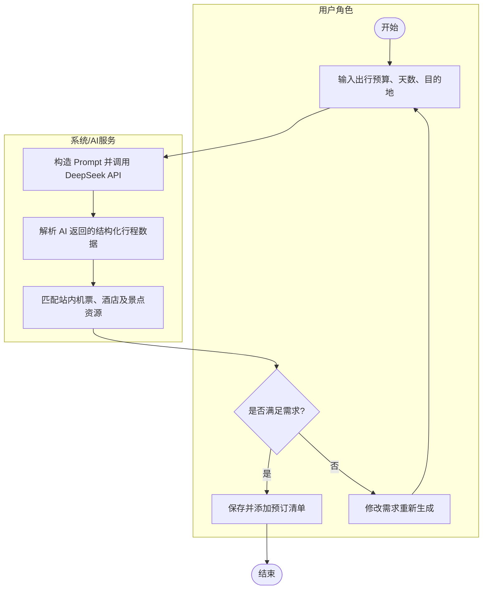
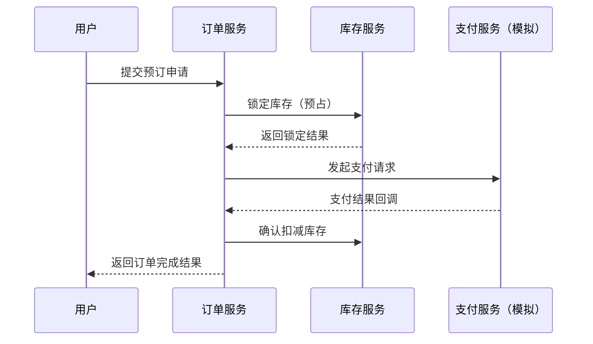

# 软件详细设计说明书：TravelMate（伴游）智能旅游平台

[TOC]

---

## 1 引言

### 1.1 编写目的

本文档旨在对“TravelMate（伴游）”智能旅游平台进行详细设计说明。在概要设计的基础上，进一步明确系统各模块的实现算法、数据结构、接口细节及业务逻辑。

本文档的预期读者包括：前端开发工程师、后端开发工程师、测试工程师、运维工程师以及项目管理人员。通过本说明书，可指导系统编码实现、模块联调以及后续测试与维护工作。

### 1.2 背景

*   **软件名称**：伴游（TravelMate）出行旅游平台
*   **任务提出者**：软件工程基础2026春课程组
*   **开发者**：Miracle 开发小组（共5名成员）
*   **预期用户**：旅游游客、旅游内容创作者、平台运营与管理人员。
*   **运行与部署环境**：
    *   **开发与测试环境**：团队成员个人计算机，支持 Chrome、Edge 等主流 Web 浏览器。
*   **核心技术栈选型**：
    *   **前端**：Vue 3 + Vite 技术栈。
    *   **后端**：Java 17 + Spring Boot 3.x + MyBatis-Plus。
    *   **数据存储与中间件**：MySQL 8.0、Redis 缓存中间件。
    *   **AI 能力接入**：支持工具调用（Skills）和 JSON Output 的 DeepSeek API。

### 1.3 术语表

| 术语       | 全称                             | 定义/说明                   |
| :------- | :----------------------------- | :---------------------- |
| AI Agent | Artificial Intelligence Agent  | 具备环境感知、推理与任务执行能力的智能代理系统 |
| JWT      | JSON Web Token                 | 用于前后端身份认证与会话保持的令牌机制     |
| RBAC     | Role-Based Access Control      | 基于角色的权限访问控制模型           |
| UGC      | User Generated Content         | 用户生成内容，如游记、评论、图片等       |
| QPS      | Queries Per Second             | 每秒请求数，用于衡量系统吞吐能力        |
| RAG      | Retrieval-Augmented Generation | 检索增强生成技术，用于提升大模型回答准确性   |

### 1.4 参考文档

1. 《TravelMate 核心需求描述文档》
2. 《软件概要设计说明书》
3. 《软件工程导论》
4. DeepSeek API 官方技术文档
5. Spring Boot、Vue3、MySQL 官方文档

***

## 2 系统结构设计及子系统划分

本项目采用前后端分离的系统架构。后端基于 Java 17 + Spring Boot 3.x 构建 RESTful 风格的服务端接口，前端采用 Vue 3 + Vite 实现响应式交互界面。在数据交互上，各模块优先统一核心数据模型（用户、订单、资源、消息等），确保不同成员开发的模块能够顺利进行集成联调。

按照项目团队的开发分工与核心业务流，我们将系统整体划分为以下五个核心子系统：

**1. 大交通票务与订单子系统（模块负责人：A 邹林利）**
*   **功能职责**：负责平台核心大交通资源的预订与基础订单生命周期管理。
*   **核心设计**：不接入真实商业票务系统，机票与火车票数据优先采用本地 Mock 数据与数据库初始化数据支撑。实现车次/航班实时查询、多平台模拟比价、历史价格走势展示。统一管理平台基础订单模型，包含订单状态机流转控制、模拟支付接口对接、库存预占调用以及退款处理逻辑。

**2. 目的地住宿与本地生活子系统（模块负责人：B 莫谨瑞）**
*   **功能职责**：提供行中阶段的酒店、景点玩乐预订以及行后的评价服务。
*   **核心设计**：实现酒店多维度搜索过滤与详情展示；重点设计房务预订逻辑中的库存防超卖控制（结合 Redis 缓存预减与数据库验证）；提供景点门票预订与电子核销二维码生成功能；构建完整的五星图文评价与反馈体系。

**3. AI 智能规划与 Agent 服务子系统（模块负责人：C 陈一鸿）**

*   **功能职责**：负责平台所有与大语言模型相关的智能化场景以及全局消息触达。
*   **核心设计**：统一封装并异步调用 DeepSeek API。行程规划模块强制使用 **JSON Output** 格式化返回结果，保障前端渲染的结构化；AI 客服 Agent 结合自然语言意图识别与 **Skills/内部工具调用**（如查询平台站内酒店数据），实现多轮智能问答。此外，负责统筹平台实时通知服务（站内信、红点未读逻辑）。

**4. 旅途社区与用户中心子系统（模块负责人：D 杜新诚）**

*   **功能职责**：承担全平台的用户认证鉴权、社交互动与内容沉淀。
*   **核心设计**：实现基于 **JWT** 的安全登录注册与用户信息管理；提供 UGC 内容发布工具（多图上传、地理位置打卡）；搭建兼容图文与视频的**双列瀑布流**交互界面；构建包含关注/粉丝体系、点赞收藏与树状评论结构的社交关系链。

**5. 管理后台与可观测性子系统（模块负责人：E 李科）**
*   **功能职责**：面向平台管理员，提供资源维护、安全审核与系统运行状态监控。
*   **核心设计**：搭建基于 **RBAC（基于角色的访问控制）** 的权限与安全架构；实现轻量数据可观测仪表盘（如实时订单大屏、本地访问量 QPS 监控、报错日志看板）；构建内容与安全审核防线（社区图文敏感词自动过滤 + 人工审核工作流）；提供大交通与酒店基础数据的后台 CRUD 管理能力。

**子系统间的协同关系说明：**
*   子系统 A 与 B 重点围绕**交易履约流程和库存控制模型**进行底层协同；
*   子系统 C 在生成行程与智能问答时，需跨模块调用 A/B 提供的资源检索接口（Mock数据共享）；
*   子系统 D 生成的 UGC 内容数据，需实时推送到子系统 E 的审核流中完成安全合规校验。


---

### 2.1 典型业务活动图（以智能行程规划为例）



---

### 2.2 典型业务顺序图（以订单支付为例）



***

## 3 功能模块设计

### 3.1 AI 行程生成模块

*   **模块描述**：根据用户输入生成个性化旅游行程，并与平台Mock资源进行关联匹配。
*   **模块编号**：TM-MOD-01 
*   **输入**：目的地（String）、天数（Int）、预算范围（Float）、出行人数（Int）、偏好标签（List）
*   **处理**：
    1.  对用户输入进行合法性校验。
    2.  构造标准化 Prompt（模板化 + 变量参数填充）。
    3.  异步调用 DeepSeek API 获取行程推荐结果。
    4.  使用 JSON Output 约束，对返回结果进行严格的结构化校验。
    5.  对不完整字段进行二次补全，或抛出异常提示用户重新生成。
    6.  调用内部服务接口（Mock数据查询），匹配对应的酒店、景点及交通资源。
    7.  **规范化记录：对调用过程中的 Prompt、多轮 Session 状态以及调用的业务数据 Skills，进行统一日志打印与留存。**
*   **算法与调用描述**：
    采用 Prompt Engineering + RAG（检索增强生成）策略，结合本地 Mock 景点数据与历史热门行程。要求模型按 `{"type":"json_object"}` 格式输出，以便前端解析渲染。
    **开发过程中所有与大模型相关的用途、Prompt 模板、Session 上下文管理逻辑以及 Skills实现机制，必须由模块负责人形成单独的 Markdown 附件进行记录提交，确保模型使用的可解释性与可追溯性。**
*   **输出**：行程 JSON 数据（按天划分）、推荐资源列表、行程摘要信息。

### 3.2 订单库存管控模块

*   **模块描述**：**根据小并发稳定性设计的目标**，负责机票、酒店等资源在预订过程中的防超卖控制与数据一致性保证。
*   **模块编号**：TM-MOD-02 
*   **输入**：商品 ID（Mock资源主键）、预订数量、用户 ID
*   **处理**：
    1.  **Redis 缓存预减**：接收请求后，优先在 Redis 中进行库存扣减操作，快速拦截非法/超量请求，提升系统在瞬时小并发下的响应速度。
    2.  **数据库原子校验**：订单落库时，放弃重量级的行级悲观锁，**采用数据库乐观锁或原子更新语句**进行库存校验（例如：`UPDATE inventory SET count = count - num WHERE id = ? AND count >= num`）。
    3.  生成待支付订单，标记库存处于“预占”状态。
    4.  接收到支付成功回调后，正式确认为已售库存。
    5.  超时未支付的订单（如15分钟），通过延时任务触发库存回滚，恢复 Redis 与数据库中的剩余可用量。
*   **算法策略描述**：
    不使用企业级庞大复杂的分布式锁方案，采用“Redis缓存预减 + 数据库乐观锁/原子更新语句 + 超时回滚”的组合策略。该策略既能有效防止资源超卖现象，又能充分验证小并发场景下系统处理关键业务的并发安全性。
*   **输出**：锁定成功 / 失败状态标识、最新库存余额。

### 3.3 社区内容推荐模块

*   **模块描述**：为用户提供基于 UGC 内容的个性化推荐流。
*   **模块编号**：TM-MOD-03 
*   **输入**：用户行为数据（浏览、点赞、收藏）、内容标签信息。
*   **处理**：
    1.  构建基于本地业务库的简易用户兴趣标签模型。
    2.  基于标签库进行协同过滤基础推荐。
    3.  按热度因子（点赞量/评论量）与时间因子进行加权衰减排序。
    4.  过滤命中后台违规词库的低质量或敏感内容。
*   **算法策略描述**：采用“标签匹配 + 热度排序 + 时间衰减”的轻量级混合推荐策略，在不引入复杂大数据组件的前提下实现基础个性化推荐，支撑双列瀑布流展示。
*   **输出**：推荐内容 ID 列表。

### 3.4 基础订单管理模块

*   **模块描述**：统管大交通与酒店业务线的生命周期，构建业务闭环的基石。
*   **模块编号**：TM-MOD-04 
*   **输入**：各业务线生成的预留单、外部支付指令（模拟）、用户侧操作指令（取消/确认出行/评价）。
*   **处理**：
    1.  统一订单模型落库：生成全局唯一的订单流水号，聚合资源信息与用户信息。
    2.  模拟支付接口（Mock）处理：不接入微信/支付宝等真实商业支付系统，而是由系统内部提供统一的“支付确认”Mock 接口（或本地桩代码），模拟支付成功并主动触发 Webhook 回调服务。
    3.  核心订单状态机流转控制：管理订单的阶段演进，校验状态跃迁的合法性。定义基础流转路径：【待支付】 -> 【已支付 / 已取消】 -> 【已出行（履约）】 -> 【已评价 / 退款处理】。
    4.  模拟生成电子票据及行程单导出功能。
*   **算法与业务逻辑描述**：
    基于状态机（State Machine）模式实现订单流转。每次状态变更须校验 `expected_current_state`（预期当前状态），防止因小并发点击导致的状态乱序。通过对支付环节进行 Mock 模拟，将重点集中于验证从“行前规划、下单预占”到“行中履约”、“行后评价”的完整业务闭环真实性。
*   **输出**：统一订单详情 DTO、状态变更操作记录。

***

## 4 界面设计

### 4.1 外部界面（接口）设计

*   **支付接口**：不接入真实商业微信/支付宝支付，而是采用内部模拟支付逻辑或本地桩代码（Mock）实现 Webhook 回调机制，专注于验证支付完成后的订单状态机流转与库存真实扣减。
*   **票务与酒店资源接口**：大交通与酒店数据**优先采用 Mock 接口响应和数据库初始化测试数据**，以此支撑前端页面的搜索与预订交互。
*   **AI 接口**：统一封装 DeepSeek API 调用接口，采用 OpenAI 兼容协议；认证方式为 Bearer Auth。对于行程生成等结构化场景，强制使用 **JSON Output**；对于内部业务联动场景，使用 **Skills 工具调用**（如将“查询本地 Mock 航班数据库”注册为工具供大模型调用），确保 AI 结果可控、可解释。
*   **地图接口**：轻量调用第三方地图 API（如高德/百度），仅用于展示行程路线节点与打卡位置，而不实现复杂的实时轨迹计算。
*   **文件接口**：支持社区图文图片的上传与获取，在前端或网关层进行图片压缩处理，降低服务器存储与带宽压力。

### 4.2 内部界面（接口）与通信设计

*   **服务间通信与规范**：采用 RESTful API，统一使用 JSON 数据格式交互。保证计划书中约定的命名一致性规范：主外键命名统一采用小写下划线，时间字段统一约定为 `create_time`、`update_time`，确保各子系统联调时不出现数据割裂。
*   **接口文档管理**：由后端采用 Swagger/OpenAPI 自动生成接口文档，奉行“接口契约先行”策略，未完成的后端接口先使用 Apifox 等工具提供 Mock 数据支撑前端页面开发。
*   **鉴权机制**：通过 JWT 在 HTTP Header 中传递 Token，后端过滤器统一进行合法性与有效期校验。
*   **异步处理机制（降级设计）**：为降低验收环境搭建成本，不引入重量级消息队列（如 Kafka/RabbitMQ）。采用 **Spring Boot 内部事件发布机制（ApplicationEvent）** 处理站内信通知、日志记录；采用 **Redis 延时队列或 Spring 定时任务（@Scheduled）** 处理超时未支付订单的库存回滚。

### 4.3 用户界面交互设计

*   **风格与实现指南**：采用简洁卡片式设计，主色调为蓝色系，保证页面的可读性与交互效率。在前端开发中合理复用通用 UI 组件库（如 Element Plus / Vant）和图表可视化库（ECharts），不在 UI 原创上投入过多时间。

*   **核心页面布局**：
    *   **综合首页（A/B模块）**：顶部多Tab搜索栏（机票/火车票/酒店） + 核心功能入口区 + 底部推荐展位。
    *   **AI 规划页（C模块）**：左侧为多轮交互对话/需求输入表单，右侧为生成的行程卡片流，支持一键加入预订清单。
    *   **社区发现页（D模块）**：双列瀑布流布局，支持图文混排浏览，右上角提供 UGC 内容“+”发布入口与地理位置打卡功能。
    *   **用户订单页（A/B/D模块公共）**：顶部状态筛选标签（待支付/已支付/已出行/退款） + 订单列表卡片 + 核心操作按钮（去支付、去评价）。
    *   **后台管理（E模块）**：采用典型的左侧折叠菜单 + 右侧内容区布局。包含平台轻量级数据监控仪表盘（QPS、业务统计）、敏感词人工审核工作流台面，以及基础资源的 CRUD 管理页。

***

## 5 异常处理设计

### 5.1 出错信息管理

*   **统一响应格式与状态码规范**：
    前后端统一定义全局响应格式结构：
    
    ```json
    {
      "code": 200,             // 业务状态码（200为成功，非200为业务异常）
      "message": "错误描述/成功提示",
      "data": null             // 泛型数据负载
    }
    ```
    
*   **核心异常分类枚举**：
    *   `401`：认证失败/Token 过期（跳转登录页）
    *   `403`：RBAC 权限不足（拒绝访问特定接口）
    *   `404`：请求的 Mock 资源或路径不存在
    *   `500`：服务器内部兜底错误
    *   `601`：库存不足/超卖拦截（针对小并发订单防超卖设计）

*   **异常处理机制**：
    *   **后端**：通过 `@RestControllerAdvice` 结合统一异常处理类（`GlobalExceptionHandler`）集中捕获自定义业务异常和运行时异常，并转化为规范的 JSON 响应，而不是将数据库原生报错栈暴露给前端。
    *   **前端**：通过 Axios 全局拦截器（Interceptors）统一拦截响应，根据 `code` 码触发统一的 UI Toast 错误提示或路由重定向。

### 5.2 故障预防与补救

*   **AI 服务降级与容错**：当 DeepSeek API 接口超时、触发并发限流或 JSON 结构化输出失败时，系统**自动降级切换为本地预设的静态推荐模板或默认行程方案**，并辅以“人工校验提示”，确保 AI 规划核心页面在演示阶段的可用性。此外，调用时需严格控制 `max_tokens` 以避免输出被中途截断导致 JSON 损坏。
*   **库存防并发与回滚**：
    *   在订票、订房场景中，后端采用**数据库原子扣减（UPDATE...WHERE count>=num）结合乐观锁**预防超卖故障。
    *   利用轻量级延时队列或定时任务，确保订单超过规定时间未完成模拟支付时，**自动触发库存回滚机制**释放预占资源。
*   **一致性问题排查**：强制要求主外键关系（如订单表与模拟资源表）在插入时进行程序逻辑校验，防止孤儿数据导致联调崩溃。
*   **数据保障（降级）**：由项目统一负责人提供包含**完整数据结构与初始测试数据（Mock数据）的 SQL 初始化脚本**，保障项目在不同成员本地以及助教验收环境中的可重现启动，不强求实现复杂的企业级数据库实时备份。

### 5.3 系统维护与可观测性设计

*   **轻量日志审计**：为降低验收环境搭建难度，不使用原本规划的 ELK（Elasticsearch, Logstash, Kibana）栈。改为**采用 Spring Boot 本地日志文件记录（Logback），并结合 Spring AOP 切面技术实现系统关键操作的日志审计**，将关键记录持久化到数据库 `sys_log` 表中。
*   **轻量监控大屏（模块 E 职责）**：在管理后台提供自研的数据可观测仪表盘。不引入第三方 APM 探针，基于 Redis 和本地应用内存，轻量级统计并展示：系统 QPS、热门查询词频、系统实时报错日志列表（便于助教排查验收）以及模拟财务结算图表。
*   **接口限流控制**：通过自定义注解结合 Redis 计数器（如 Lua 脚本），对敏感接口（如提交订单、获取验证码）配置简易的 QPS 限流控制防刷。

***

## 6 性能优化和安全设计

### 1. 性能优化

*   **Redis 缓存热点数据**：对于高频访问且极少变动的基础 Mock 数据（如热门目的地、首页推荐聚合、基础价格查询），以及系统全局配置，使用 Redis 进行缓存。用户会话状态管理采用无状态 JWT 结合 Redis 黑名单实现。
*   **前端资源优化**：由于不部署真实 CDN 节点，前端性能优化通过 Vue 路由的**页面组件懒加载**、Vite 构建时的代码分包（Code Splitting）以及在网关层/Nginx 配置 HTTP Gzip 压缩来实现。
*   **图片与 UGC 内容压缩**：针对 D 模块（旅途社区）的 UGC 图文发布，前端使用 Canvas 或相关组件在上传前进行图片尺寸裁切与压缩（或转换为 WebP 格式），减少服务器带宽与存储占用。
*   **防并发与小规模削峰**：在订票/订房场景，通过 Redis 进行**预占库存的快速校验**，阻挡无效的高并发写请求直达数据库；抛弃重量级消息队列（Kafka/RabbitMQ），通过 Spring 内部的轻量级线程池异步处理非核心链路任务（如发送站内信通知、记录操作日志）。

### 2. 安全与风险控制设计

围绕系统一致性和核心业务运转，实施以下安全防护措施：

*   **数据安全**：用户密码须采用加盐哈希算法（如 BCrypt）进行加密存储，不明文保存敏感信息。
*   **认证与会话安全**：采用 JWT 生成无状态 Token，实现前后端分离下的会话保持。设置合理的 Token 过期时间，并在修改密码或登出时实现 Token 吊销机制（结合 Redis）。
*   **权限安全控制（RBAC）**：由 E 模块负责实现基于角色的访问控制（Role-Based Access Control）。在后端采用基于注解（如 `@PreAuthorize`）的接口级权限拦截，确保普通用户无法越权操作管理后台的审核与资源维护接口。
*   **社区内容安全审核**：为保证 UGC 社区合规，采用“**敏感词词库自动过滤拦截 + 后台人工审核工作流**”的双重机制。对于存疑内容，管理员可进行动态一键屏蔽或拉黑处理，避免不良信息展示。
*   **关键交易与接口安全**：
    *   **防超卖安全**：利用数据库原子更新（乐观锁）保障订单并发创建时的数据一致性。
    *   **防刷与限流**：针对高频请求（如频繁点击下单按钮、验证码获取），前端实施按钮防抖拦截，后端使用自定义拦截器配合 Redis 进行 IP 频次限制（如单用户每秒限流 1 次）。

---

## 7 项目测试计划

| 序号 | 测试类型 | 对应部分     | 测试内容                | 计划测试时间 |
| :- | :--- | :------- | :------------------ | :----- |
| 1  | 单元测试 | 核心算法/工具类 | AI 提示词生成、库存扣减逻辑正确性  | 第9周    |
| 2  | 集成测试 | 接口联调     | 前后端接口、AI、支付模块联调     | 第10周    |
| 3  | 性能测试 | 预订系统     | 高并发下库存一致性与响应时间      | 第11周    |
| 4  | 安全测试 | 权限/风控    | Token 校验、越权访问、敏感词过滤 | 第11周    |
| 5  | 系统测试 | 全流程      | 完整业务闭环（规划→预订→评价）    | 第12周    |