# 软件需求规格说明书

## 1 范围
### 1.1 标识
- 系统名称：伴游（TravelMate）出行旅游平台
- 缩略词：TravelMate
- 版本号：V1.1
- 编制日期：2026-08-25
- 开发小组：Miracle 开发小组

### 1.2 系统概述
“伴游(TravelMate)”是一款面向出行旅游场景的一体化平台，旨在围绕“行前规划——行中服务——行后分享”的完整旅程为用户提供服务。系统主要功能包括：
资源预订：机票、火车票购买，酒店住宿及本地玩乐预订。
智能服务：基于大语言模型的AI行程规划及AI客服Agent。
社交分享：旅途社区游记分享与互动。
管理端：后台资源维护、内容安全审核及系统可观测性监控。
本项目为软件工程基础课程模拟项目，强调核心需求覆盖、功能可用性、小并发稳定性以及文档一致性。

### 1.3 文档概述
本文档描述“伴游”平台的 CSCI 需求及验收条件，作为系统设计与测试的基础。文档包含用户故事与需求编号、完整用例图、UC01—UC19 用例说明、领域概念类图、逐用例系统级模型图，以及功能、性能、环境、安全性和外部接口需求，适用于开发团队、教师及助教。

### 1.4 基线
《软件开发计划书》V1.0 
《TravelMate 核心需求描述文档》 
《软件概要设计说明书》 
《项目构思文档》 

## 2 引用文件
《软件工程基础2026春大作业要求》 
《软件开发计划书》V1.0(Miracle小组) 
《软件详细设计说明书》(Miracle小组) 
DeepSeek API官方技术文档 
Spring Boot, Vue3, MySQL官方技术规范

## 3 需求
### 3.1 所需的状态和方式
系统需支持以下运行状态：
正常运行状态：用户可进行资源检索、AI行程生成、下单支付及社区发布。
离线/维护状态：后台进行资源批量更新或数据库维护。
降级模式：在大模型API响应超时时，系统需提供本地Mock数据支持或错误重试提示。

### 3.2 需求概述
#### 3.2.1 目标
核心目标：解决传统旅游平台信息破碎、行程规划繁琐的问题，利用AI技术实现结构化、个性化的旅程定制。
处理流程：用户输入需求->AI生成结构化行程->匹配本地Mock资源->下单预占库存->模拟支付->订单履约->行后社区分享。
系统定位：作为课程驱动的模拟软件，不接入真实支付与票务接口，采用“业务闭环真实、外部依赖模拟”策略。
#### 3.2.2 运行环境
客户端：支持Chrome、Edge等主流Web浏览器。
服务端：Java 21, Spring Boot 3.x。
数据库：MySQL 8.0, Redis缓存。
#### 3.2.3 用户的特点
普通游客：需要直观的资源搜索和一键式AI行程生成，对交互效率有要求。
内容创作者：使用社区发布工具进行多图上传和位置打卡。
平台管理员：进行资源管理、内容审核及系统运行状态实时监控。
#### 3.2.4 关键点
AI Agent集成：利用DeepSeek API实现JSON结构化输出，通过结构化Prompt工程与多轮对话上下文管理实现个性化行程规划与智能客服问答。
库存防超卖：采用“Redis 缓存预减+数据库乐观锁”策略保证订票订房场景的并发安全。
状态机控制：严格管理订单从“待支付”到“已出行”的状态跃迁，防止状态乱序。
#### 3.2.5 约束条件
开发期限：2026年4月至6月，共9周。
技术栈限制：必须采用Vue 3, Spring Boot 3.x, MySQL, Redis等指定栈
经费限制：课程模拟项目，预算有限，优先使用免费及公开API。

### 3.3 需求规格
#### 3.3.1 软件系统总体功能/对象结构
系统分为表现层(Vue 3)、业务服务层(Spring Boot)及数据持久层(MySQL/Redis)。
#### 3.3.2 软件子系统功能/对象结构
系统划分为五个核心子系统：大交通票务子系统：机票/车次查询、历史价格走势图、候补抢票、优惠券抵扣、订单生命周期管理。
目的地住宿与本地生活子系统：酒店多维搜索、房务库存控制、景点门票预订与订单凭证、五星评价体系（含标签、举报与商家回复）。
AI智能规划与Agent服务子系统：行程JSON生成、AI多轮客服问答、全局通知服务。
旅途社区与用户中心子系统：JWT认证、UGC图文发布、瀑布流社交关系链。
管理后台与可观测性子系统：RBAC权限、操作日志统计大屏、敏感词过滤审核、退款审核工作流、CSV批量数据导入、用户封禁管理。
#### 3.3.3 描述约定
时间标准：统一采用create_time, update_time字段名。
命名规范：数据库字段采用小写下划线，代码变量采用camelCase。

### 3.4 CSCI 能力需求

#### 3.4.1 用户故事与需求编号

本项目以 UC01—UC19 为唯一业务场景基线，采用 `REQ-xx / UCxx / SYS-UCxx / COMP-UCxx / OBJ-UCxx / UNIT-TC-1xx / INT-TC-1xx / E2E-TC-1xx` 编号。单个页面、按钮、接口或数据库操作只作为用例步骤，不另立用例。本说明书包含 21 张需求模型图：1 张完整用例图、1 张概念类图，以及 UC01—UC19 各 1 张系统级顺序图、状态图或活动图。

| 需求编号 | 用户故事 | 验收要求 | 对应用例 |
| :--- | :--- | :--- | :--- |
| REQ-01 | 作为游客，我希望完成“用户注册、登录与账户安全”，以获得明确且可验证的业务结果 | 账户数据正确；登录获得有效 Token；非法访问返回 401/403 | UC01 |
| REQ-02 | 作为用户，我希望完成“查询并预订航班”，以获得明确且可验证的业务结果 | 生成待支付交通订单；航班库存按人数扣减且不为负 | UC02 |
| REQ-03 | 作为用户，我希望完成“查询并预订火车票或提交候补”，以获得明确且可验证的业务结果 | 生成交通订单或候补记录；库存与候补关系正确 | UC03 |
| REQ-04 | 作为用户，我希望完成“交通订单支付、取消、退款与凭证查看”，以获得明确且可验证的业务结果 | 订单状态、支付退款记录和库存一致；凭证可查询 | UC04 |
| REQ-05 | 作为用户，我希望完成“搜索酒店并完成订房”，以获得明确且可验证的业务结果 | 生成待支付酒店订单；房型库存正确扣减且不超卖 | UC05 |
| REQ-06 | 作为用户，我希望完成“酒店订单支付、取消、退款与库存回补”，以获得明确且可验证的业务结果 | 订单状态与两级库存一致，重复操作不重复回补 | UC06 |
| REQ-07 | 作为用户，我希望完成“景点浏览与购票”，以获得明确且可验证的业务结果 | 景点订单、票数、金额和游客信息正确 | UC07 |
| REQ-08 | 作为游客，我希望完成“选择并预订一日游或周边游产品”，以获得明确且可验证的业务结果 | 成功时订单可查；失败时不扣库存、不产生脏订单 | UC08 |
| REQ-09 | 作为用户，我希望完成“提交评价、回复评价与举报处理”，以获得明确且可验证的业务结果 | 评价、回复、举报工单和处理终态关联正确 | UC09 |
| REQ-10 | 作为用户，我希望完成“优惠券领取与订单核销”，以获得明确且可验证的业务结果 | 用户券状态、减免金额和 used_time 正确且仅更新一次 | UC10 |
| REQ-11 | 作为用户，我希望完成“生成并保存 AI 行程”，以获得明确且可验证的业务结果 | 行程记录可查询；正常和降级结果均符合前端结构 | UC11 |
| REQ-12 | 作为用户，我希望完成“AI 客服多轮对话”，以获得明确且可验证的业务结果 | 同一会话消息顺序正确；失败提示明确且不编造库存订单信息 | UC12 |
| REQ-13 | 作为用户，我希望完成“通知中心与站内私信”，以获得明确且可验证的业务结果 | 未读数、已读状态和会话消息正确，无越权泄露 | UC13 |
| REQ-14 | 作为用户，我希望完成“游记发布、编辑、删除与审核”，以获得明确且可验证的业务结果 | 游记状态、审核结果、操作人和通知可查询 | UC14 |
| REQ-15 | 作为用户，我希望完成“社区点赞、收藏与评论”，以获得明确且可验证的业务结果 | 互动关系唯一；树状评论和统计数量一致 | UC15 |
| REQ-16 | 作为用户，我希望完成“常用旅客管理与使用”，以获得明确且可验证的业务结果 | 旅客归属和证件信息正确，其他用户无法访问或使用 | UC16 |
| REQ-17 | 作为用户，我希望完成“用户主页与关注关系”，以获得明确且可验证的业务结果 | 关注关系唯一，计数一致，隐私字段不泄露 | UC17 |
| REQ-18 | 作为管理员，我希望完成“管理后台资源、订单与用户管理”，以获得明确且可验证的业务结果 | 业务数据状态正确，关键动作和操作人可追踪 | UC18 |
| REQ-19 | 作为管理员，我希望完成“内容安全、举报处理与可观测性”，以获得明确且可验证的业务结果 | 内容、工单、词库、日志和指标状态均可追踪 | UC19 |

#### 3.4.2 系统总用例图

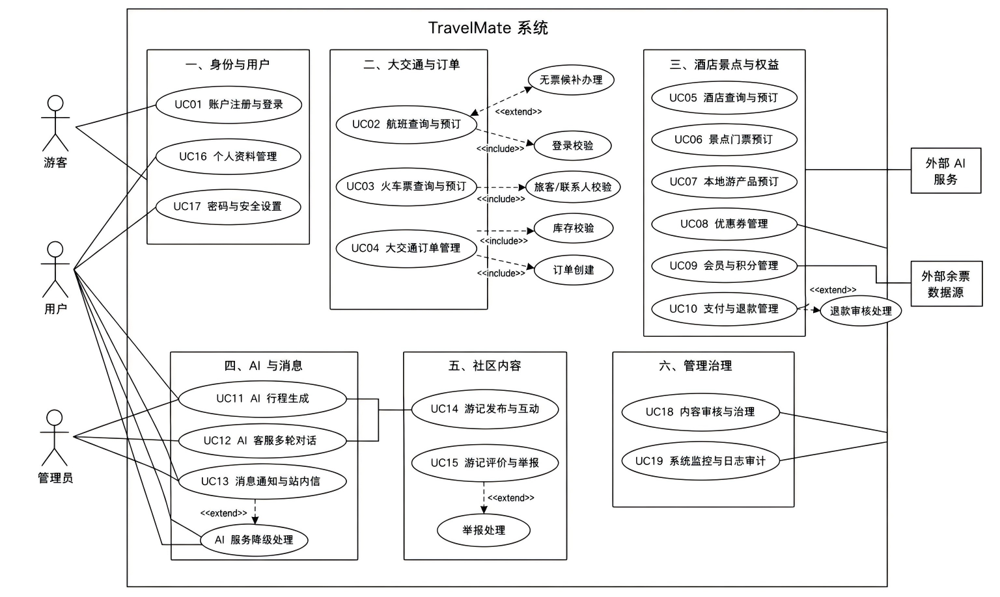

图 REQ-FIG-01 TravelMate UC01—UC19 完整系统用例图

该图从系统边界层面集中展示 TravelMate 的业务范围、主要参与者及外部依赖。UC01—UC19 共同构成课程验收范围，覆盖账户、交通、酒店、景点、本地游、权益、AI、消息、社区以及后台治理等业务领域。

#### 3.4.3 完整用例说明

| 用例 | 参与者、触发条件与前置条件 | 主成功流程 | 备选或异常流程 | 可验证结果 | 系统级模型 |
| :--- | :--- | :--- | :--- | :--- | :--- |
| UC01 用户注册、登录与账户安全 | 游客、用户；游客提交注册/登录，或用户修改密码；受保护操作前账户应可用 | 提交注册或登录信息 → 校验参数与账号 → BCrypt 保存/比对密码 → 签发 JWT → 访问受保护功能或修改密码 | 用户名重复、凭据错误、Token 失效、账号禁用、旧密码错误或越权时拒绝 | 账户数据正确；登录获得有效 Token；非法访问返回 401/403 | SYS-UC01 |
| UC02 查询并预订航班 | 用户；用户输入出发地、目的地和日期；创建订单前已登录并选择本人旅客 | 查询航班 → 选择航班、舱位和旅客 → 校验库存与优惠 → 原子扣减座位 → 创建待支付交通订单 | 无航班、参数非法、旅客无效、库存不足、优惠不可用或重复提交时不建单 | 生成待支付交通订单；航班库存按人数扣减且不为负 | SYS-UC02 |
| UC03 查询并预订火车票或提交候补 | 用户；用户输入车站和日期；下单或候补前已登录并选择旅客 | 查询车次 → 选择席别与旅客 → 判断余票 → 有票扣减并建单，无票时按用户选择提交候补 | 公共余票同步失败时使用本地数据；参数非法、旅客无效或不接受候补时返回失败 | 生成交通订单或候补记录；库存与候补关系正确 | SYS-UC03 |
| UC04 交通订单支付、取消、退款与凭证查看 | 用户、管理员；用户操作本人交通订单；退款审核时管理员已登录 | 查看订单 → 按当前状态支付、取消、申请退款或查看凭证 → 必要时管理员审核 → 更新状态和库存 | 越权、超时支付、非法状态跃迁、重复取消/退款或审核拒绝时保持原状态 | 订单状态、支付退款记录和库存一致；凭证可查询 | SYS-UC04 |
| UC05 搜索酒店并完成订房 | 用户；用户输入城市、入住和离店日期；提交订单前已登录 | 搜索酒店 → 查看房型 → 选择日期、房间数和入住人 → 校验房态与优惠 → 扣减库存 → 创建待支付酒店订单 | 日期非法、房型下架、库存不足、优惠无效、Redis 不可用或重复提交时进入相应分支 | 生成待支付酒店订单；房型库存正确扣减且不超卖 | SYS-UC05 |
| UC06 酒店订单支付、取消、退款与库存回补 | 用户、管理员；用户操作本人酒店订单；退款审核时管理员具有权限 | 读取订单 → 支付或取消；已支付订单可申请退款 → 管理员审核 → 更新状态 → 回补 Redis 与数据库库存 | 支付超时自动关闭；越权、非法状态、重复取消/退款和重复回补时拒绝或幂等返回 | 订单状态与两级库存一致，重复操作不重复回补 | SYS-UC06 |
| UC07 景点浏览与购票 | 用户；用户选择景点和票种；购票前已登录并填写游客信息 | 搜索景点 → 查看详情 → 选择成人/儿童票及游客 → 校验价格和票量 → 扣减票量 → 创建景点订单与凭证 | 景点或票种下架、票量不足、游客信息无效、金额异常或未登录时不建单 | 景点订单、票数、金额和游客信息正确 | SYS-UC07 |
| UC08 选择并预订一日游或周边游产品 | 游客、用户；游客可浏览产品；提交预订前用户已登录并选择日期、人数和联系人 | 浏览产品 → 查看行程步骤与可售日期 → 选择日期、人数和联系人 → 校验库存与价格 → 创建订单并返回结果 | 产品下架、日期不可售、库存不足、未登录、联系人无效或重复提交时失败 | 成功时订单可查；失败时不扣库存、不产生脏订单 | SYS-UC08 |
| UC09 提交评价、回复评价与举报处理 | 用户、管理员/商家；用户对已完成服务评价；管理员或商家回复、处理举报 | 校验履约资格 → 保存评分和图文 → 有权限角色回复 → 用户举报 → 生成工单 → 管理员处理 | 重复评价、评分越界、空内容、越权回复、重复举报或工单重复处理时拒绝/幂等 | 评价、回复、举报工单和处理终态关联正确 | SYS-UC09 |
| UC10 优惠券领取与订单核销 | 用户、管理员；管理员已发布有效优惠券；用户登录后领取并在符合条件订单中使用 | 查询优惠券 → 领取 → 创建用户券 → 下单时校验有效期、门槛和适用范围 → 计算减免 → 一次性核销 | 库存为零、过期、重复领取、不满足门槛、订单类型不适用或重复核销时拒绝 | 用户券状态、减免金额和 used_time 正确且仅更新一次 | SYS-UC10 |
| UC11 生成并保存 AI 行程 | 用户、外部 AI 服务；用户已登录并提交目的地、日期、预算和偏好 | 校验参数 → 调用 AI → 校验结构化 JSON → 匹配站内资源 → 保存行程 → 返回分天卡片 | API Key 缺失、调用超时、服务错误、JSON 非法或部分地点无法匹配时降级 | 行程记录可查询；正常和降级结果均符合前端结构 | SYS-UC11 |
| UC12 AI 客服多轮对话 | 用户、外部 AI 服务；用户已登录并在同一 session 中连续提问 | 保存第一轮问题 → 读取上下文并调用 AI → 保存回答 → 第二轮携带历史上下文调用 → 返回连续回答 | 消息为空、会话不属于当前用户、AI 超时/失败或回答涉及实时业务数据时降级或拒绝 | 同一会话消息顺序正确；失败提示明确且不编造库存订单信息 | SYS-UC12 |
| UC13 通知中心与站内私信 | 用户；业务事件触发通知，或用户主动选择联系人发送私信 | 写入并查询通知 → 标记已读/删除；或选择联系人 → 发送消息 → 查询双方会话 | 通知写入失败不回滚核心交易；接收者不存在、空消息、拉黑关系或越权读取时拒绝 | 未读数、已读状态和会话消息正确，无越权泄露 | SYS-UC13 |
| UC14 游记发布、编辑、删除与审核 | 用户、管理员；用户登录后提交游记；管理员具有内容审核权限 | 上传图文 → 敏感词检测 → 保存待审 → 管理员审核 → 发布或驳回；作者可按状态编辑或删除 | 上传失败、命中禁止规则、越权编辑/删除、重复审核或已发布内容违规下架时进入相应分支 | 游记状态、审核结果、操作人和通知可查询 | SYS-UC14 |
| UC15 社区点赞、收藏与评论 | 用户；用户已登录并打开可见游记 | 浏览帖子 → 点赞/取消点赞 → 收藏/取消收藏 → 发表评论或回复 → 更新统计 | 重复点赞/收藏保持幂等；评论为空、父评论不存在、内容违规或删除他人评论时拒绝 | 互动关系唯一；树状评论和统计数量一致 | SYS-UC15 |
| UC16 常用旅客管理与使用 | 用户；用户已登录；新增旅客时提交姓名、证件类型和证件号 | 查询旅客 → 新增/修改/删除本人旅客 → 交通预订时选择旅客 → 校验归属后使用 | 证件格式错误、同证件重复、越权访问、删除已被未完成订单引用的旅客时拒绝 | 旅客归属和证件信息正确，其他用户无法访问或使用 | SYS-UC16 |
| UC17 用户主页与关注关系 | 用户；用户访问本人或他人主页；关注操作前已登录 | 查询公开资料与游记 → 关注或取消关注 → 查询粉丝/关注列表 → 更新计数 | 自关注、目标不存在、重复关注/取消、查看隐私字段或越权修改主页时拒绝/幂等 | 关注关系唯一，计数一致，隐私字段不泄露 | SYS-UC17 |
| UC18 管理后台资源、订单与用户管理 | 管理员；管理员登录后台并通过 RBAC 校验 | 选择资源/订单/用户任务 → 查询或维护数据 → 执行启停、导入或退款审核 → 写入审计日志 | 普通用户访问、CSV 非法行、删除被引用资源、非法订单状态或重复审核时拒绝 | 业务数据状态正确，关键动作和操作人可追踪 | SYS-UC18 |
| UC19 内容安全、举报处理与可观测性 | 管理员；管理员进入审核、举报、敏感词或监控页面并具有权限 | 审核内容 → 处理举报 → 维护敏感词 → 查询日志、QPS 和业务指标 → 记录操作 | 重复处理保持终态；词库更新失败保留旧规则；统计失败不阻断审核；无权限拒绝 | 内容、工单、词库、日志和指标状态均可追踪 | SYS-UC19 |

#### 3.4.4 概念类图

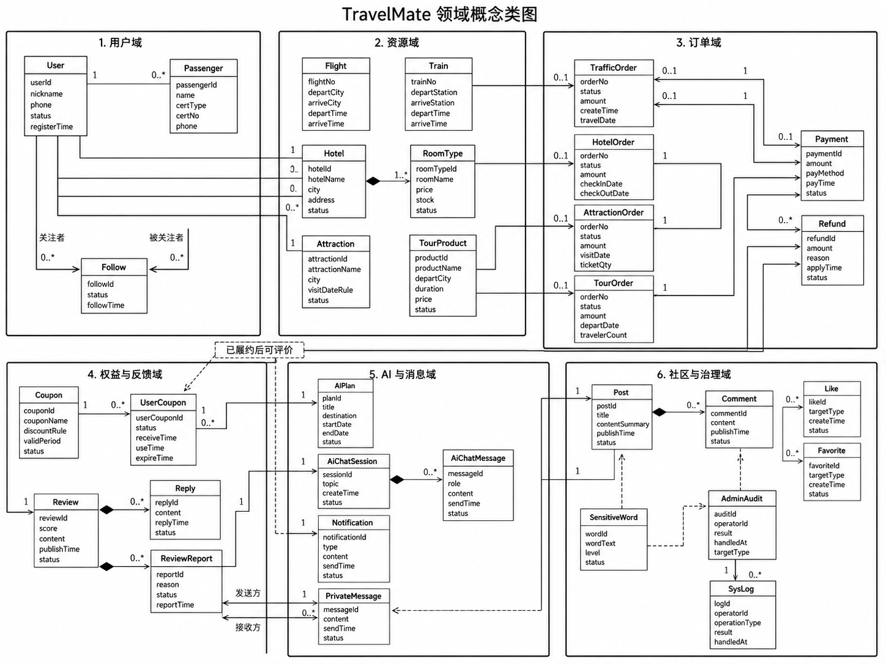

图 REQ-FIG-02 TravelMate 领域概念类图

该图描述需求层面的核心业务概念及其关系，重点体现用户、资源、订单、支付退款、权益、内容和治理数据之间的关联。概念类图作为后续数据库设计和详细类设计的业务语义基线，不包含具体框架类和实现技术。

#### 3.4.5 UC01—UC19 系统级模型图

本节从使用者和外部系统视角描述十九个业务场景的完整处理过程，重点体现业务请求、系统响应、异常结果和可验证终态。各模型与 3.4.3 节的用例说明一一对应，并作为概要设计、详细设计和测试用例的上游依据。

##### REQ-FIG-03 SYS-UC01 用户注册、登录与账户安全活动图

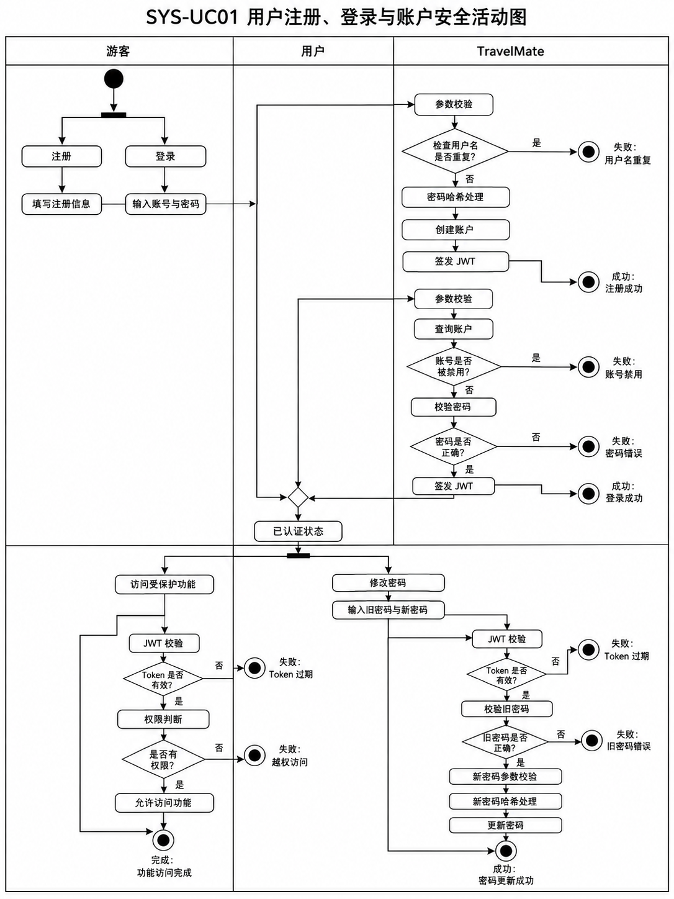

图 REQ-FIG-03 SYS-UC01 用户注册、登录与账户安全活动图

该流程覆盖注册、登录、身份校验和密码维护。系统在成功操作后建立可信身份状态，在凭据错误、Token 失效、账号禁用或越权时返回明确的拒绝结果。

##### REQ-FIG-04 SYS-UC02 查询并预订航班系统级顺序图

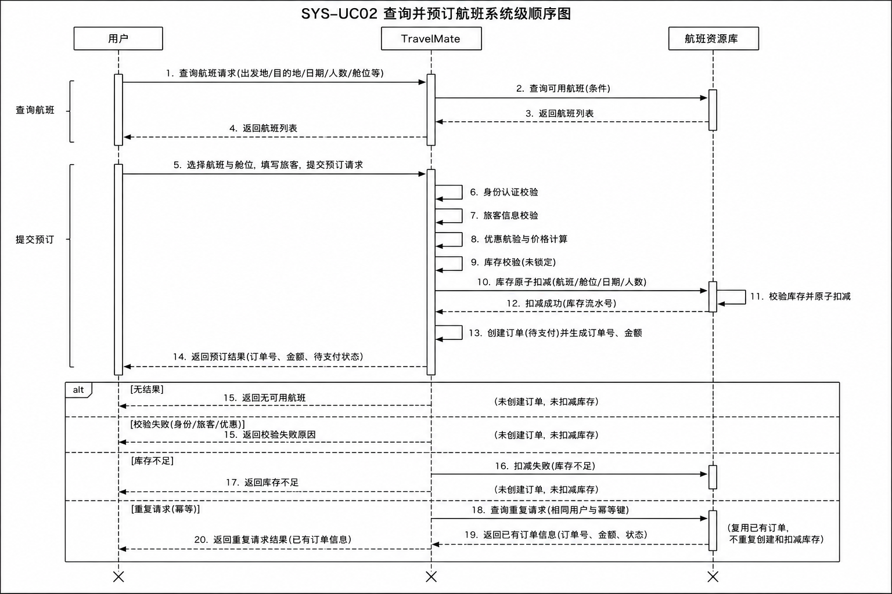

图 REQ-FIG-04 SYS-UC02 查询并预订航班系统级顺序图

该流程展示用户从提交航班查询条件到获得待支付订单的完整交互。订单创建以旅客有效、价格正确和库存扣减成功为前提，任何校验失败均不得产生有效订单。

##### REQ-FIG-05 SYS-UC03 查询并预订火车票或提交候补活动图

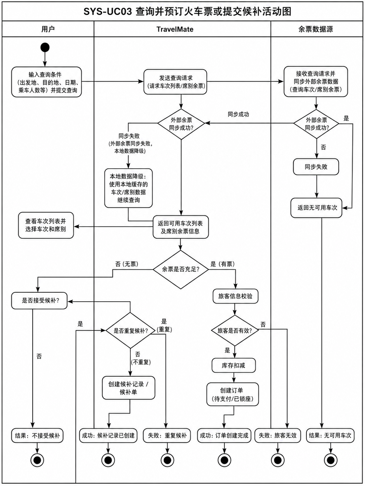

图 REQ-FIG-05 SYS-UC03 查询并预订火车票或提交候补活动图

该流程根据余票结果形成直接预订和候补申请两条业务路径。有票时生成交通订单，无票且用户接受候补时生成候补记录，最终结果可以通过订单号或候补记录进行验证。

##### REQ-FIG-06 SYS-UC04 交通订单支付、取消、退款与凭证查看状态图

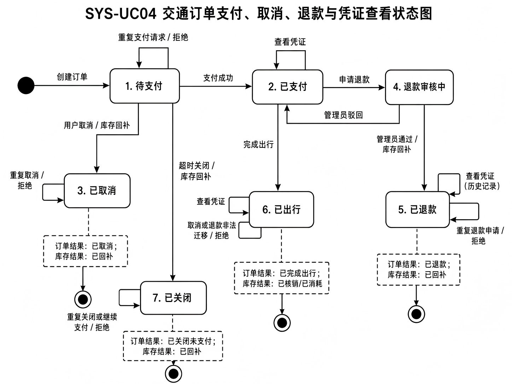

图 REQ-FIG-06 SYS-UC04 交通订单支付、取消、退款与凭证查看状态图

该模型说明交通订单在待支付、已支付、已取消、退款中、已退款和已完成等状态之间的变化。每次操作均受当前状态和订单归属约束，并保持支付、退款、库存及凭证数据一致。

##### REQ-FIG-07 SYS-UC05 搜索酒店并完成订房活动图

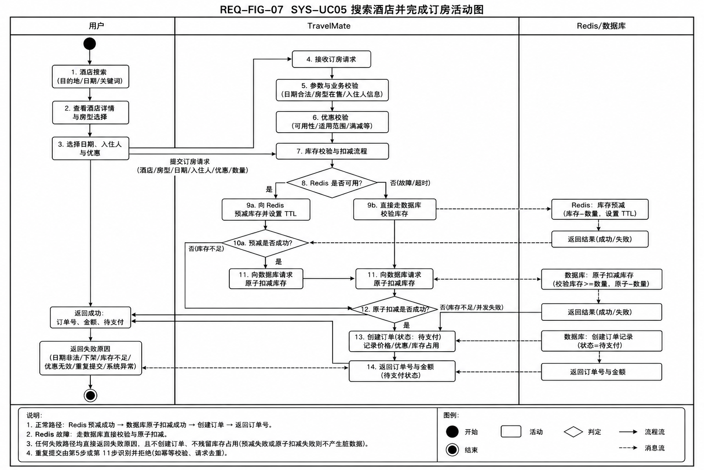

图 REQ-FIG-07 SYS-UC05 搜索酒店并完成订房活动图

该流程覆盖酒店搜索、房型选择、入住信息填写、优惠校验、库存扣减和订单创建。预订成功后生成待支付酒店订单，库存不足、日期非法或重复提交时不产生脏数据。

##### REQ-FIG-08 SYS-UC06 酒店订单支付、取消、退款与库存回补状态图

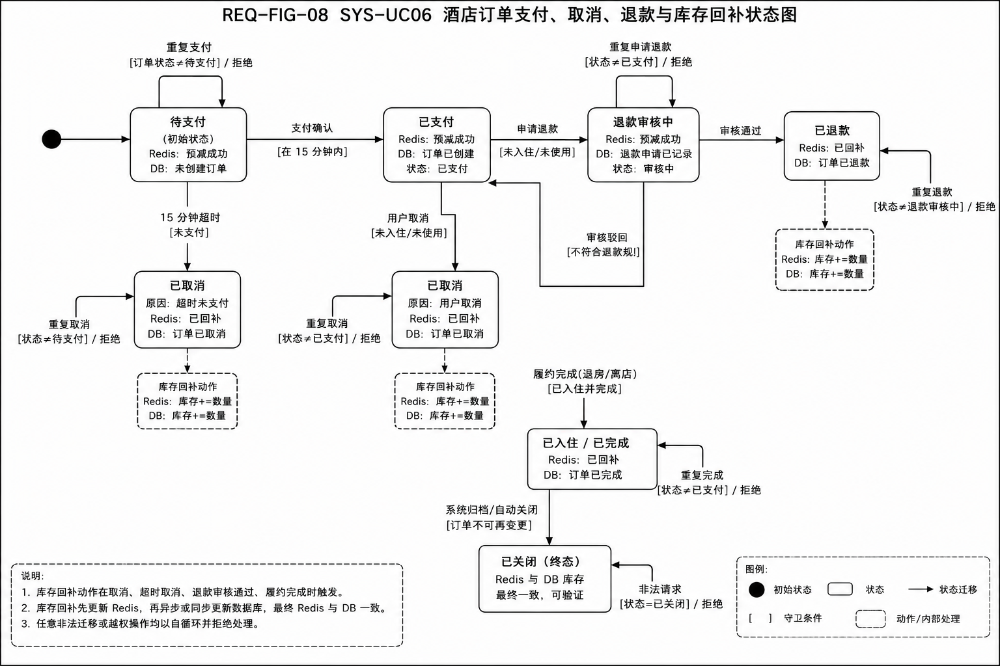

图 REQ-FIG-08 SYS-UC06 酒店订单支付、取消、退款与库存回补状态图

该模型描述酒店订单支付后的生命周期以及取消、超时关闭和退款处理。涉及订单终止的操作需要同步完成库存回补，并保证缓存库存与数据库库存最终一致。

##### REQ-FIG-09 SYS-UC07 景点浏览与购票活动图

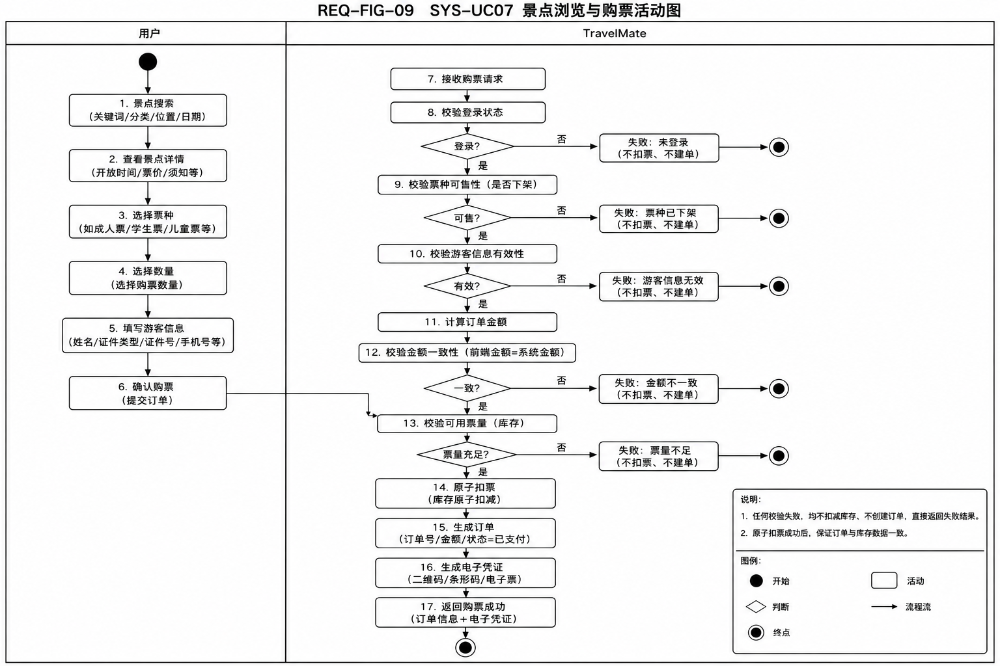

图 REQ-FIG-09 SYS-UC07 景点浏览与购票活动图

该流程从景点浏览和票种选择开始，经游客信息、票价及票量校验后生成购票订单和电子凭证。票种下架、票量不足或游客信息无效时，系统返回失败结果且不扣减票量。

##### REQ-FIG-10 SYS-UC08 选择并预订一日游或周边游产品活动图

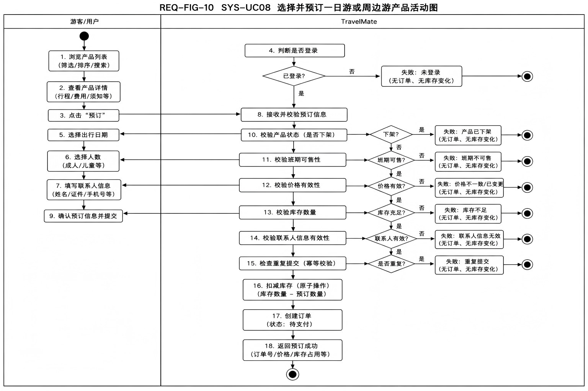

图 REQ-FIG-10 SYS-UC08 选择并预订一日游或周边游产品活动图

该流程覆盖产品浏览、班期选择、人数与联系人填写以及订单提交。系统根据产品状态、班期、价格和库存决定是否建单，确保失败请求不会造成库存或订单异常。

##### REQ-FIG-11 SYS-UC09 提交评价、回复评价与举报处理活动图

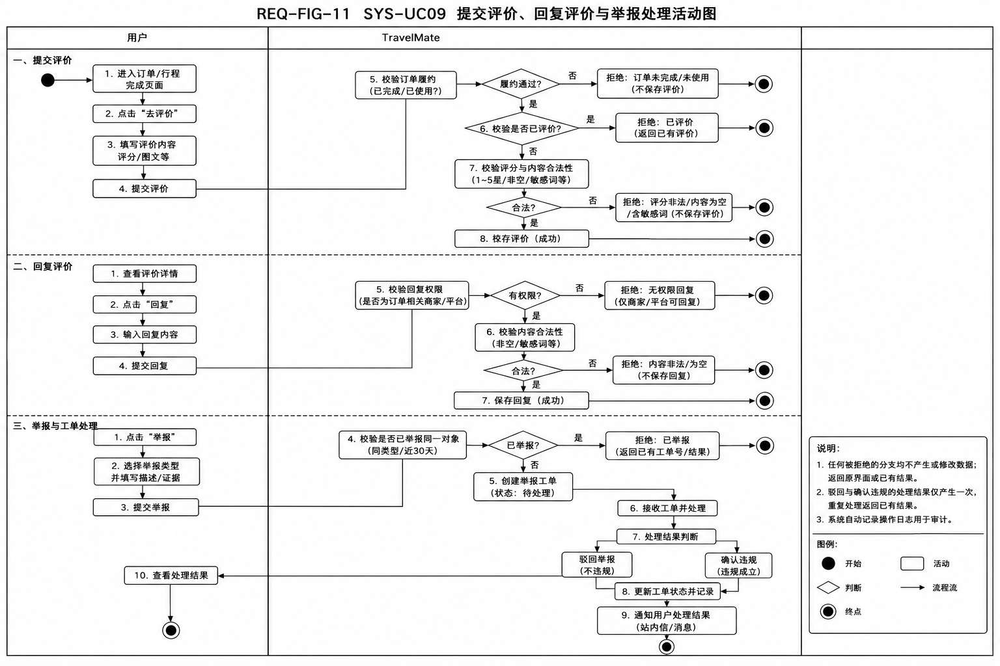

图 REQ-FIG-11 SYS-UC09 提交评价、回复评价与举报处理活动图

该流程将履约后评价、商家或管理员回复、用户举报和后台处理连接为完整闭环。系统需要验证评价资格和操作权限，并为举报生成可追踪的处理记录及明确终态。

##### REQ-FIG-12 SYS-UC10 优惠券领取与订单核销状态图

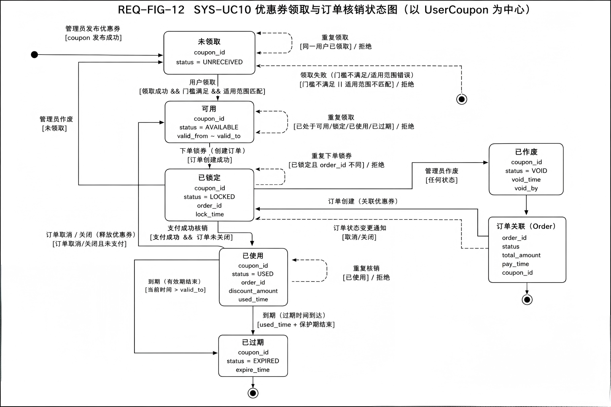

图 REQ-FIG-12 SYS-UC10 优惠券领取与订单核销状态图

该模型描述优惠券从发布、领取、锁定到核销、释放、过期或作废的状态变化。优惠券只能在适用范围和有效期内使用，同一权益不得被重复领取或重复核销。

##### REQ-FIG-13 SYS-UC11 生成并保存 AI 行程系统级顺序图

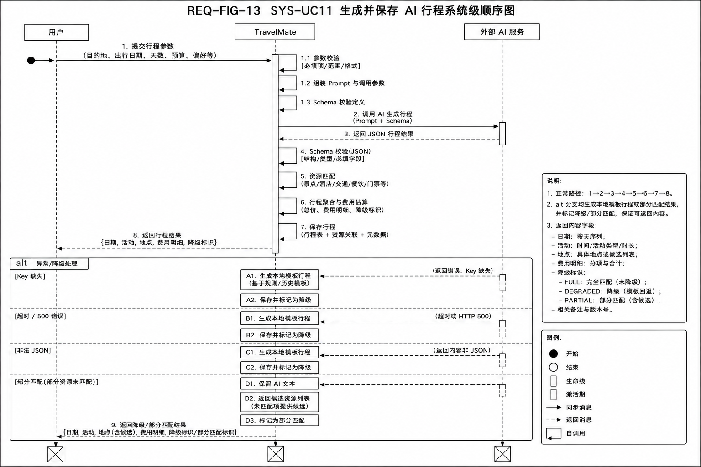

图 REQ-FIG-13 SYS-UC11 生成并保存 AI 行程系统级顺序图

该流程展示用户提交目的地、天数、预算和偏好后，系统调用外部 AI、校验返回结构、匹配站内资源并保存行程。外部服务不可用时返回可解释的降级结果，不影响用户获得基础行程方案。

##### REQ-FIG-14 SYS-UC12 AI 客服多轮对话系统级顺序图

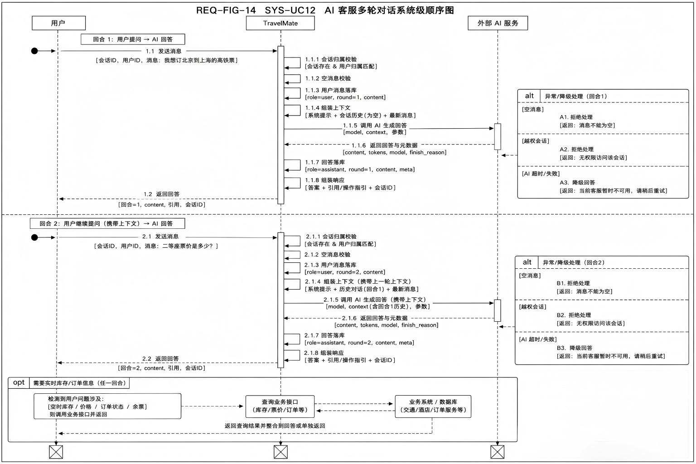

图 REQ-FIG-14 SYS-UC12 AI 客服多轮对话系统级顺序图

该流程体现同一会话中的连续提问、上下文传递和回答保存。系统必须校验会话归属，并在 AI 超时或失败时提供明确提示，避免伪造实时库存和订单信息。

##### REQ-FIG-15 SYS-UC13 通知中心与站内私信活动图

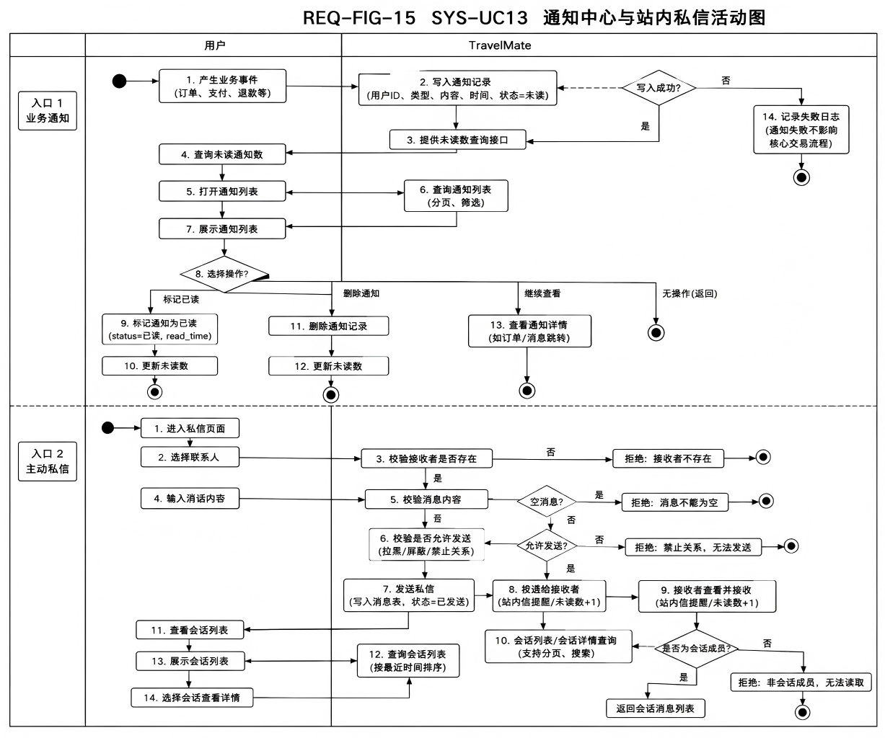

图 REQ-FIG-15 SYS-UC13 通知中心与站内私信活动图

该流程同时覆盖业务事件触发的站内通知和用户主动发送的私信。通知写入失败不得回滚核心交易，私信发送和会话读取则必须校验接收者及会话成员权限。

##### REQ-FIG-16 SYS-UC14 游记发布、编辑、删除与审核状态图

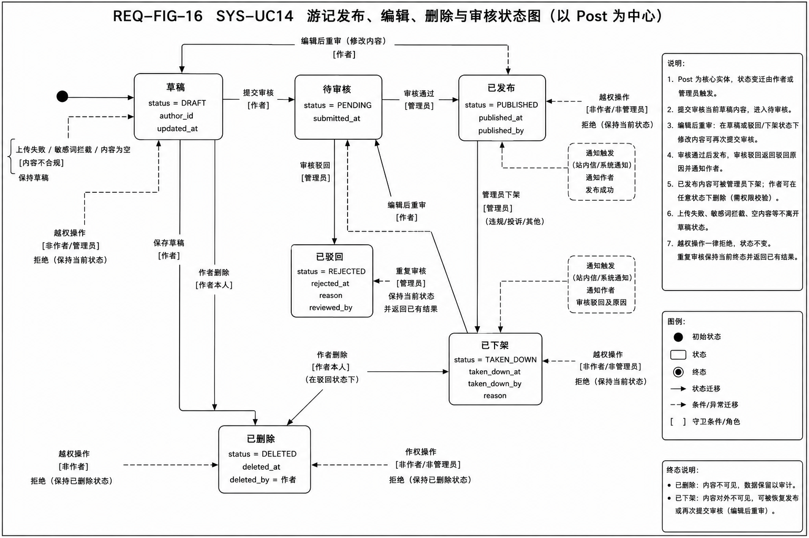

图 REQ-FIG-16 SYS-UC14 游记发布、编辑、删除与审核状态图

该模型描述游记从草稿、待审核到发布、驳回、下架或删除的生命周期。编辑后的内容需要重新进入审核，作者和管理员只能在各自权限范围内执行状态操作。

##### REQ-FIG-17 SYS-UC15 社区点赞、收藏与评论活动图

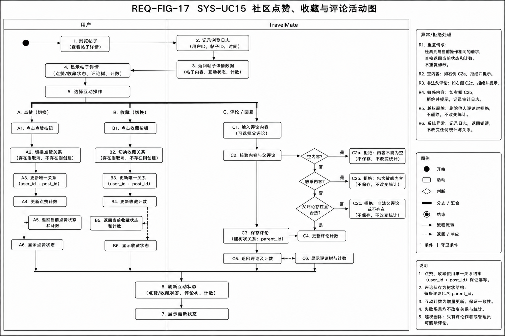

图 REQ-FIG-17 SYS-UC15 社区点赞、收藏与评论活动图

该流程展示用户浏览游记后进行点赞、收藏、评论和回复的互动过程。系统通过唯一关系和权限校验保证操作幂等，并在失败时保持互动计数与实际数据一致。

##### REQ-FIG-18 SYS-UC16 常用旅客管理与使用活动图

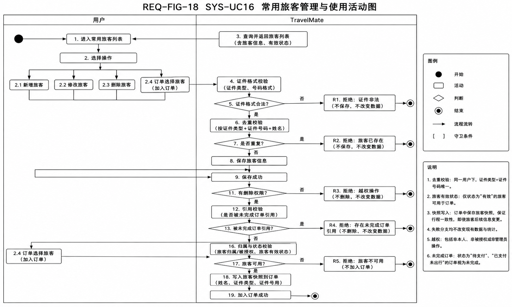

图 REQ-FIG-18 SYS-UC16 常用旅客管理与使用活动图

该流程覆盖常用旅客的新增、修改、删除和预订时选用。系统需要验证旅客归属、证件格式及重复证件，并在下单时保存必要的旅客信息快照。

##### REQ-FIG-19 SYS-UC17 用户主页与关注关系活动图

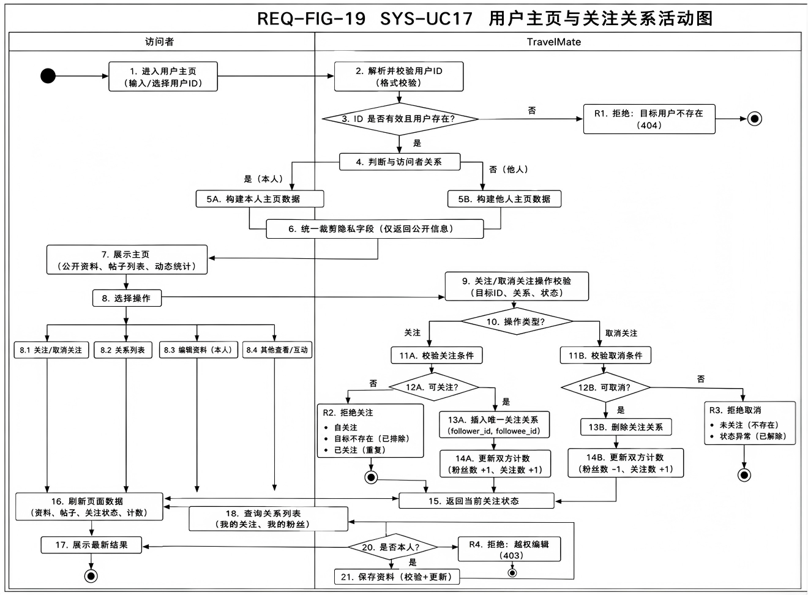

图 REQ-FIG-19 SYS-UC17 用户主页与关注关系活动图

该流程描述用户主页展示、关注或取消关注以及粉丝和关注列表查询。公开信息与隐私信息需要严格区分，关注关系必须唯一且双方统计数量保持一致。

##### REQ-FIG-20 SYS-UC18 管理后台资源、订单与用户管理活动图

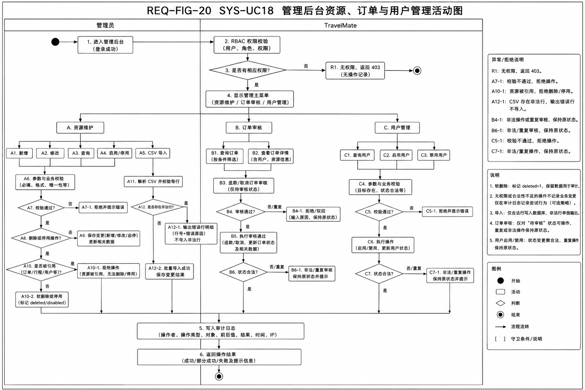

图 REQ-FIG-20 SYS-UC18 管理后台资源、订单与用户管理活动图

该流程归纳管理员对资源、订单和用户执行维护、审核、启停及批量导入的业务操作。所有管理动作必须经过权限校验，并记录操作人、处理结果和时间等审计信息。

##### REQ-FIG-21 SYS-UC19 内容安全、举报处理与可观测性活动图

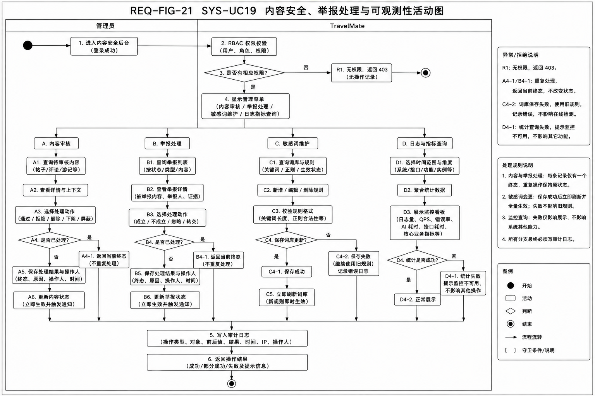

图 REQ-FIG-21 SYS-UC19 内容安全、举报处理与可观测性活动图

该流程覆盖内容审核、举报工单处理、敏感词维护以及日志和指标查询。处理结果需要可追踪，监控统计失败不得阻断核心审核业务，敏感词更新失败时继续使用原有规则。

#### 3.4.6 AI 行程生成与调度
输入：目的地、天数、预算、人数、偏好标签。
处理：构造 Prompt 异步调用 DeepSeek API，通过 JSON Output 约束返回结果，并匹配站内 Mock 资源。
输出：分天展示的 JSON 行程数据及推荐资源列表。

#### 3.4.7 订单并发与库存控制
行为：用户下单时，Redis 优先预减库存，数据库使用原子语句校验，防止超卖。
时限：超时 15 分钟未支付订单需自动触发库存回滚。

#### 3.4.8 内容审核与社交安全
功能：对 UGC 内容进行敏感词自动过滤与人工复核，确保社区合规性。

### 3.5 CSCI外部接口需求
#### 3.5.1 接口标识
系统与DeepSeek API、第三方地图API及文件存储服务进行交互。
#### 3.5.2 用户接口
风格：卡片式设计，蓝色系主调。组件：Element Plus（统一用于 PC Web 端）。
#### 3.5.3 硬件接口
运行于标准个人计算机，适配1080P及以上分辨率显示器。
#### 3.5.4 软件接口
DeepSeek API：采用OpenAI兼容协议，Bearer Auth认证。
支付模拟：内部Webhook回调，不接真实网关。
#### 3.5.5 通信接口
协议：HTTP/HTTPS,RESTful API。
数据格式：标准 JSON。

### 3.6 CSCI内部接口需求
子系统C(AI)需调用子系统A/B提供的资源检索接口获取Mock数据。
子系统D生成的内容需推送到子系统E的审核流接口。

### 3.7 CSCI内部数据需求
核心业务概念、关键属性、关系和基数以 3.4.4 节 REQ-FIG-02《TravelMate 领域概念类图》为需求基线。概要设计和详细设计可以增加技术类与实现关系，但不得改变本需求说明定义的业务概念含义。

### 3.8 适应性需求
前端需通过Vue路由懒加载和Vite资源分包适应不同网络环境下的加载速度。

### 3.9 保密性需求
身份验证：基于JWT的Token验证机制。
权限控制：基于RBAC的角色访问控制，防止越权访问。

### 3.10 保密性和私密性需求
用户密码存储需进行哈希加密，社区隐私字段在接口层进行数据脱敏。

### 3.11 CSCI环境需求
开发工具：JDK 21,Node.js,Git,IDE。
部署工具：Nginx配置HTTP Gzip压缩。

### 3.12 计算机资源需求
#### 3.12.1 计算机硬件需求
本系统(CSCI)主要部署于云端服务器或本地模拟环境，具体硬件需求如下：
处理器(CPU)：建议2核及以上，以支持Java虚拟机的并发处理与大模型API的异步调度。
存储器(RAM)：系统运行总内存需求不低于4GB。其中，Java运行时环境(JRE)建议分配1GB-2GB堆内存，MySQL与Redis实例各需约512MB运行空间。
辅助存储器(硬盘)：初始占用空间约2GB(含系统镜像与基础数据)，建议预留20GB以上固态存储(SSD)空间，用于存储UGC社区图片、系统运行日志及数据库持久化文件。
通信/网络设备：需配备标准的以太网卡或无线网络适配器，支持持续的互联网接入，以确保与外部DeepSeek API及其它第三方地图服务联通。
#### 3.12.2 计算机硬件资源利用需求
为保证系统在演示及测试阶段的稳定性，硬件资源利用限制如下：
处理器利用率：在正常负载下(如单用户行程规划)，平均CPU利用率应低于30%；在模拟并发下单场景下，峰值CPU利用率不应长时间超过70%。
存储器容量利用：系统常驻内存占用应控制在分配总额的80%以内。Redis缓存需配置过期策略，防止Mock数据堆积导致内存溢出。
辅助存储器利用：由于采用图片压缩技术，UGC存储空间增长应可控；系统需配置日志滚动删除策略，确保磁盘占用率不超过90%。
网络带宽利用：单次AI交互产生的数据流量通常在KB级别，峰值带宽占用主要集中在前端静态资源初次加载与社区图片上传阶段。
#### 3.12.3 计算机软件需求
系统开发与运行必须依赖以下软件环境：
操作系统：服务端建议使用Linux(Ubuntu 20.04 LTS 或 CentOS 7.9 及以上)；客户端支持Windows 10/11、macOS或现代移动端浏览器。
数据库管理系统：MySQL 8.0.x，用于核心业务数据的持久化存储。
缓存软件：Redis 6.2或7.x版本，用于库存预占、会话管理及热点Mock数据缓存。
运行环境与实用软件：
Java Development Kit (JDK) 21：后端服务运行基石。
Nginx 1.20+：负责静态资源托管及后端API的反向代理。
Node.js 18+：前端构建工具Vite的运行环境。
外部API引用：DeepSeek API(兼容 OpenAI 协议版本)，用于支持AI智能规划的核心功能。
#### 3.12.4 计算机通信需求
系统涉及的通信机制与性能指标要求如下：
配置与拓扑结构：采用典型的前后端分离架构。前端(Browser)通过公共网络与后端(Spring Boot Server)连接，后端在内网环境下与MySQL和Redis实例通信。
传输技术与协议：全站基于TCP/IP协议，应用层统一采用HTTP/HTTPS协议及RESTful API规范。
数据传输速率：后端接口响应(不含 AI 生成)时间应在500ms以内；AI行程生成受限于大模型算力，首字响应(Stream)或整体返回时间应控制在3-10秒。
网关需求：需支持跨域资源共享(CORS)配置，以允许前端单页面应用(SPA)的安全访问。
数据的峰值与容量：系统需具备处理短时间内每秒数十次(QPS)请求的能力，特别是针对订票与订房的库存减扣接口。

### 3.13 软件质量因素
#### 3.13.2 可靠性
数据一致性：在高并发模拟场景下，订票与订房库存不得出现超卖现象，数据库与Redis缓存状态需最终一致。
服务可用性：系统应具备处理大模型API超时或宕机的异常处理机制，保证在非核心功能失效时主流程依然可访问。
#### 3.13.3 可维护性
规范化：代码需遵循阿里巴巴Java开发手册规范，前端遵循Vue 3组合式API开发规范。
模块化：采用前后端分离架构，各功能模块通过RESTful API通信，确保单个模块的修改不影响整体系统。
#### 3.13.4 易用性
交互效率：用户从输入行程需求到生成计划的操作步骤应控制在3步以内。
反馈及时性：所有写操作(如提交订单)需在1秒内给出反馈。AI生成等长耗时操作需提供Loading状态或流式输出。

### 3.14 设计和实现的约束
技术栈约束：后端必须使用JDK 21与Spring Boot 3.x；前端使用Vue 3 (Vite + JavaScript)；数据库使用MySQL 8.0与Redis。
接口规范：AI模块必须兼容OpenAI API协议，采用异步调用机制以防止阻塞主线程。
数据标准：所有地理位置信息需符合标准经纬度格式，订单金额统一使用分(Integer 类型)存储。
安全性约束：用户密码必须经过BCrypt或类似的单向哈希加密存储，敏感接口需携带JWT令牌验证。

### 3.15 数据
输入数据：用户注册信息、行程偏好(地点、预算、天数等)、订单支付指令、UGC社区图文内容。
输出数据：AI生成的结构化行程JSON、订单状态凭证、可视化系统监控报表、社区动态瀑布流。
处理量与数据量：系统应支持至少100个模拟并发连接；数据库设计需支持万级订单量与十万级Mock资源数据的快速检索。

### 3.16 操作
常规操作：用户通过浏览器访问平台，进行登录、搜索资源、AI规划行程、下单及社区发布。
初始化操作：通过执行init.sql脚本完成数据库表结构与基础Mock数据的装载；通过Nginx配置文件完成前端静态资源与后端API反向代理的映射。
恢复操作：若系统宕机，需支持通过重启JAR包及Redis实例实现快速服务恢复；数据库需支持基于Binlog的增量恢复。

### 3.17 故障处理
API 故障：当DeepSeek API响应超时或由于额度不足返回错误时，系统需拦截错误并返回预定义的“推荐行程模版”，确保用户不看到空白页面。
库存冲突：当多用户同时抢购最后一份资源时，系统应捕获数据库OptimisticLockingFailureException，并向用户提示“库存已售罄”。
错误信息定义：
ERR_001: AI服务暂不可用，请稍后再试。
ERR_002: 库存不足，订单关闭。
ERR_003: 登录过期，请重新认证。

### 3.18 算法说明
#### 3.18.1 AI 结构化生成算法
概况：利用Prompt Engineering将非结构化的用户需求转化为结构化的JSON数据。
实现细节：系统构建一个包含出行背景的System Prompt，要求模型按预定义的分天行程Schema输出（包含：活动名称、时间点、地点、费用估算）；AI响应落库后支持历史记录查询；API超时时自动降级返回预设模板行程。
#### 3.18.2 库存防超卖算法
概况：基于Redis原子操作与Lua脚本的分布式限流与扣减算法。
公式：IF (Redis.get(stock_key) >= req_num) THEN Redis.decrby(stock_key, req_num) ELSE RETURN -1。

### 3.19 有关人员需求
普通用户：需具备基础的Web浏览器操作能力，无需专业背景。
系统管理员(开发者)：需熟悉Linux基础命令、Git版本控制以及Spring Boot监控端点(Actuator)的使用。
并发需求：系统需支持50-100名用户同时在线进行行程查询。

### 3.20 有关培训需求
系统应交付《用户操作指南》，涵盖如何启动AI行程助手以及如何进行订单核销。
开发者需提供《部署维护文档》，说明环境搭建、API Key配置及数据库迁移步骤。

### 3.21 有关后勤需求
维护支持：采用GitHub/GitLab进行代码版本管理。
托管环境：可运行于配备4G内存以上的轻量级云服务器或本地实验环境计算机。

### 3.22 其他需求
可观测性：系统管理端需集成轻量级监控大屏，实时展示系统QPS、AI响应耗时及错误日志占比。

### 3.23 包装需求
交付物组成：源代码压缩包、数据库初始化.sql文件、README.md(包含运行步骤)、演示视频(MP4 格式)。
标签规范：代码库需打上v1.0-final的Release标签。

### 3.24 需求的优先次序和关键程度
关键(Essential)：用户认证、AI行程生成主流程、订单支付逻辑、库存安全校验。
重要(Important)：社区图文上传、后台资源管理模块、系统监控报警。
重要(Important)：历史价格趋势 ECharts 图表展示、CSV 批量数据导入、候补抢票系统。
可选(Optional)：多语言切换、AI语音输入交互。

## 4 合格性规定

| 验收项 | 合格标准 | 合格性方法 |
| :--- | :--- | :--- |
| 用例完整性 | UC01—UC19 均可运行，并产生本说明书规定的可验证结果 | 按 19 个用例逐项演示，检查数据库、接口响应、页面结果和异常路径 |
| 需求与模型 | 每个 UC 均有 REQ、用例说明、SYS、COMP、OBJ 编号，总用例图和概念类图内容一致 | 文档审查和编号交叉检查 |
| 测试与追溯 | 每个 UC 均有 UNIT、INT、E2E 测试及实际报告、截图、执行时间和 commit | 检查测试代码、原始报告和追溯矩阵，不接受只写“通过” |
| 并发性能 | 并发下单时库存不超卖、不出现负数，订单与库存最终一致 | 使用 JMeter 进行 50 线程以上压力测试并核对数据与日志 |
| AI 降级 | AI 超时、配置缺失或结构非法时返回可解释的降级结果，主页面不空白 | 故障注入、接口断言和页面演示 |
| 接口规范 | 接口采用 HTTP/HTTPS、RESTful、JSON 和统一错误响应 | 检查 Knife4j/接口文档、请求响应和实现代码 |
| 安全性 | 密码哈希、JWT 鉴权、RBAC 和隐私字段裁剪有效 | 代码审查、数据库抽检和未认证/越权测试 |

## 5 需求可追踪性

本说明书中的需求采用以下追溯链：

`REQ-xx → UCxx → SYS-UCxx → COMP-UCxx → OBJ-UCxx → 主要代码 → UNIT-TC-1xx / INT-TC-1xx / E2E-TC-1xx → 实际报告与 commit`

1. REQ-01—REQ-19 与 UC01—UC19 一一对应，关系见 3.4.1 节。
2. UC01—UC19 的系统级模型为 SYS-UC01—SYS-UC19，对应 REQ-FIG-03—REQ-FIG-21。
3. 组件级模型 `COMP-UCxx` 应在概要设计说明书中保持同一用例边界；对象级模型 `OBJ-UCxx` 应在详细设计说明书中落实到真实代码对象。
4. 测试编号必须与 UC 后两位保持对应，例如 UC02 使用 UNIT-TC-102、INT-TC-102、E2E-TC-102。
5. 每个用例的验收结论由设计、代码、测试和实际运行证据共同支持。
6. UC01—UC19 构成本项目的验收范围，需求、模型、代码和测试采用统一编号进行交叉核对。

## 6 外部依赖与范围约束

外部 API 稳定性：第三方 DeepSeek API 可能出现响应延迟或不可用，系统通过超时控制、结构校验和本地行程模板保证降级可用。

支付接口范围：课程项目采用模拟支付，不接入支付宝、微信支付等真实商业支付网关。

## 7 注解
CSCI: Computer Software Configuration Item，本说明书指代“伴游”系统整体。
UGC: User Generated Content，用户生成的社区内容。
JWT: JSON Web Token，用于身份认证的开放标准。

## 附录
无
