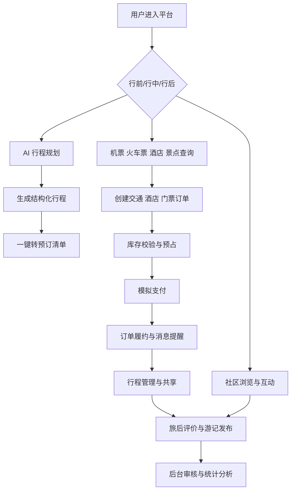

# 软件概要设计说明书

[Toc]

## 1 引言

### 1.1 编写目的

本文档用于说明伴游（TravelMate）出行旅游平台在系统设计阶段的总体设计方案，描述系统的业务目标、总体架构、模块划分、接口组织、数据结构、数据库方案和运行机制，为后续详细设计、编码实现、测试验证、部署交付和课程答辩提供统一依据。

本文档主要面向以下读者：

1. 项目组成员，用于统一架构理解和模块边界；
2. 教师与助教，用于审阅系统设计的完整性与合理性；
3. 测试与部署人员，用于理解系统组成、接口关系和运行方式；
4. 后续维护人员，用于快速理解系统总体设计。

### 1.2 背景

软件系统名称：伴游（TravelMate）出行旅游平台。

项目任务提出者：软件工程基础 2026 春课程组。

项目开发者：Miracle 小组。

系统预期用户包括：

1. 普通游客用户；
2. 平台内容创作者；
3. 平台运营与审核人员；
4. 平台管理员与超级管理员。

本系统对标携程、同程、去哪儿等出行旅游平台，同时结合内容社区、AI 智能规划与后台可观测等课程加分项，覆盖“行前规划 - 行中服务 - 行后分享”的完整旅程场景。

### 1.3 定义

本文档涉及的主要术语定义如下：

1. OTA：Online Travel Agency，在线旅游代理平台。
2. UGC：User Generated Content，用户生成内容，如游记、评论、图片、视频等。
3. JWT：JSON Web Token，用于前后端身份认证和会话校验的令牌。
4. RBAC：Role-Based Access Control，基于角色的访问控制模型。
5. QPS：Queries Per Second，每秒请求数，用于衡量接口吞吐能力。
6. Mock：模拟数据或模拟接口，用于课程项目中替代真实商业接口。
7. RESTful API：基于 HTTP 协议的资源风格接口设计方式。
8. Agent：具备任务理解、工具调用和多轮对话能力的智能代理。
9. Skills：大模型可调用的外部工具或内部函数能力。
10. RAG：Retrieval-Augmented Generation，检索增强生成技术。
11. Redis：键值缓存中间件，用于缓存、限流、延时控制和热点状态存储。
12. MyBatis-Plus：基于 MyBatis 的 ORM 增强框架。

### 1.4参考设计

本系统概要设计参考以下资料：

1. 软件工程基础 2026 春大作业要求；
2. 伴游（TravelMate）出行旅游平台软件开发计划书；
3. TravelMate（伴游）智能旅游平台软件详细设计说明书；
4. 软工小组大作业构思文档；
5. 项目现有前后端代码、接口定义、数据库脚本和原型设计稿；
6. Spring Boot、Vue 3、Vite、MySQL、Redis、Element Plus、ECharts 等官方文档；
7. 携程、同程、去哪儿、小红书等产品的公开功能调研结果。

## 2 系统需求概述

### 2.1需求规定

TravelMate 面向旅游出行全流程，要求支持用户完成从方案规划、资源检索、订单生成、行程管理，到消息提醒、内容分享和后台运营的一体化使用过程。

系统的主要输入包括：

1. 用户输入的出发地、目的地、日期、预算、人数、偏好标签等查询和规划条件；
2. 用户提交的注册登录信息、旅客信息、住客信息、订单信息、社区内容和互动行为；
3. 管理员维护的航班、火车、酒店、景点、价格、促销、敏感词和权限配置数据；
4. AI 模块调用时的对话上下文、工具参数和行程约束条件；
5. 系统监控模块采集的访问日志、异常日志和业务统计指标。

系统的主要输出包括：

1. 航班、车次、酒店、景点、本地玩乐等资源检索结果；
2. 机票、火车票、酒店、门票等订单处理结果及状态变化信息；
3. AI 生成的结构化行程单、客服问答结果和消息提醒；
4. 社区内容流、互动结果、用户主页数据和推荐结果；
5. 后台资源管理结果、审核结果、监控面板数据和系统日志信息。

### 2.2业务目标

本系统的业务目标如下：

1. 构建一个覆盖“行前规划 - 行中服务 - 行后分享”完整旅程链路的综合出行旅游平台；
2. 完成机票、火车票、酒店、本地玩乐、AI 行程规划、AI 客服、旅途社区、后台管理和可观测仪表盘等核心需求实现；
3. 建立统一的用户体系、订单体系、资源体系、消息体系和权限体系，为多模块协同提供稳定基础；
4. 在课程项目范围内实现可演示、可部署、可答辩、可复现的完整系统；
5. 保证关键业务链路在小并发场景下具备稳定性，满足课程对可用性和工程完整性的要求。

### 2.3运行环境

本系统采用 B/S 架构，用户和管理员通过浏览器访问前端页面，前端通过 HTTP/JSON 调用后端接口，后端通过 MySQL、Redis 和外部 AI 服务完成数据存储、状态控制与智能处理。

系统运行方式支持正常运行、维护运行和降级运行三种状态：

1. 正常运行状态下，平台提供完整的资源检索、AI 行程生成、下单支付、社区互动和后台管理能力；
2. 维护运行状态下，后台可进行资源批量更新、数据库维护和配置调整；
3. 降级运行状态下，当大模型接口或第三方服务异常时，系统自动切换为本地模板、Mock 数据或错误重试提示，以保证主流程仍可访问。

#### 2.3.1设备

运行本系统所需的硬件设备包括：

1. 开发与测试使用的个人计算机，用于前后端开发、联调和本地部署；
2. 可运行现代浏览器的桌面终端或移动终端，用于访问用户端和管理端页面；
3. 本地或局域网部署的 MySQL 与 Redis 运行主机，用于业务数据持久化和缓存服务；
4. 课程验收时用于展示和部署的普通 PC 环境，用于现场演示和答辩。

其中可选的新型设备及其专门功能包括：

1. 智能手机或平板设备：用于移动端浏览、行程查询、社区浏览和消息提醒展示；
2. 摄像头与麦克风设备：用于 AI 客服、语音输入、演示录制和答辩展示；
3. 扫码设备或摄像头扫码能力：用于社区打卡、门票核销和二维码展示场景；
4. 外接显示器：用于管理后台大屏、可观测仪表盘和多窗口联调展示。

本系统不依赖专用票务服务器、GPU 集群或生产级多节点环境，强调轻量、可复现和课程场景可部署。

#### 2.3.2支持软件

本系统依赖的软件环境包括：

1. Windows 或其他支持 Java 与 Node.js 的操作系统；
2. JDK 17；
3. Maven；
4. Node.js 18+ 与 npm；
5. MySQL 8.0；
6. Redis 6.x 或兼容版本；
7. Spring Boot 3.x；
8. Vue 3 + Vite；
9. MyBatis-Plus；
10. Element Plus；
11. ECharts；
12. Nginx 1.20+；
13. Postman 或 Apifox；
14. JMeter；
15. Git 代码托管工具；
16. DeepSeek 或同类大模型接口服务。

### 2.4设计约束

本系统设计需遵循以下约束：

1. 项目属于课程大作业，应优先保证核心业务真实、完整、可答辩，不追求商业级无限扩展；
2. 不接入真实支付、真实航司库存或真实酒店分销系统，采用模拟支付和业务数据建模保证流程闭环；
3. 五名成员并行开发，要求接口契约、数据命名、主外键关系和状态机规则高度统一；
4. 关键流程必须考虑小并发稳定性，避免库存超卖、订单状态错乱和权限越权；
5. AI 模块必须具备可解释性，Prompt、Session、Skills 调用链需要能够单独说明；
6. 过程文档必须与最终系统功能对应，不能出现“文档一套、系统一套”的情况；
7. 设计需兼顾课程加分项，包括 Agent 模块、可观测性、UI/UX 和拓展功能；
8. 前端单页面应用需支持路由懒加载与资源分包，以适应不同网络环境下的访问速度要求；
9. 地理位置类数据统一采用标准经纬度格式；
10. 订单金额在设计上统一按“分”作为最小金额单位进行存储与传输，避免精度误差。

### 2.5功能需求

系统按业务职责划分为五个核心子系统，共同构成完整的旅游平台。

1. 大交通票务子系统

支持机票搜索、航班筛选、航班详情、退改签说明、航班预订、火车票查询、席别选择、中转推荐、价格比对、降价订阅、订单状态流转、模拟支付、退款处理和行程单导出。

2. 酒店与目的地服务子系统

支持酒店搜索、地图找房、房型展示、房务预订、防超卖控制、景点门票预订、本地玩乐推荐、扫码核销、订单完成后评价、图文评价和举报处理。

3. AI 智能规划与 Agent 服务子系统

支持用户输入预算、目的地、天数和偏好后生成结构化行程；支持 AI 客服通过多轮对话回答旅行问题，并通过 Skills 调用天气、订单、资源检索等内部工具；支持消息通知、未读红点、行程共享、行程修改和导出；当大模型接口超时、额度异常或结构化输出失败时，系统自动降级为预置行程模板或推荐资源回退结果。

4. 旅途社区与用户中心子系统

支持图文或视频内容发布、草稿保存、位置打卡、话题标签、瀑布流浏览、关注流与推荐流切换、点赞收藏、评论回复、关注关系、私信、用户主页、账户安全和行为记录。

5. 管理后台与可观测子系统

支持运营人员和管理员完成资源库管理、库存干预、价格维护、内容审核、用户封禁、举报处理、订单流水查看、角色权限控制、系统日志审计、业务统计和可观测大屏展示。

系统完整业务闭环可概括如下：

### 2.6非功能需求

本系统的主要非功能需求如下：

1. 可用性：系统在课程验收环境中能够正常启动、正常访问，关键功能流程可完整演示；
2. 性能：常见查询操作和核心业务接口应具备良好响应速度；
3. 稳定性：在小并发条件下，库存扣减、订单状态更新和消息通知保持正确；
4. 安全性：支持 JWT 认证、RBAC 授权、参数校验、敏感词过滤和统一异常处理；
5. 可维护性：采用分层架构、模块化组织和统一编码规范，便于多人协作和后续扩展；
6. 可测试性：各接口边界清晰，支持单元测试、集成测试、黑盒测试和压力测试；
7. 可扩展性：允许后续新增更多旅游产品、推荐逻辑、外部服务和多端适配；
8. 可解释性：AI 模块和核心业务规则具备明确说明与留痕能力；
9. 可观测性：支持关键业务数据、系统错误和访问指标的采集与可视化展示；
10. 常规业务接口响应时间目标控制在 500ms 左右，AI 行程生成整体响应时间控制在 3 至 10 秒区间，并提供 Loading 或流式反馈；
11. 系统具备处理 50 至 100 名用户同时在线查询与下单的能力，关键库存接口支持短时间内每秒数十次请求；
12. 当 AI 或外部接口故障时，系统需保持非 AI 主流程可访问。

### 2.7系统总体架构

本系统采用前后端分离的分层架构，并将业务系统划分为用户端、管理端、业务服务层、智能服务层、数据持久层和基础设施层。

系统总体架构如下：

系统架构分层说明如下：

1. 表现层：由用户端前端与管理端前端构成，负责页面交互、状态展示和数据可视化；
2. 接入层：负责统一路由、参数接收、结果封装、鉴权校验和异常拦截；
3. 业务服务层：负责交通、酒店、玩乐、社区、订单、用户、后台管理等业务规则；
4. 智能服务层：负责 AI 行程规划、AI 客服、消息编排和工具调用；
5. 持久化层：由 Mapper 和数据库共同构成，负责结构化数据读写；
6. 基础设施层：由 Redis、日志、定时任务、监控统计、Nginx 反向代理和第三方 AI 接口组成。

五个核心子系统的协同关系如下：

1. 大交通子系统与酒店子系统共享统一订单中心和库存控制策略；
2. AI 子系统通过 Skills 调用交通、酒店、景点和消息相关服务；
3. 社区子系统与用户中心共享账号体系，并接受后台审核服务统一管控；
4. 管理后台子系统对资源库、订单流、社区内容和系统日志进行统一管理；
5. 可观测模块横向覆盖所有业务服务，采集订单、流量、错误和热点统计信息。

## 3 系统接口设计

### 3.2接口设计

系统接口遵循以下设计原则：

1. 对外统一提供 RESTful 风格接口；
2. 接口数据格式统一为 JSON；
3. 统一返回结构采用 Result 封装；
4. 认证接口、业务接口、管理接口和 AI 接口按职责分层管理；
5. 关键接口支持参数校验、权限控制和统一异常返回；
6. 内部服务间主要采用同步调用，辅以定时任务和事件机制处理延时场景。

#### 3.2.1用户接口

面向普通用户和管理员的主要界面如下：

1. 首页与综合搜索页

提供机票、火车票、酒店、景点、本地玩乐等统一入口，支持 Tab 搜索、推荐位展示和优惠信息查看。

2. AI 规划页

提供预算、天数、偏好、人群等输入表单，支持生成结构化行程、每日路线展示、预算估算和一键加入购物清单。

3. 资源详情页

提供航班、车次、酒店、景点的详细信息展示，包括价格、规则、设施、评价和库存状态。

4. 下单与订单页

支持填写旅客或住客信息、提交订单、模拟支付、取消订单、退款申请、查看订单状态与导出行程单。

5. 消息与行程页

支持消息分类查看、未读红点、行程列表、倒计时提醒、行程拖拽调整和多人共享行程。

6. 社区发现页与发布页

支持瀑布流浏览、话题聚合、图文或视频发布、位置打卡、点赞评论、关注用户和分享动态。

7. 用户中心页

支持注册登录、个人资料编辑、我的发布、我的收藏、账户安全和身份信息管理。

8. 管理后台页

支持左侧菜单导航、资源管理、内容审核、财务订单、用户管理、RBAC 权限配置和监控大屏。

本系统不涉及专用硬件控制面板，所有交互均通过浏览器界面完成。

#### 3.2.2 与其他软件、硬件接口

本系统与外部软件、支撑软件和系统内部模块的接口关系如下：

1. 浏览器接口：用户和管理员通过浏览器访问用户端和管理端页面；
2. Web 接口：前端通过 Axios 调用后端 HTTP 接口；
3. 数据库接口：后端通过 MyBatis-Plus 操作 MySQL；
4. 缓存接口：后端通过 Redis 处理热点缓存、库存预减、延时队列、限流计数和未读状态；
5. 鉴权接口：Spring Security、JWT 过滤器和 RBAC 规则共同完成权限控制；
6. AI 接口：智能服务层通过 OpenAI 兼容协议调用大模型接口，并通过 Skills 访问内部资源查询函数；
7. 地图接口：用于地图找房、景点定位、行程路线与足迹地图展示；
8. 文件接口：用于社区图片、头像、封面和凭证文件上传下载；
9. 网关接口：通过 Nginx 提供静态资源托管、Gzip 压缩、反向代理和跨域访问支持；
10. 测试工具接口：通过 Postman、Apifox、JMeter 完成接口联调与压力验证。

系统主要接口分组如下：

| 接口分类       | 代表接口                                         | 说明                 |
| -------------- | ------------------------------------------------ | -------------------- |
| 用户认证接口   | 注册、登录、退出、获取个人信息                   | 提供统一身份入口     |
| 交通资源接口   | 航班查询、车次查询、中转推荐、价格趋势           | 支撑大交通业务       |
| 酒店与玩乐接口 | 酒店搜索、房型查询、景点预订、评价列表           | 支撑住宿与目的地业务 |
| 订单接口       | 创建订单、支付订单、取消订单、退款申请、订单列表 | 支撑统一订单中心     |
| AI 接口        | 行程生成、Agent 对话、行程保存、工具调用         | 支撑智能能力         |
| 消息接口       | 站内信、提醒、已读管理、未读统计                 | 支撑通知中心         |
| 社区接口       | 发布动态、评论、点赞、收藏、关注、推荐流         | 支撑内容生态         |
| 管理接口       | 资源管理、审核、监控、权限配置、日志查看         | 支撑后台运营         |

### 3.3 系统数据结构设计

#### 3.3.1 逻辑结构设计要点

系统逻辑数据结构围绕“用户、资源、订单、行程、社区、消息、权限、监控”八类核心对象展开。

1. 用户类数据结构

包括 User、UserProfile、UserRole、UserSecurity，用于描述账号身份、角色、资料、凭证和账户安全。

2. 交通类数据结构

包括 Flight、Train、Passenger、PriceHistory、TrafficOrder，用于描述机票、火车票、常用旅客、价格波动和交通订单。

3. 酒店与目的地类数据结构

包括 Hotel、HotelRoom、HotelOrder、Attraction、LocalProduct、ScenicTicket、Review，用于描述住宿资源、本地玩乐资源和评价信息。

4. AI 与行程类数据结构

包括 AiPlan、AiConversation、AiMessage、ItineraryDay、ItineraryItem、SharedTrip，用于描述 AI 行程生成结果、对话历史和共享行程。

5. 社区类数据结构

包括 Post、PostMedia、Tag、Comment、LikeRecord、FavoriteRecord、FollowRelation、PrivateMessage，用于描述内容发布和社交互动。

6. 消息通知类数据结构

包括 Notification、NotificationType、UnreadCounter、SystemMessage，用于描述系统提醒和站内信。

7. 后台与权限类数据结构

包括 Role、Permission、RolePermission、AdminLog、AuditTask、SensitiveWord、Blacklist，用于描述后台权限和审核能力。

8. 可观测类数据结构

包括 SysLog、ErrorLog、VisitStat、OrderStat、DestinationStat，用于描述系统日志和统计指标。

核心实体关系如下：

#### 3.3.2 物理结构设计要点

系统物理结构采用 MySQL 关系型数据库为主，Redis 作为缓存和状态辅助存储，设计要点如下：

1. 所有业务表统一采用 tm\_ 作为前缀；
2. 主键统一采用 BIGINT 或业务唯一编号；
3. 公共时间字段统一为 create_time、update_time 等可语义化命名；
4. 逻辑删除字段统一为 deleted；
5. 用户名、手机号、订单号、资源编号等关键字段建立唯一约束；
6. 高频查询条件字段建立索引，如 user_id、order_no、hotel_id、post_id、create_time；
7. 订单、支付和退款等金额字段统一使用“分”为单位的整数型存储，展示层再转换为元；
8. 大文本内容如社区正文、AI 结果、审核说明使用 TEXT 类型；
9. Redis 主要保存热点资源缓存、未读数、库存预占标记、限流计数和延迟取消任务状态；
10. 文件资源路径保存为 URL 或对象存储引用，不直接存大文件二进制内容。

关键物理更新策略如下：

1. 交通与房态库存采用“Redis 缓存预减 + 数据库乐观锁或原子更新”的双重控制避免超卖；
2. 订单创建和库存预占在同一事务中处理；
3. 未支付订单在 15 分钟超时后由定时任务或 Redis 延迟控制触发自动取消与库存回滚；
4. 敏感内容发布前进行审核状态标记，审核结果异步写回；
5. 统计数据采用业务表实时统计加缓存聚合的方式生成展示结果。

#### 3.3.3数据结构与程序关系

数据结构与程序模块的对应关系如下：

1. User、Role、Permission 由用户中心、认证模块和后台权限模块共同使用；
2. Flight、Train、Passenger、TrafficOrder、PriceHistory 由大交通票务与订单模块使用；
3. Hotel、HotelRoom、HotelOrder、Attraction、Review 由酒店与目的地服务模块使用；
4. AiPlan、AiConversation、ItineraryDay、Notification 由 AI 规划、Agent 和消息模块使用；
5. Post、Comment、LikeRecord、FavoriteRecord、FollowRelation 由社区模块使用；
6. AuditTask、SensitiveWord、Blacklist、AdminLog 由后台审核与安全模块使用；
7. SysLog、VisitStat、OrderStat、DestinationStat 由可观测与统计模块使用；
8. DTO、VO 和统一 Result 封装由各控制器和服务模块共同使用。

## 4 系统数据库设计

本系统数据库采用 MySQL 8.0，数据库按业务域划分为以下几类核心表：

1. 用户与权限域

包括 tm_user、tm_role、tm_permission、tm_user_role、tm_role_permission、tm_user_profile、tm_admin_log。

2. 大交通域

包括 tm_flight、tm_train、tm_passenger、tm_traffic_order、tm_price_history、tm_coupon、tm_price_subscription。

3. 酒店与目的地域

包括 tm_hotel、tm_hotel_room、tm_hotel_order、tm_attraction、tm_local_product、tm_ticket_order、tm_review。

4. AI 与行程域

包括 tm_ai_plan、tm_ai_conversation、tm_ai_message、tm_itinerary_day、tm_itinerary_item、tm_trip_share。

5. 社区域

包括 tm_post、tm_post_media、tm_post_tag、tm_comment、tm_like_record、tm_favorite_record、tm_follow、tm_private_message。

6. 消息与通知域

包括 tm_notification、tm_notification_type、tm_system_message、tm_unread_counter。

7. 后台与安全域

包括 tm_audit_task、tm_sensitive_word、tm_blacklist、tm_sys_log、tm_error_log。

8. 统计与可观测域

包括 tm_visit_stat、tm_order_stat、tm_destination_stat、tm_dashboard_snapshot。

数据库设计遵循以下原则：

1. 以统一用户主键和统一订单编号体系保证跨模块关联；
2. 以资源表、订单表、消息表和社区表四类核心表构成业务骨架；
3. 以权限表、审核表和日志表构成后台治理骨架；
4. 以统计表和缓存聚合数据支撑可观测与运营分析；
5. 保证表结构与模块边界清晰对应，便于多人分工和联调测试。

## 5 运行设计

### 5.1运行模块组合

系统运行时由以下模块组合构成：

1. 用户端前端模块

负责普通用户的搜索、规划、预订、消息、社区和个人中心交互。

2. 管理端前端模块

负责管理员和运营人员的资源管理、审核处理、订单监控、权限配置和可观测大屏展示。

3. 认证与权限模块

负责登录注册、JWT 校验、角色识别和接口权限控制。

4. 大交通票务模块

负责航班、车次、价格趋势、旅客管理和交通订单处理。

5. 酒店与目的地模块

负责酒店搜索、房务预订、景点与本地玩乐预订、评价与反馈。

6. AI 智能服务模块

负责 AI 行程规划、AI 客服、多轮对话、工具调用和行程管理。

7. 社区与用户中心模块

负责 UGC 发布、瀑布流推荐、社交关系、用户中心和私信。

8. 管理后台与审核模块

负责资源管理、内容审核、平台财务、权限治理和系统配置。

9. 消息通知与可观测模块

负责站内信、提醒、日志记录、统计聚合和仪表盘数据生成。

10. 数据持久化与缓存模块

负责数据库读写、缓存、延迟任务状态和热点资源加速。

11. 运行状态与降级模块

负责在正常、维护和降级三种运行模式之间切换，并在 AI 或第三方依赖异常时执行兜底控制。

### 5.2运行控制

系统运行控制遵循以下机制：

1. 前端通过统一路由进入功能页并发起 HTTP 请求；
2. 接口接入层统一完成参数校验、权限校验和结果封装；
3. 业务处理由 Service 层集中实现，复杂写操作通过事务控制；
4. 库存扣减、订单创建、消息通知和日志记录按业务优先级分别采用同步与异步组合处理；
5. 下单场景优先在 Redis 完成库存预减，再由数据库原子更新或乐观锁完成最终一致性校验；
6. AI 模块先进行上下文整理，再调用模型服务，并按结构化结果回填前端；当 AI 接口失败时，返回预设行程模板或错误重试提示；
7. 系统支持正常运行、维护运行和降级运行三种控制模式；
8. 社区内容在发布后先进入审核状态，再按审核结果决定可见范围；
9. 管理后台通过 RBAC 控制资源访问与操作范围；
10. 可观测模块周期性汇总订单、访问、错误和热门目的地指标；
11. 超时未支付订单通过延时机制自动回滚库存与房态。

订单与通知核心运行时序如下：

### 5.3运行时间

在课程项目环境下，系统运行时间目标如下：

1. 用户端和管理端启动后能够稳定访问；
2. 搜索、列表、详情等常见查询操作具备良好响应速度；
3. 下单、支付、取消、审核等关键写操作在小并发场景下保持稳定；
4. AI 行程规划和客服响应时间控制在可接受的交互范围内，并支持失败兜底；
5. 定时任务、统计任务和延时回滚任务按分钟级或秒级策略稳定运行；
6. 系统支持按需启动、停止和重启，适合本地开发、联调、测试、验收和答辩展示。

系统通过 Nginx 提供静态资源分发、Gzip 压缩和反向代理能力，前端通过路由懒加载与资源分包减少弱网环境下的加载压力。

综上，TravelMate 的概要设计采用“前后端分离 + 统一用户体系 + 统一订单中心 + 智能服务增强 + 后台治理与可观测并行”的总体方案，已完整覆盖大交通、酒店与目的地、AI 规划与 Agent、旅途社区、管理后台与可观测等全部核心功能，能够支撑课程项目对功能完整性、工程合理性、系统稳定性和答辩展示效果的要求。
